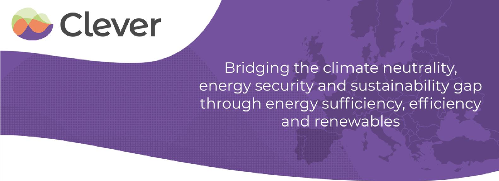
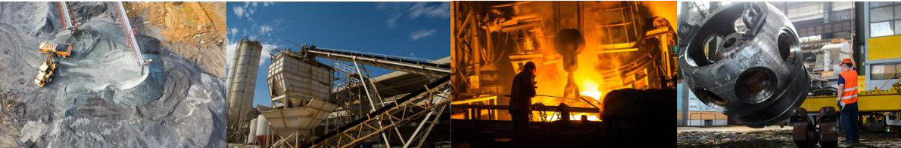
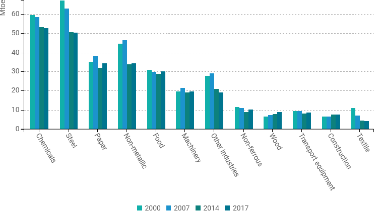
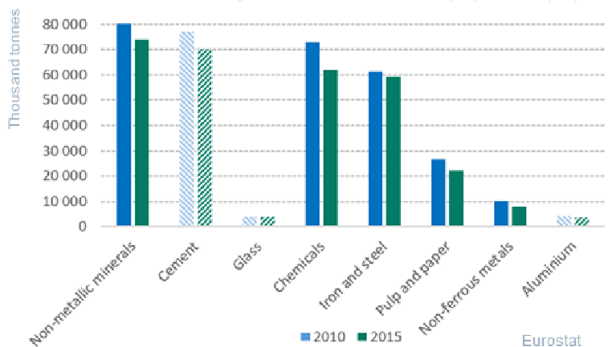
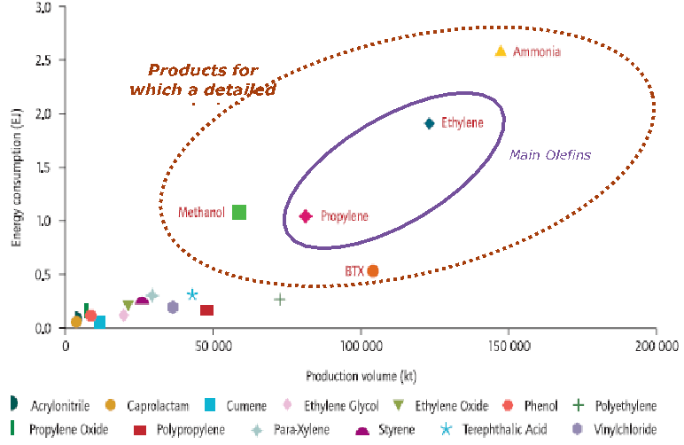
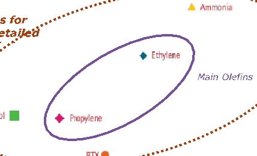
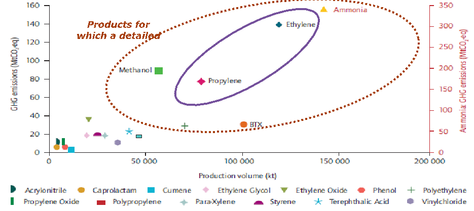
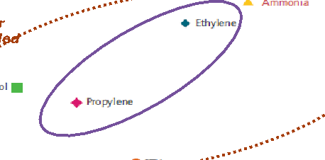
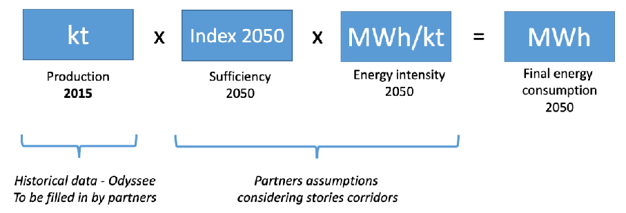
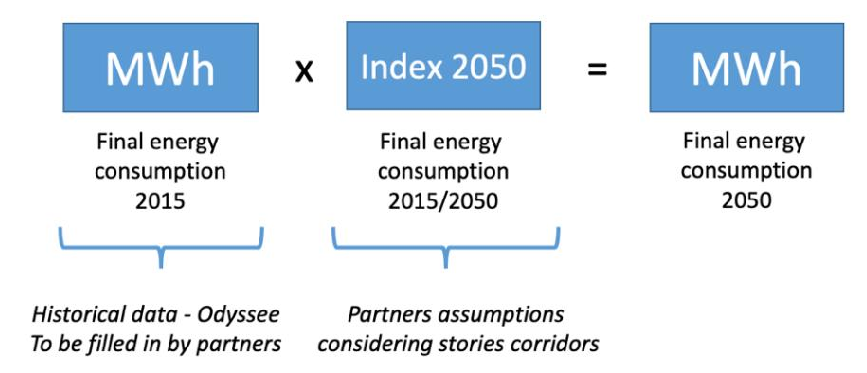

# Establishment of energy consumption convergence corridors to 2050

## Industrial sector

June 2022

Clever – a Collaborative Low Energy Vision for the European Region

### Content

This note was written by the negaWatt Association in the build-up of the CLEVER scenario, with a view to directing national partners towards constructing coherent industrial decarbonisation pathways for European countries. It proposes convergence corridors for the energy consumption of major industrial sectors towards 2050, together with policy measures to support this transition.

### Authors

- - Adrien Toledano, Energy-climate-materials analyst Contact: adrien.toledano@negawatt.org

- - Nicolas Taillard, CLEVER project manager Contact: nicolas.taillard@negawatt.org

- - Stephane Bourgeois, European relations and policies manager Contact: stephane.bourgeois@negawatt.org

- - Jonathan Vavre, European policy advisor
- - Émile Balembois, European policy advisor
- - Emmanuel Rauzier, Industry technical expert

Cover illustration credits: images taken from Stocklib, Pixabay and Pexels image databases.

## Table of contents

Introduction.......................................................................................................... 6 Establishing a common vision on industry ............................................................6 Content of the note ..........................................................................................9 Summary table of the proposed corridors...........................................................10

First proposal for policy measures supporting the assumptions........................ 11 Energy consumption corridor per industrial sector ............................................ 15

Cement........................................................................................................15 Steel ...........................................................................................................19 Pulp and Paper Industry (PPI) ..........................................................................24 Chemicals.....................................................................................................29 Chemicals: ammonia ......................................................................................31 Chemicals: High Value Chemicals (HVCs) ...........................................................34 Chemicals: Other Chemicals ............................................................................39 Glass ...........................................................................................................41 Food............................................................................................................44 Non-Ferrous Metals (NFM)...............................................................................46 Other non-energy intensive industries (metallurgy, machinery, electronics, etc.).......48

References .......................................................................................................... 49 Annexes............................................................................................................... 50

- Annex 1: Methodology for integrating assumptions in the trajectories .....................50
- Annex 2: Analysis for ammonia and HVC including feedstock .................................52

## Figures and tables

### Figures

- Figure 1: Energy consumption of EU industry by sector ............................................................8
- Figure 2: Greenhouse gas emissions of EU industry by sector ...................................................8
- Figure 3: Foreseen final energy consumption for cement in different scenarios .......................... 15
- Figure 4: Foreseen production of steel in different scenarios ................................................... 16
- Figure 5: Foreseen energy intensity of cement in different scenarios ........................................ 18
- Figure 6: Foreseen final energy consumption for steel in different scenarios.............................. 20
- Figure 7: Foreseen production of steel in different scenarios. .................................................. 21
- Figure 8: Foreseen energy intensity of steel in different scenarios............................................ 22
- Figure 9: Foreseen final energy consumption for pulp and paper.............................................. 25
- Figure 10: Foreseen production of pulp and paper ................................................................. 26
- Figure 11: Foreseen energy intensity for pulp and paper ........................................................ 27
- Figure 12: Global energy consumption of top 18 large-volume chemicals.................................. 29
- Figure 13: Global greenhouse gas emissions of top 18 large-volume chemicals ......................... 29
- Figure 14: Foreseen final energy consumption for chemicals ................................................... 30
- Figure 15: Foreseen production of ammonia ......................................................................... 31
- Figure 16: Foreseen energy intensity for ammonia................................................................. 32
- Figure 17: Foreseen production of HVC ................................................................................ 35
- Figure 18: Foreseen energy intensity for HVC........................................................................ 36
- Figure 19: Comparison of the final energy consumption reduction (without sufficiency) of other chemicals industry subsectors by 2050 (source: negaWatt French scenario) ............................. 39
- Figure 20: Foreseen final energy consumption for glass.......................................................... 41
- Figure 21: Foreseen production of glass ............................................................................... 42
- Figure 22: Foreseen energy intensity for glass ...................................................................... 43
- Figure 23: Foreseen final energy consumption for food industrial sector ................................... 44
- Figure 24: Comparison of the final energy consumption reduction of food industry subsectors by 2050 (source: negaWatt French scenario)............................................................................ 44
- Figure 25: Foreseen final energy consumption for NFM........................................................... 46
- Figure 26: Foreseen final energy consumption for “others” industrial sector .............................. 48
- Figure 27: Foreseen final energy consumption for ammonia including feedstock ........................ 52
- Figure 28: Foreseen final energy consumption for ammonia including feedstock ........................ 52

### Tables

- Table 1: Summary table of the scenarios used to define the corridors with reference used in the text to cite them........................................................................................................................9
- Table 2: Summary table of proposed industrial corridors differentiating corridors determined through a detailed and simplified analysis ..................................................................................... 10

## Introduction

### Establishing a common vision on industry

In the framework of the build-up of the CLEVER scenario led by the negaWatt association, convergence corridors for key consumption indicators in the industry sector by 2050 were established in order to facilitate the bottom-up construction of the scenario. This note presents this construct and the convergence corridors.

##### The CLEVER scenario

Since 2018, a network of around 24 European partners under the leadership of negaWatt have been engaging in a technical dialogue to ensure the collective development of a European energy and climate scenario1. This scenario is being constructed using a bottom-up approach with national trajectories as a starting point. It assesses all decarbonisation potentials through the main prism of energy analyses based on energy demand reduction (sufficiency and efficiency) and renewable energy development. It aims at being as ambitious as possible: targeting carbon neutrality and a 100%-renewable energy mix at the European level as soon as possible and by 2050 at the latest, in line with 1.5 degrees pathways. Reaching carbon neutrality by then requires an ambitious and coordinated energy transition strategy supported by concrete and bold policies.

##### Energy consumption corridors concept definition

The CLEVER vision of energy demand reduction is based on an approach of feasibility and equitable sharing of energy services. However, the baseline of each national trajectory might be very different. It can be an obstacle to the establishment of an equitable and convergent European trajectory. To address this issue, it has been decided in the construction of CLEVER to use the concept of “consumption corridors”: for each major parameter in the scenario, a target corridor for energy consumption by 2050 was proposed. The idea behind this is to take into account national circumstances while ensuring that each national trajectory converge towards the common European low-energy vision. The corridors are built according to a principle of equity and high environmental ambition inspired from the doughnut economy principle of Kate Raworth2: the new consumption society defined by these corridors should be bounded between a social lower bound corresponding to the satisfaction of all basic individual needs for all and an environmental higher bound corresponding to the limitation of impacts below planetary limits.

The concept of corridors is crucial in CLEVER vision of energy use and frames the way the project define energy sufficiency. In order to explain it, the CLEVER energy consumption corridors and their development process for key sectors is published in a first series of publication. The current publication is focused on industry and has been built top-down. Bottom-up publications for the residential and mobility sectors are also available3.

- 1 A presentation of the network and its composition is available on this webpage.

- 2 See her book: Raworth, K. (2017). Doughnut economics: seven ways to think like a 21st-century economist. Chelsea Green Publishing.

- 3 These different publications are available on this webpage.

##### Establishment of corridors in the industry sector

###### Top-down modelling approach

Due to a lack of detailed modelling expertise of the industry sector in the network, the main inputs for this note come from the expertise of the project leader (negaWatt) and some partners (mainly Fraunhofer ISI and Wuppertal Institute) originally gathered in an “industry working group”. On the basis of this knowledge, negaWatt has reviewed the prospective assumptions of major European, French and German industry modelling exercises listed in Table 1, which allowed to define energy consumption corridors based on an analysis of technical feasibility.

These corridors were proposed to CLEVER partners by negaWatt in a top-down approach. They were used as a basis to improve their technical expertise on the sector and were adapted in a bottom-up approach when specific national issues were raised.

###### Corridor composition

Industry is a crucial sector in an energy and climate scenario. Two key sources of GHG emissions must be considered in that regard:

- • Emissions coming from the energy consumption
- • Emissions coming from industrial processes

In order to build CLEVER, the emissions reduction potential of these two sources have been analysed. Especially, the sufficiency assumptions have an impact on each of those by reducing the overall industrial activity. Two types of corridors have been established in the energy-climate trajectory for industry:

- • Energy consumption corridors
- • Energy carrier corridors (defining the CO2 intensity of the energy use).

However, in order to focus the message on an energy sufficiency-based methodology, this note only considers energy consumption, which encompasses the key industry transition assumptions of the CLEVER trajectory. The energy carriers’ corridors could be made available on demand.

In order to frame the shaping of the national trajectories for the industry sector, an approach by industrial branch have been adopted. The goal is to forecast the evolution of consumption linked to the use of each raw material in 2050. Through the CLEVER vision, the consumption assumptions in each industrial branch have been defined in 3-steps:

- • Sufficiency: Scale the material demand in the various industrial sectors. This means adjusting nature and amount of the demand to cover the needs for services with a minimum of material. This directly leads to a reduction of production and hence of the energy consumption in the given industrial sector.
- • Circularity: Optimise the products lifecycle through more durable design, longer use and higher recycle rates. The two first lead to a reduction in the demand for materials and therefore in production, while the third one leads to the shift from raw materials to recycled ones, which production is generally less energy intensive.
- • Efficiency: Reduce the energy intensity of production, through new technologies as well as fuel and material substitution.

The final corridors presented in this note served as a reference for partners to finalise their national industry trajectories. They came at a pace of transformation and a level of ambition which is feasible and coherent with their national context, if supported by the right policy framework.

##### Chosen parameters and level of analysis

There is a high level of difference in energy consumption and CO2 emissions throughout the industrial sectors. Both parameters are expressed in Figure 1 and 2 below for each main EU industrial industry branch.

Figure 1: Energy consumption of EU industry by sector (source: Odyssee database using Eurostat data)

Figure 2: Greenhouse gas emissions of EU industry by sector (source: Odyssee database using Eurostat data). Materials in hatched bars correspond to subcategories of the solid bar material to the left of these bars.

Two different levels of analysis have been used depending on the weight (energy and greenhouse gases) of each industrial branch.

For the “heavy-weight” sectors (steel, cement, pulp and paper, chemicals, glass), a detailed analysis defines corridors in both production level (impacted by sufficiency and circularity assumptions) and energy intensity (impacted by circularity and efficiency assumptions). Both corridors were directly implemented in the national trajectories. Their aggregation defines the final corridor of energy consumption.

For other sectors (food, non-ferrous metals, others), a simplified analysis has focused directly on the definition of an energy consumption corridor to be implemented in each national trajectory.

The level of analysis of each industrial sector and the associated corridors is summarised in Table 2.

### Content of the note

The note is divided in 2 parts. In a first political part, it presents the key features of a policy framework which is necessary to support the assumptions defining the corridors. In a second technical part, it details for each industrial branch, the assumptions used to define energy consumption corridors.

The technical part compares the assumptions of different reports and scenarios. Most of them entail EU trajectories while some are national. They are listed in Table 1 below and their complete reference can be found at the end of the document.

The calculation method used to translate the presented corridors in the CLEVER national trajectories is available in annex 1.

- Disclaimer 1: the policy proposal presented are the result of an introductory research work and consultation within the project’s partners network. It aims at achieving a collaborative vision that strengthens the scenario-building assumptions. By no means can they be referred to as official position of negaWatt or project partners.

- Disclaimer 2: these corridors are defined for European countries which are heavily industrialised. Any comparison between an industry transition pathway and this note must be set against the local contexts. There are for instance a difference in energy consumption in several industrial branch (e.g. steel or paper) following the origin of the material (primary or recycled) creating national disparities for the energy intensity of the associated sectors.

- Disclaimer 3: Because of the top-down approach to defining corridors, little analysis of national trajectories has been done. The proposed corridors could therefore be very large to adapt to every European national context and or may present exceptions. Moreover, due to this approach, the content of this note will focus on general technical information and not contain national context analysis as available in the in the residential and mobility note4 of this series.

Table of baseline scenarios

|Organism|Name and link of the scenario|Scale|Reference used|
|---|---|---|---|
|EU Calculator|Module on industry: key behaviours pathway  |Europe|EUCALC|
|Climact, ECF, ClimateWorks|EU CTI 2050 Shared effort scenario  |Europe|EU CTI 2050|
|Fraunhofer ISI, ICF|Pathways to deep decarbonisation of Industry  |Europe|FhISI|
|Material Economics|Industrial Transformation 2050  |Europe|Material Economics|
|negaWatt association|negaWatt 2022 scenario  |France|negaWatt|
|ReINVENT Decarbonisation|Climate innovation in the climate industry: demand scenario  |Germany|ReINVENT|
|Umwelt Bundesamt|Resource-Efficient Pathways towards Greenhouse-Gas-Neutrality (RESCUE)  |Germany|RESCUE|

Table 1: Summary table of the scenarios used to define the corridors with reference used in the text to cite them.

- 4 These different publications are available on this webpage.

### Summary table of the proposed corridors

|Industrial sector|Production (index 2015: % of the 2015 value in 2050) Based on sufficiency and circularity assumptions  |Energy intensity (MWh/kt) Based on circularity and efficiency assumptions  |Final energy consumption (index 2015: % of the 2015 value in 2050)  |
|---|---|---|---|
|Cement|52 – 99|560 – 800|31-64|
|Steel|74 – 92|2060* – 2690*|42*-52*|
|Pulp & paper|58 – 110|1890* – 3780*|31*-64*|
|Chemicals  (aggregated value for simplified approach)  | | |70 – 75|
|Chemicals – Ammonia (detailed approach)  |58 – 80|1580 – 2500| |
|Chemicals – HVC (detailed approach)  |59 – 98|3140 – 5680| |
|Chemicals – Others (detailed approach)  | | |69– 89|
|Glass|61 – 95|700 –2190|23 –68|
|Food| | |42 – 64|
|Non-ferrous metals  | | |39 – 87|
|Others| | |63 – 85|

Table 2: Summary table of proposed industrial corridors differentiating corridors determined through a detailed (purple) and simplified (orange) analysis *: corridors with exceptions for some countries, see the disclaimer at the start of the associated parts

## First proposal for policy measures supporting the assumptions

The technical elements of this note have been consolidated through some policy research and dialogues within the CLEVER network. It draws a policy framework supporting CLEVER’s low energy vision for the industry sector. This chapter shares this general framework by detailing key policies underlying sufficiency, circularity and efficiency assumptions.

##### Sufficiency policies

Sufficiency assumptions and policies are meant to scale and reduce whenever possible the industrial production. The material (steel, cement, glass…) and goods (paper, food…) industrial production is directly linked with the final sectors consuming them (transports, building, agri-food…) and import/export logics (not considered in this note). To reduce the industrial production, it is hence necessary to establish policies impacting these different sectors. This is allowed thanks to the CLEVER systemic approach considering every consumption sector in its scenario.

###### Key sufficiency policy directions for the industry sector

This chapter underlines policies with the aim of reducing the demand within the industry sector. Key policies are underlined for each direction. Detailed information for these policies will be given for the mobility and building sectors in the 2 further notes of this series of publications. Policies regarding other sectors will be detailed in a final publication by Spring 2023.

Sufficiency policies could reduce industrial needs in 3 different ways:

- 1. By targeting a dimensional downscaling of goods needed to answer the same energy service, materials consumption decreases for instance, the use of smaller cars could strongly reduce the needs of steel: average SUVs are 40% heavier than the average car5.

- • The straightforward way to obtain it is by furnishing information for the consumers on the sustainability and reparability of every products Such policies are an important pillar of the EU circular economy action plan6 for the energy related products through an eco-design and energy labelling working plan7. Some policies of this plan have already been published in the first EU circular economy package8 proposal. In particular, the revision of the consumer’s right9 entails a right to know the sustainability, reparability and updates level of any product. This ambition could be raised in a sufficiency perspective through mandatory CO2 and life-cycle footprint labelling throughout all the value chain10. The information of this label could be accessible through a unified digital product passport11.
- • A complementary policy is to put minimum environmental requirements to ensure that products that are harming the environment are removed from the market12. It could be set through a cap on greenhouse gases emissions of products. This could be completed by financial incentives for less environmentally damaging products such as VAT reductions.

- 5 Car Care Portal, 2019

- 6 See the presentation and timeline of the plan by the EU Commission

- 7 EU Commission communication, 04/05/2022 ; another working plan is discussed for the intermediary products as part of the revision of the Ecodesign law.

- 8 EU Commission, 30/03/2022

- 9 See the description of the directive by the EU Commission

- 10 For instance, the negaWatt scenario (negaWatt, 2021) for France considered an EU label covering 80% of the carbon footprints of goods by 2025.
- 11 See the ECOS coalition recommendations (March, 2022) on this effective disclosure and communication.

- 12 See the ECOS review of the Ecodesign Directive and negaWatt 2022 scenario policies p.17

• Finally, an important reglementary lever is to ban adds promoting high energy consuming goods13.

- 2. A push to mutualise goods, reducing the amount of goods per capita to be produced. This requires sectoral policies to incentivise good-sharing that mainly falls under national jurisdiction. For instance, car sharing could be supported in the transport sector (mandatory dedicated parking areas or high occupancy vehicles lanes)14 or home-sharing in the building sector (lower taxes for high occupancy level of homes…)15.
- 3. A change in uses could lead to less material demand. The set of related policies is mainly located at national level, while the EU could have an influence through funding. One key example of these policies are those favouring dietary change towards less meat consumption (1 or 2 vegetarian meals per week in public canteens16, labelling on CO2 impact…). Lower meat consumption would in the end lower many industrial needs such as for chemistry (fertilizers, medicinal products for animals…). Another example could be incentives for public transport and soft mobility, that could lead to a decrease in car production17 and thus steel and other materials production.

Finally, some policies could use these 3 levers. That’s the case of policies preventing soil sealing (or land take) in the building sector. Restricting soil sealing reduces the needs of construction material by reducing the demand of new buildings18. Targets to limit soil sealing exist in some EU country19, a target of zero net land take by 2050 at the latest should be implemented in every heavily urbanised country20. The current role of the EU is a regular sharing of guidelines on soil sealing21. The EU Commission should increase its leadership and recover the ambition of the aborted Soil Directive proposal in 2006 that intended to define soil sealing and enjoined member states to take measures to limit it22.

##### Circularity policies

The EU adopted in 2020 a circular economy action plan23 with planned legislative packages until 2030. Making circularity an overarching principle is a paradigm shift for our economy. Policies to answer that challenge should set strong regulations as well as incentives and labelling.

###### Key circularity policy directions for the industry sector

To create a circular economy, the products should be monitored throughout their life cycle. This requires a general transparent EU-system for tracking the different steps of the value chain24. It also requires specific polices at each phase.

During the production phase, requirements should be set for the eco-design of products. This implies a prohibition of planned obsolescence defined using the eco-labelling framework discussed in the sufficiency part (a minimum lifetime floor). It could be completed through the extension of legal

- 13 Proposal that could be found in the Belgium National Energy Climate Plan (NECP), p.129

- 14 More details in the CLEVER mobility corridor note, available on this webpage.

- 15 More details in the CLEVER residential corridor note, available on this webpage.

- 16 See the EGAlim law in France making one vegetarian meal per year in public canteen mandatory.
- 17 Further details in the CLEVER mobility corridor note.

- 18 It is concretely leading to new uses with a different urban planning and incentives multi-family building.
- 19 No net land-take by 2050 target in France ; 20 ha/day target by 2030 in Germany ; other policies in this report.

- 20 See the CLEVER residential note (on this webpage), indicator “floor area”.

- 21 The EU Commission has a target of no net land take by 2050 in its Roadmap to a Resource Efficient Europe. It was translated in an EU Soil Strategy leading to the publication of guidelines on soil sealing in 2012 and next announced in 2024.

- 22 See the 2006 Soil Directive Proposal article 2 and 5.,

- 23 See the presentation and timeline of the plan by EU Commission

- 24 Which could be reach if a strong digital product passport is adopted by the EU : ECOS, March 2022

guarantee periods. Finally, a “precycling” strategy should be set in order to restrict the use of nonrecyclable materials in new products25.

During the use phase, a focus should be made on reusing and repairability. The promotion of reusing could be guided thanks to reuse targets26. The achievement of these targets will be possible through the development of deposit systems and second-hand exchanges. A global framework for reparability could be developed under the umbrella of a “right to repair”27. Concretely in this framework it should be compulsory for manufacturers to offers spare parts for reparation for a range of at least 5 to 10 years28. In addition, a labelling telling the reparability and recyclability of the products should be put in place. A move in this direction has already been made by the EU Commission in its revision of the consumer’s right29. This could be part of a new labelling and tracking of the different stages of the value chain, made possible by a robust Digital Product Passport.30.

Finally, during the end of life phase phase, policies should ensure the highest recycling rate possible and sale opportunities for recycled materials. On the supply side, support should be given to the creation of a competitive European recycling industry by limiting exports of wastes outside the EU31. On the demand side, it implies regulations on minimum rates of recycled materials in the production phase32. This could also be completed by a tax on the use of raw materials to make recycled material more competitive.

Relocalisation policies could support this circular economy framework by reducing the travel for products and hence reinforcing synergies between recycling and production. The relocalisation is also important to reduce the industry carbon footprint (production in countries with a lower carbon intensive electricity mix, reduction of transports)33.

##### Efficiency policies

Efficiency policies in the industry sector consist in building an economical and technological framework pushing manufacturers to reduce energy and carbon intensity of their activities as fast as possible given the available technologies.

###### Key efficiency policy directions for the industry sector

On the one hand, a general economic framework needs to be ensured by strong EU ETS and CBAM regulations. Indeed, these regulations could make efficiency investment cost effective in the industrial sector by:

- • Increasing their return on investment (thanks to the EU ETS).
- • Preventing cheaper, more carbon and energy intensive imported industrial materials to compete with local products (thanks to the CBAM).

The more ambitious these regulations will be, the more they will support efficiency investments.

On the other hand, more concrete efficiency policies could also provide incentives to support three key levers of decarbonisation:

- 25 German Zero report (2021) suggests for instance an EU level ban of microplastics (p.150); Irelands suggest in their NECPs to set higher fee on the production of material which are difficult to recycle (Ireland NECP, p.74).

- 26 Proposed in ECOS priority measures for the EU Circular Economy plan. For instance, the French negaWatt scenario modelized a reuse rate for glass of 28% by 2030 and 50% by 2050 (French negaWatt 2022 scenario p.48).

- 27 Request from the European Parliament

- 28 It is in particular Friends of Earth position to reduce overproduction.

- 29 Right to access to reparability and updates information EU Commission proposal, 30/03/2022

- 30 ECOS, March 2022

- 31 French negaWatt 2022 scenario p.44

- 32 It is an objective of the circular economy action plan

- 33 French negaWatt 2022 scenario p.44

- 1) Fuel substitution away from fossil fuels: A strong regulation such as a ban on fossil fuel generation technologies by 2040 could be envisaged34. Such ban would only be efficient if key policies on sufficiency and circularity already exists and if other possible sustainable fuels (hydrogen, biogas) are well defined thanks to a clear certification system through the REDII Directive.
- 2) Material substitution toward less energy or carbon intensive material: through legally binding targets of sustainable material use. For instance, in the building sector the use of wood should be promoted35: the 2022 negaWatt scenario for France sets progressive targets towards 95% of new individual homes built in wood in 2050 (80% in 2030)36. An investment in the training of craftsmen will be necessary to ensure the right level of competence for this substitution.
- 3) Technological gains: they should be promoted through the financing of research to support both previous points and an improvement of industrial appliances. The key tool in that context is the EU Innovation fund (from the EU ETS revenues), that already provided funding in April 2022 to 3 research projects in the industry sector37.

|Box 1: Sufficiency in industry and employment|
|---|
|Sufficiency, circularity and efficiency measures will deeply alter the industry landscape. Several socio-economic foresight studies have concluded that sufficiency measures should have a positive or neutral impact on employment38. Three elements explain this result:  • sufficiency assumptions lead to a redistribution of jobs by directly reducing industrial production on the one hand and stimulating other industries (e.g. the bicycle and train industry, the wood industry...) on the other. • the circular economy will lead to the creation of many jobs in the reuse and repair economy. • a reindustrialisation of Europe should be fostered to implement these measures which should also have a positive impact on employment. |

- 34 Fraunhofer, 2019 part I

- 35 Germany propose to remove the legal barriers for the use of wood in its Climate Action Plan 2050 , p.69

- 36 French negaWatt 2022 scenario (p.44).

- 37 EU Commission, 01/04/2022

- 38 Studies on the impact of these 3 measures were made in France by negaWatt in its 2017 scenario for France (part 6) and by The Shift Project.

## Energy consumption corridor per industrial sector

### Cement

##### Industry overview

Cement is a glue that acts as a hydraulic binder, used to bind fine sand and coarse aggregates in the manufacture of concrete. This material is used in the construction of buildings and infrastructure of all kinds. There are currently 5 main types of cement, and the clinker content varies greatly from one to another. The production of clinker, an essential component of cement, accounts for a large part of the energy consumption and CO2 emissions of cement plants, since the clinkerisation process is carried out at around 1450°C and emits very large quantities of CO2 as a result of chemical reactions.

European cement production meets the EU's demand. In the EU28, this demand exceeded 182 million tonnes in 2019. This makes Europe one of the largest cement producing regions ahead of the USA (89Mt) but behind India (320Mt) and far behind China (2300Mt) which produces more than half of the world's cement. The EU28 represents about 5% of the world cement industry which is responsible for about 7% of global CO2 emissions and 4.5% of GHG emissions. Cement is the largest industrial sector emitting GHGs in Europe. Its decarbonisation and the reduction of cement demand are therefore essential to achieve the climate objectives.

##### Chosen corridor

###### A reduction in European cement energy consumption between 31% and 64% of the 2015 consumption level in 2050

| |
|---|

Figure 3: Foreseen final energy consumption for cement in different scenarios

###### The most robust scenarios which achieve carbon neutrality or industry decarbonisation in 2050 for Europe and include a thorough industry sector modelling suggest a reduction of

energy consumption for the production of cement in Europe between 31% (FhISI) and 64% (Rescue and negaWatt). Another pathway achieves energy consumption around the middle of this corridor: Material Economics. EU CTI 2050 achieves even more ambitious results, an 84% reduction of energy consumption.

Note on the cement scenarios:

This European analysis integrates French and German scenario assumptions because both countries have a Production/Consumption ratio similar to the EU’s (1.18 for Germany, 1.02 for France and 1.1 for Europe in 2017), with the assumption that all cement demand is covered by production at the EU level and that these P/C rates remain similar by 2050. To adapt to their national context, the partner took into consideration P/C ratios and trends of their own country before integrating their trajectory in the corridor.

Partners who weren’t able to develop an industrial strategy for this sector considered P/C ratios identical between 2015 and 2050.

The final corridor defined is based on intermediary trajectories, excluding EU CTI 2050 which uses a different P/C ratio (0.8). However, EU CTI 2050 assumptions were also used and are still referred to in the following paragraphs. Similarly, the trend from Climact’s EUCALC trajectory “Key behaviours scenario” has been excluded from the graphics but assumptions have also been used for the narrative part.

##### Production

Impact of sufficiency and circularity assumptions: 38% to 48% reduction of cement demand39

General analysis of the industrial demand evolution

| |
|---|

Figure 4: Foreseen production of steel in different scenarios

- 39 In this story, the reduction trends do not consider relocalisation assumptions and proportions of imports/exports are considered constant.

Towards 2050 at the European level, Material Economics and negaWatt forecast a reduction of cement production between 38% and 48% respectively compared to 2015 level, in line with Rescue projections (48%), with similar production/consumption ratios.

FhISI foresees a low reduction of cement production due to further developments in the construction sector (e.g. renovation activities and investments in infrastructure). For EU CTI 2050, industrial production is endogenous, i.e. defined by the model according to the activity in the different sectors, and their simulation model may explain their ambitious figures of reduction of production. The European Union is a light cement net exporter: all the demand is covered by the production. Hence, sufficiency assumptions on cement production have a direct impact on European cement demand and vice versa. Today, the main cement-consuming sectors are the construction of new buildings (50%), civil engineering and new infrastructure (30%) and maintenance across these two categories (20%). Except FhISI, all the scenarios forecast a significant production decline, especially due to the effects of demographic change (lower cement consumption per capita) and changes in the way construction will be carried out in the future (building with wood, carbon concrete). In infrastructure, these trends lead to a reduction between 30% and 70% of EU cement demand by 2050. Sufficiency is characterised by a decrease in new engineering structures in favour of the renovation of existing structures (ports, airports, bridges, etc.) but above all a reduction of the road network, because the need for roads is decreasing40. In the building sector, negaWatt foresees an increase of cohabitation, leading to fewer dwellings being built and less growth than in the last 20 years. Tertiary and industrial buildings are also seeing their growth rate decrease. In these two sectors, cement losses account for about 15% of buildings materials wasted in construction. Smarter designs, reduction of overspecification and end-to-end optimisation of cement use may enable to use less cement than required in the specified concrete mix, with a potential of 65% less cementitious material identified by Material Economics.

###### Specific impact of circularity: 14% to 65% of concrete recycling

Unlike plastics or metals, cement is not easily recycled by re-melting or similar processes, and the original chemical process cannot be reversed. Nonetheless, there are opportunities to recover useful constituents from end-of-life cement to reduce requirements for new production. The material recirculation will be based on recycling of cement fines (e.g. separation of pure concrete fines as raw material for new cement production) and the reusing of structural elements as key lever in reduction trends, leading to a reduced demand for clinker or polymer cement. While in 2015 the cement recycling rate is around 5%, FhISI assumes that recycled cement will be around 14% of total cement production in 2050 where EU CTI 2050 plans it around 34%. Material Economics foresees a bigger potential of concrete recycling by 65% towards 2050.

##### Energy intensity

###### Impact of efficiency assumptions: 7% to 30% reduction of cement production energy intensity

- 40 The assumptions leading to these decreases are given in the CLEVER note on mobility corridors available on this website.

| |
|---|

Figure 5: Foreseen energy intensity of cement in different scenarios

Rescue and negaWatt consider that energy efficiency will play a key role, allowing a reduction of the energy intensity reaching around 600 MWh/kt by 2050. FhISI scenario present also present a gain in energy intensity reaching by 2050 around 650 MWh/kt. Material Economics scenario shows a small energy intensity, their prospective value of 804 MWh/kt in 2050 represents the upper boundary of the corridor.

###### Technology and innovation: 4% to 18% reduction of energy intensity

Innovative cement types will enter the market and allow technological improvements that will lead between 4% to 18% energy efficiency gains in clinker production. EU CTI 2050 asserts that wet clinker will be entirely substituted by dry clinker and new types of cements will appear, such as polymer cement (makes up 10% of the cement production) and low-carbon-impact cements (e.g. re-carbonating cement products). Such new binders reduce both process-related (less/no decarbonation) and energy-related emissions (lower process temperatures, lower demand for thermal energy) compared to conventional Portland cement production. According to FhISI, all innovative cement varieties/products will substitute around 50% of cement production in 2050.

###### Material and fuel substitution: 3% to 12%41 reduction of energy intensity

Material substitution will have an impact thanks to different types of cement substitution techniques with specific resource availability and specific impact on the cement performance (GGBS, PFA, Pozzolana, Limestone). EU CTI 2050 plans that concrete clinker is substituted by polymer cement (only 66% of clinker left in cement) and Rescue by alternative additives such as unburnt limestone. More specifically in buildings (residential and tertiary), concrete is substituted between 10% and

- 40% by timber (e.g. increase use of cross-laminated timber) and at 10% by insulation materials (represented by HVC chemicals). In infrastructure, concrete is substituted at 2,5% by insulation materials (represented by HVC chemicals).

Fuel switch to alternative fuels will also clean up current processes (e.g. increase energy efficiency through pre-calciners/preheating, waste heat recovery). The EU CTI 2050 scenario assumes that 46% of fossil fuels are substituted by biomass in the European cement sector. Rescue’s GreenSupreme scenario goes further assuming that the use of coal will already be abandoned in 2040 and the processes will integrate electricity-based renewable gas into the general gas supply, so that the conversion of the steel industry will take place more. Thus, the thermal efficiency could increase by 10% for the production of conventional cement by 2050 by use of waste heat or more efficient kilns.

- 41 The corridors for technology and substitution are created around the only figure offered by the reports (18% of energy efficiency gains). The other data that make up the corridors have been calculated for the purpose of the note.

### Steel

##### Industry overview

The steel industry is one of the largest heavy industries in the European Union with a production of 153 million tonnes in 2020 through more than 500 sites across the continent and creating a total of €125 billion of Gross Value Added to the EU economy every year. Steel, an alloy mainly composed of iron, carbon (2%) and manganese (1%), is used in a wide range of applications from transport to construction and infrastructure. In Europe, steel is traditionally produced by reducing iron ore with coke in blast furnaces. Although most iron ore is now imported from countries such as Brazil and Australia, primary steel production remains important in Europe, allowing for a rather balanced trade balance. This primary steel production is concentrated in about thirty large production sites (between 1.5 and 11.5 million tonnes of capacity) in the most industrialised countries. Recycled steel has become increasingly important over time, reaching 41% of steel production in 2019 at EU28 level. A wider mesh of small recycled steel production sites (<0.1 to 1 million tonnes capacity) has been developed in all EU countries except the Baltic States and Denmark.

The steel industry, which employs more than 300,000 people in Europe42, is the second largest consumer of energy and the third in terms of greenhouse gas emissions. It is therefore one of the industries where decarbonisation, that requires a radical transformation, is a priority.

Disclaimer: The energy intensity for steel production is highly variable following the input: recycled steel production is between 3 and 4 times less energy intensive than primary steel production43. Energy consumption corridors for steel could only be built for countries having similar shares of recycled steel.

The following corridor corresponds to countries near of the average EU steel recycled rate (39% of recycled steel in steel production). This means countries with recycled rates between 30% and 50% (France, Germany, Belgium, Sweden, Poland…). Other countries with higher (Italy, Spain…) or lower (Netherlands, UK…) recycled rates were considered separately for the energy intensity part and the finally chosen energy consumption corridor. However, these countries followed the same assumptions for production.

- 42 Eurofer data, 2021

- 43 Primary steel production: 5000 MWh/kt observed in 2015 and 4060 MWh/kt planned in 2050. Recycled steel production: 1500 Mwh/kt observed in 2015 and 1020 MW/kt planned in 2050. Data coming from the French Modeire (previously Pepito) project to which negaWatt participated.

##### Chosen corridor

###### For trajectories with a recycled rate in 2015 between 30% and 50%: a reduction in European steel energy consumption between 42% and 52% of the 2015 consumption level in 2050

| |
|---|

Figure 6: Foreseen final energy consumption for steel in different scenarios. Note: Rescue trajectory starts in 2010 and does not provide data of energy consumption or industrial production in 2015. Odyssee data for 2015 has been used instead.

The most robust scenarios which achieve carbon neutrality or industry decarbonisation in 2050 for Europe and include a thorough industry sector modelling suggest a reduction of steel energy consumption in Europe between 42% (Material Economics) and 52% (negaWatt). Two other pathways achieve energy consumption around the middle of this corridor: FhISI, and Rescue. EU CTI 2050 achieves even more ambitious results, with a 72% reduction of energy consumption.

Note on the steel scenarios:

This European analysis integrates French and German scenario assumptions as both countries have a Production/Consumption (P/C) ratio similar to the EU’s (around 1.06 for Germany, 1.03 for France and 1.0 for Europe in 2015). To adapt to their national context, the partner took into consideration P/C ratios and trends of their own country before integrating their steel trajectory in the corridor.

Partners who weren’t able to develop an industrial strategy for this sector considered P/C ratios identical between 2015 and 2050.

The final corridor defined is based on intermediary trajectories, excluding EU CTI 2050 which uses a different P/C ratio (0.78). However, EU CTI 2050 assumptions were also used and are still referred to in the following paragraphs. Similarly, the trend from Climact’s EUCALC trajectory “Key behaviours scenario” has been excluded from the graphics but assumptions have also been used for the narrative part.

##### Production

###### Impact of sufficiency and circularity assumptions: 8% to 25% reduction of steel demand44

| |
|---|

Figure 7: Foreseen production of steel in different scenarios.

Towards 2050 at the European level, FhISI and negaWatt forecast a reduction of steel production between 8% and 26% respectively compared to 2015 level, in line with Rescue projections (25%). Material Economics completes this corridor with a potential of reduction of 16%.

For EU CTI 2050, industrial production is endogenous, i.e. defined by the model according to the activity in the different sectors, and their model may explain these ambitious figures of reduction of production. According to Eurofer, in 2015, the main steel-consuming sectors in Europe are construction of buildings and infrastructure (35%), the automotive sector (20%) and mechanical engineering (15%). Except EU CTI 2050, all scenarios and simulation forecast a moderate decline of steel production: in construction due to changing buildings surface and wood penetration; in transportation due to modification of fleet size, penetration of aluminium and steel weight reduction. In the construction sector, Material Economics forecasts a specific demand reduction around 23%. Tertiary and industrial buildings, greedy of steel components, are seeing their growth rate decrease leading to a drop in steel consumption: the lifetime of buildings could be increased by 40% by making buildings more adaptable and modular promoting durability. Sufficiency is characterised also by a decrease in new engineering structures in favour of the renovation of existing structures (ports, airports, bridges, etc.). Avoiding less over-specification in construction (better design, better material) could cut steel use by 20-30% and waste could be reduced by 5% (today, between 15% and 50% of steel are wasted in construction). Material substitution will have an impact in the construction sector where steel is expected to be substituted by biomass-based products and especially by timber (10%). In the transportation sector, the need for transport falls between 23% (negaWatt) and 33% (Material Economics) because of a reduction in the mobility of people and lower need for goods transport. The modal shift from private car to gentler mobility and to public transport together with car sharing (63% of all cars shared) reduce the need for materials. Material Economics suggests that steel needs in transport could fall by 75%, based on 2050 assumptions of 33% of lighter vehicles, 15% remanufacturing, an occupancy of 1.93 per car and an increased car lifetime by 94%. EU CTI 2050 adds that consumer behaviours will change with cars and trucks performing more km in lifetime, more km per year, resulting in lifetimes between 9 and 13 years, in line with 10.7 years old average age of cars in the European Union. The use of high-strength steel enables carmakers to reduce vehicle weight by 25%-39% compared to conventional steel. Material substitution will have an impact: for cars and trucks, around 10% of steel is substituted by carbon

- 44 In this story, the reduction trends do not consider relocalisation assumptions and proportions of imports/exports

fibres (HVC chemicals) and 10% by aluminium, whereas steel is substituted at 25% by carbon fibres for planes.

##### Energy intensity45

###### Impact of efficiency and circularity assumptions for trajectories with a recycled rate in 2015 between 30% and 50%: energy intensity between 2060 and 2690 MWh/kt46

| |
|---|

Figure 8: Foreseen energy intensity of steel in different scenarios

All scenarios consider that energy efficiency will play a major role, allowing a reduction of the European energy intensity reaching in 2050 between 2690 MWh/kt (negaWatt & Rescue) and 2060 MWh/kt (FhISI & Material Economics).

This trend is a combination of circularity gains (recycled share increase) and energy efficiency gains (new technologies, fuel substitution and material substitution). The efficiency gains must be understood with a split between results from conventional and scrap steel: the primary route allows an energy intensity reduction between 15% and 30% whereas the secondary route has a potential between 15% and 45%.

###### Circularity: increase of the recycled share to a corridor between 50% and 77%

While scenarios differ by demand assumptions and by production routes (BF-BOF and H-DRI for primary steel and EAF for scrap steel), all agree that the future of steel production lies in the recycling industry with an increase of scrap usage in both primary and secondary routes. In 2015, the share of scrap-EAF is around 40% and will continue to increase in the future due to a larger availability of scrap (making up two thirds of new steel production) and a possible EU steel stock saturation. According to the ambition of the scenarios, EUCALC assumes that a prospective shift to recycling is confined by scrap availability and its quality whereas Material Economics estimates that the amount of scrap available could be as large as total EU annual steel needs. FhISI underlines that production of high-quality EAF steel has reached industrial scale and can be used in high-performance steelsegments (e.g. aviation and automotive). While the production of EAF steel is based on 100% scrap as raw material, no more than 25% scrap is added in primary steel production in an oxygen steel converter. Eventually, primary route (BF-BOF/H-DRI) is expected to represent between 23% and

- 45 The energy used for hydrogen production in the steel industrial process is considered in the calculation of energy intensity.
- 46 In this story, the reduction trends do not consider relocalisation assumptions and proportions of imports/exports

50% of crude steel production in 2050 (vs 60% in 2015) and EAF between 50% and 77% in 2050 (vs 40% in 2015).

###### Technology and fuel substitution: 20% to 30% reduction of energy intensity

In the European Union, approximately 60% of total crude steel is produced by blast furnaces basic oxygen furnaces (BF-BOF, for primary steel), using mainly coal, with the remainder (40%) produced by electric arc furnace (EAF, for scrap steel) technologies, using mainly electricity. Nearly all energy consumption from steelmaking arises in two core processes: producing the heat energy to melt steel and the reduction of iron ore to iron. Thus, a major candidate for deep cuts is to replace these two steps, requiring further developments of the Direct Reduction of Iron (DRI) processes to replace the carbon in fossil fuels with electricity (for energy) and with hydrogen (for the reduction of iron ore) in the traditional BF-BOF route. DRI is a proven process47 but only accounts for 0,4% in the EU in 2015. The plausible technologies for Europe include HIsarna (smelting reduction process but at early stage of development), H-DRI (hydrogen-based direct reduction, from both natural gas or water from electrolysis) and DR electrolysis (purely electricity-based direct reduction). Swapping to hydrogen for natural gas is technically plausible and several EU steel companies estimate some 10-15 years before the technology is fully proven and ready to operate at large capacities. According to EU CTI 2050 as the only one to mention this technology, HIsarna can replace the BF-BOF route by around 10% in 2050. For the other two technologies, Material Economics plans that around 35% of primary steel can be made by H-DRI towards 2050. In the FhISI scenario 4aMix80, it is assumed that 80% of conventional blast furnace production in 2050 is substituted by direct reduction based on hydrogen and by electrolysis steel, which is assumed to be available after 2030. Rescue and negaWatt both agree that the blast furnace route will be completely replaced by a steel production based with hydrogen direct reduced iron. This technology changeover is completely achieved by 2040 for Rescue. For the EAF route, a further increase of electric steel production is possible thanks to innovative collection and sorting technologies (e.g. robotic cutting and handling). Overall, Rescue predicts an improvement between 20% and 30% in terms of energy efficiency.

###### Material and fuel substitution: 10% to 15% reduction of energy intensity

Energy demand in the steel industry in Europe is still dominated by the use of coal, required as a reducing agent in the blast furnace but as explained above all scenarios forecast a strong reduction of the BF-BOF production route. For the remaining coal use, energy efficiency improvements will be made to clean up current processes and a fuel switch to biofuels and gas is forecasted. EU CTI 2050 estimates that 2,5% of coke is substituted by gas in classic plants (addressed by the EAF and electrolysis technologies). Charcoal (solid biomass) is also one option to replace coal both as fuel and feedstock in BF-BOF plants, even if it requires smaller furnaces and is less efficient for now. A potential between 10% and 15% of coal is substituted by biomass in classic BOF plants by 2050.

- 47 TRL 9 according to Toktarota et al, 2020

### Pulp and Paper Industry (PPI)

##### Industry overview

The Pulp and Paper Industry is a mature industry with overall stagnating market demand in the past 10 years and relatively high levels of recycling. Paper production is based either on virgin wood pulp or on pulp from recovered/recycled paper. Two ways of producing virgin wood pulp exist: the first one is by separating wood-fibres via mechanical wood grinding, also called mechanical pulp (28% of the European virgin pulp production) and used for weaker papers such as newsprint; the second one by separating fibres under high pressure using chemicals to cook the woodchips, also called chemical pulp (72% of the European virgin pulp production) to create high-quality paper products. Europe is a net exporter of paper and its production is based on 46% of virgin paper and 54% of recovered paper.

Disclaimer: The total energy intensity of the pulp production could be highly diverse depending on national context:

- • The recycled share in the final production as recycled pulp is 10 time less energy intensive than primary48and the primary pulp production over paper production ratio could vary from values lower than 40% (France, Germany, Belgium…) to higher than 90% (Sweden, Finland).
- • The share of pulp imported: only few countries, like Sweden, Finland, Portugal and Estonia reaches P/C ratios on pulp equal or over 1. Most of EU countries are net importers of pulp for paper production, creating disparities in final local energy consumption (as the method of calculation used didn’t consider the footprint of importation).

The disparity of these two parameters implies a broad diversity of national context that is complex to harmonise in one corridor. This is reinforced by a lack of data in some countries. The definition of a corridor was however necessary to guide the national trajectories with the description of a clear possible energy consumption pathway.

The chosen corridor was defined based on scenarios at different geographic scale (EU, France and Germany level) giving a large indicative corridor made to include the diversity of these 2 parameters. However, if the energy consumption corridor is indicative, every country followed the same assumptions for production volumes.

- 48 Primary pulp production: 5400 MWh/kt observed in 2015 and 3300 MWh/kt planned in 2050. Recycled pulp production: 460 MWh/kt observed in 2015 and 280 MW/kt planned in 2050. Data coming from the French MODEIRE (previously Pepito) project to which negaWatt participated.

##### Chosen corridor

###### Indicative corridor: a reduction in European pulp and paper energy consumption between 31% and 64% of the 2015 consumption level in 2050

| |
|---|

Figure 9: Foreseen final energy consumption for pulp and paper

The most robust scenarios which achieve carbon neutrality or industry decarbonisation in 2050 for Europe and include a thorough industry sector modelling suggest a reduction of paper energy consumption in Europe between 31% (FhISI) and 64% (Rescue). Two other pathways achieve energy consumption levels around the middle of this corridor: negaWatt for France and the Demand-Management scenario in reINVENT.

Note on the pulp and paper scenarios:

This European analysis integrates French and German scenario assumptions as both countries have a Production/Consumption ratio similar to the EU’s (around 1.14 for Germany and 1.22 for the EU,0.90 for France in 2015), with the assumption that these ratios are similar up to 2050. In light of the great variety of P/C ratios in the paper and pulp industry around Europe, the partner took into consideration P/C ratios and trends of their own country before integrating their pulp and paper trajectory in the corridor.

Partners who weren’t able to develop an industrial strategy for this sector considered P/C ratios identical between 2015 and 2050.

##### Production

###### Impact of sufficiency and circularity assumptions: 12% to 42% reduction of paper and pulp demand49

| |
|---|

Figure 10: Foreseen production of pulp and paper

Towards 2050 at the European level, negaWatt forecasts a reduction of paper production around 12%, whereas Rescue and reINVENT go further in their production prospective with a reduction between 42% and 32% in 2050 compared to 2015.

Only FhISI expects a growth of paper production in 2050 (+10%), mainly due to the e-commerce growth. In 2016, the main uses of paper and boards in Europe are packaging paper and boards (carton boards, case materials, wrappings - 50% of demand), graphic papers (newsprint – 37%), sanitary and household papers (tissue and other hygienic papers – 8%) and special papers (cigarette papers, filter papers, for industrial purpose – 5%). There is certain potential to provide these services more efficiently and reduce the demand of these services such as information dissemination via digitalisation, improve the efficiency for hygiene products via product design or packaging with less material. The growth of e-commerce and the Internet will have a clear impact on both packaging papers with changes in logistics and storing and graphic papers with a replacement of the printed press by digital. As a result, packaging paper is expected to grow between 12% and 30% by 2050 mainly because of digitalisation and substitution to plastics packaging. On the opposite, graphic paper is expected to go through a big decrease between 20% and 49% by 2050 because of the replacement by digital and the end of abusive advertising. It is assumed that the ratio of packaging paper to graphic paper will shift from the current level to 2:1 by 2050 because of the ongoing digitalisation of former print media and the rising demand for packaging. For sanitary and special papers, they will continue to slowly increase from 1% to 5%. Material efficiency will also have an impact on the production reduction with a potential for saving wood resources and energy by producing more lightweight products or by modifying the material composition (with fibres, fillers, etc.) of the paper products. This material efficiency gain is expected to be between 8% and 17%.

- 49 In this story, the reduction trends do not consider relocalisation assumptions and proportions of imports/exports are considered constant.

##### Energy intensity

###### Indicative corridor: impact of efficiency and circularity assumptions: 11% to 53% reduction of paper and pulp production energy intensity

| |
|---|

Figure 11: Foreseen energy intensity for pulp and paper Note: Energy required for pulp production is also taken into account but the amount of pulp is most likely lower than paper production in most of European countries. No assumption on pulp production relocalisation is here considered.

FhISI, negaWatt and Rescue scenarios consider that energy efficiency will play a major role, allowing a reduction of the European energy intensity reaching in 2050 between 2920 MWh/kt and 1890 MWh/kt. This trend is a combination of gains in technologies, fuel substitution and material substitution. ReINVENT scenario present a lower energy efficiency gain with an energy intensity in 2050 of 3880 MWh/kt.

Pulp and paper production is energy intensive: the mechanical pulping process mainly uses electricity as energy input and the chemical pulping process uses large amount of process heat but less electricity. The PPI is characterised by its high thermal energy consumption where most of the energy is used in the drying section of the paper machine. Drying accounts for up to 70% of the fossil energy use in the European PPI. Much of this fossil fuel use takes place in paper mills that use recovered fibre.

###### Impact of circularity: a paper recycling rate from 62% to 80%

Paper can currently be recycled 4 to 8 times on average and the recycling rate in Europe amounted to 62% in 2016. This rate has consequences on the use of recovered paper and its share in the pulp production (54% of recovered paper in 2015). Increasing the use of recovered paper in paper production saves wood and energy resources since re-pulping requires less energy input than chemical and mechanical pulping. As a reminder, recycled paper is twice less energy-intensive than virgin wood paper production (3.11 TWh vs. 6.04 TWh). A recycling rate of 80% (equal to using the fibres on average 5 times) has been suggested by reINVENT to be a realistic goal considering the consumption of non-recoverable paper such as tissue, in line with the ambition of negaWatt and Rescue. The main potential for an extended use of recovered paper lies in the production of graphic paper, for which the quality requirements have always been high. negaWatt estimates that the share of recovered paper in 2050 will be the same as 2015 in the paper production. On their side, FhISI and Rescue forecast a growth between 10% and 20% of the share of recovered fibres in pulp production, assuming steady improvements in paper recycling by increasing the rate of collected wastepaper and yield improvement of recycled fibres by improving the separation of contaminants.

###### Technology and innovation: 5% to 40% reduction of energy intensity

Decarbonisation of the PPI is technically fairly uncomplicated since the processes require process heat of low and medium temperature. The European PPI can invest in three types of technologies and innovations. The first lever is a gradual replacement of machinery to more efficient equipment. Since drying is the largest energy use in paper production, the PPI has always looked for new ways of producing paper with less water, more efficient ways of dewatering paper and improved drying techniques for paper mill (e.g. impulse drying, steam/air impingement drying, development of the extended nip press for dewatering). The impulse drying technique may enter the market in 2025 and result to up to 10% of energy savings by 2050. The second lever to reduce energy intensity in PPI is through an improved process control and optimisation. For chemical pulp process, black liquor gasification and the reuse of green liquor for pre-treatment of wood chips can be developed to generate surplus of electricity or biofuels (around 5% of energy savings). In the mechanical pulping process, enzymatic pre-treatment for wood is being developed with a potential of 20% of energy savings by 2050. Concerning both chemical and mechanical pulping process, a breakthrough technology is the use of deep eutectic solvents that have the ability to dissolve and fractionate lignin and cellulose at low temperature. The benefit of this pulping technology is that it would deliver up to 40% energy savings and enable the extraction of cellulose from waste (entry market around 20302035). Finally, the third energy-efficient lever is the waste heat recovery that can be achieved by heat integration and installation of heat pumps that lifts the temperature of waste heat to a temperature high enough for reuse (both chemical and mechanical pulp).

###### Fuel substitution: 6% to 13% reduction of energy intensity

According to Odyssee, the energy mix of the European PPI in 2015 is dominated by biomass (37%) and electricity (31%), the remainder being divided between natural gas (20%) and liquid and solid fossil fuels (12% with coal and oil). In 2020, most of the heat demand is fulfilled via the power boiler using the on-site residual biomass products and boilers running on fossil fuels. Such process heat can be supplied from biomass combustion or electric boilers. The European PPI has heavily invested in combined heat and power (CHP) in the past years. Whereas all scenarios project that either biofuels or electricity will be dominant in the final energy consumption in 2050, differences appear on the lever to actuate. First, biomass can replace fossil fuels (oil and gas) in the production of process heat in boilers and in the lime kilns (kraft pulp mills especially) and has increasingly been doing so for the past 20-30 years. In theory, all process heat in the PPI could be supplied by biomass combustion. The opportunities for using bioenergy, however, differ between different types of mills depending on their availability of internal by-products and residues and location. For chemical pulp mills, sludge from wastewater treatment is increasingly being used for biogas production and could provide 5-10% of the energy use at a paper mill that uses recovered fibre. The electricity currently produced by gas CHP can be replaced by biomass CHP. Second, in theory as well, electrification of the PPI could also be achieved by the restructuring of the industry towards more mechanical pulping. In reality though, the strategy is constrained by the lower quality of mechanical pulp. Nevertheless, electricity can replace steam and fuels for heating purposes by producing steam and hot water from electricity via electric boilers and industrial heat pumps (for impulse drying for example). As a conclusion, nearly all the scenarios agree on the fact that fossil fuels in PPI will be very low or phased out by 2050 (by 2030 for reINVENT) and replaced to some extent by bio-fuelled boilers or electric boilers and heat pumps. FhISI and negaWatt forecast that electricity will supply more than 40% of the final energy where reINVENT and RESCUE estimate that modern biofuels (e.g. black liquor, etc.) will be the first energy carrier around 38%.

### Chemicals

##### Industry overview

A research from International Energy Agency (IEA) proposes roadmap of energy use and GHG emissions for the top 18 chemical products on the global scale. It shows that olefins, aromatics, methanol and ammonia represent about 50% of the global chemicals industry energy demand. This conclusion is nearly similar for GHG emissions, as shown in Figure 12 and Figure 13 below.

Products for

which a detailed

analysis is

Main Olefins

Figure 12: Global energy consumption of top 18 large-volume chemicals (source: Dechama, 2017 using IEA data)

Products for which a detailed story is provided

Main olefins

Figure 13: Global greenhouse gas emissions of top 18 large-volume chemicals (source: Dechama, 2017 using IEA data)

Regarding to the European level, the production volumes of HVC represent about 40% of the entire chemical industry, followed by 10% for ammonia and 50% for the rest of chemicals. All these sectors are highly energy intensive though.

##### Methodology for chemicals corridors

The corridors in the chemicals industry has been defined using 2 different methodologies following the data available in each country:

- • Detailed analysis: given their weight, whenever possible, corridors have been defined for the production and energy intensity of the ammonia and HVC sector (see the dotted circle in Figure 12 and Figure 13 above). The corridors and assumption for the 3 industry branches of this detailed analysis (ammonia, HVC and other chemicals excluding the latest) are given in the next 3 parts.
- • Aggregated analysis: when there was a lack, a corridor has been made for the overall chemical sector. This corridor was built aggregating the assumptions of the detailed analysis. It is given in the section below.

##### Chosen aggregated corridor

###### A reduction in European chemicals energy consumption between 70% and 75% of the 2015 consumption level in 2050

This corridor is the result of an analysis splitting these sectors in 3 analyses detailed in the next 3 parts.

| |
|---|

Figure 14: Foreseen final energy consumption for chemicals

By 2050, the energy consumption corridor for the total chemicals sector lies in between 75,0 for the European FhISI pathway and 70,3 for the French negaWatt one. The German Rescue pathway achieves final energy consumption reduction levels around the middle of this corridor.

In 2015, the chemicals sector was the EU most energy-intensive and the third emitting sector.

### Chemicals: ammonia

##### Industry overview

The EU has produced around 17.2Mt of ammonia in 2015 for a consumption nearly similar of 17.5Mt. The industry is structured around 17 countries producing ammonia at 42 plants. Germany produces the most ammonia with 17% of the EU’s capacity, Poland is next with 16% of the overall capacity, and the Netherlands follows with 13%.

Approximately 82% of global ammonia produced is used in fertiliser application to sustain agriculture production through soil fertilisation and increasing crop nutrients (mostly nitrogen fertilisers -72%, followed by potassium and phosphorous fertilisers with respectively 16% and 12%). This fertiliser consumption is mostly based on 46% of (ammo)nitrates, 22% of urea and 13% of UAN.

The remaining 18% of ammonia production is used in various industrial applications, such as general surface cleaning solutions.

###### Note on the ammonia scenarios:

This European analysis integrates negaWatt’s French scenario assumptions as France has a Production/Consumption ratio similar to the EU’s (around 0.93 for France and 0.98 for the EU in 2015), with the assumption that these ratios are similar up to 2050. Considering the great variety of P/C ratios in the ammonia industry around Europe, the partners took into consideration P/C ratios and trends of their own country before integrating their trajectory in the corridor.

Partners who weren’t able to develop an industrial strategy for this sector considered P/C ratios identical between 2015 and 2050.

To define this corridor, some key elements and figures have been used from the EUCALC and Rescue reports in addition to the scenario detailed in this part.

##### Production

###### Impact of sufficiency and circularity assumptions: 20% to 32% reduction of ammonia demand50

|Figure 15: Foreseen production of ammonia|
|---|

- 50 In this story, the reduction trends do not consider relocalisation assumptions and proportions of imports/exports are considered constant.

Towards 2050 at the European level, FhISI forecasts a reduction of ammonia production of 20% (80 in index 2050), whereas negaWatt and Material Economics go further in their production prospective with a reduction between 26% and 42% in 2050 compared to 2015. In addition, in order to reduce GHG emissions, negaWatt and Material Economics consider that 100% of the production by 2050 will be swiched to hydrogen-based ammonia instead of methane as at present. In FhISI scenario, 74% of the production is switched to hydrogen and 26% remains methane-based.

Reduction of food waste, especially in processing and by consumers, reduces the amount of food production required and subsequently fertiliser needs. An estimated 90 Mt of food is wasted yearly in the EU and Material Economics evaluates that it can be reduced by 70% by 2050. Instead, it is dependent on the development of a more efficient food industry, the adoption of new methods within agriculture to reduce food production and implement changes in diets. These aspects will have an undeniable consequence on the utilisation of fertilisers, which will be the largest influencer of demand. FhISI anticipates that usage from farming will be reduced for more targeted and controlled fertilising.

Reducing synthetic fertilizer use by 40% involves a fundamental change in the agricultural system according to FhISI. Material Economics and negaWatt are in line with this 2050 objective with respectively a reduction of 45% and 50% of fertiliser demand. negaWatt forecasts the implementation of agro-ecological practices such as longer rotations allowing the introduction of leguminous plants that fix nitrogen from the air and the generalisation of inter-crop cover to limit nitrate leaching. The three scenarios agree on the fact that nitrogen fertilisers can be used in a more efficient way but a greater share of nitrogen input will switch to organic fertilisers (more urea in nitrogen, switch to more potassium and phosphorous fertilisers, farming waste, biomass digestate, community compost). At the end, reduced demand for synthetic fertilisers results in a decrease in ammonia production, from 20% for FhISI to 42% for negaWatt. This sort of development may favour the development of smaller, innovative ammonia production plants, capable of responding to varying fertiliser needs. A large-scale EU-wide shift to sustainable extensive farming will not need additional land if accompanied by a shift in diets according to WHO recommendations and substantially reduce the environmental impact of the agricultural sector (Westhoek et al. 2014).

##### Energy efficiency assumptions on energy intensity

###### Projected energy consumption: between 1580 and 2500 MWh/kt.

| |
|---|

Figure 16: Foreseen energy intensity for ammonia

Note: Dechema’s trajectories haves been built using Dechema (2017) publication evaluating the best practice technology (BPT) existing today for methane-based ammonia and available low-carbon process for hydrogenbased amonia. A linear trend connects the observed 2015 intensity and a 2050 planned consumption based on the generalization of Dechema state of the art of best practices available.

Towards 2050 at the French level, negaWatt forecasts a reduction of the energy intensity reaching around 1580 MWh/kt by 2050 excluding feedstock51. This low energy intensity value (excluding feedstock) can be explained by switching to hydrogen technology. This is trend is confirmed by Dechema’s hydrogen-based ammonia trajectory. Moreover, Dechema study shows that an energy efficiency gain is possible for methane-based technology (even if it will remain more GHG emitting). The aim of switching to hydrogen technology (using low-carbon electricity) is mainly to decarbonise production. However, if we consider feedstock, it will increase the energy intensity of ammonia.

###### Innovation and material substitution

An increased use of efficiency for fertilisers and precision agriculture may reduce energy intensity up to 10%. A long list of small changes to practice can increase efficiency substantially to reduce leakage to water and air by controlling conditions (controlling soil acidity, using additives that stop volatilisation of urea), improving application (using more frequent and varied application, using cover crops), switching to nitrate fertilisers (ensuring sufficient availability of other nutrients such as sulphate and phosphate) or increasing precision of application (timing application to weather conditions, improving application accuracy).

###### Technology and fuel substitution

Ammonia is produced by a reaction of hydrogen with nitrogen in the Haber-Bosch process. To generate the starting mixture, nitrogen is extracted from the air, while hydrogen is usually produced from steam methane reforming. In Europe, the most common feedstock is natural gas.

In a way to replace steam methane reforming, technologies develop low-carbon hydrogen through water electrolysis. The two main techniques are alkaline electrolysis, as the most mature technology, and Proton Exchange Membrane (PEM) reverse fuel cell electrolysis. According to FhISI, both of these techniques use only electricity as an energy source and require 11% less energy than the steam cracking process, which means an 8% reduction in the total ammonia production process. Another technology is in development as the Solid Electrolyte membrane electrolysis that can deliver a 12% better energy efficiency compared to steam methane reformation. This one results as a 9% saving across the entire ammonia production chain (market entry in 2025). Electrolysis would make it possible to offer flexibility and even storage services to the electrical system. Another energy carrier switch that can be expected is the use of biogas instead of natural gas both as fuel and feedstock (from gasification of wet biomass).

The production of ammonia is a very energy demanding process and electrolysis will switch inputs from natural gas and electricity, to just electricity. For now, most EU plants operate well above the practical minimum energy consumption level estimated but there is room for improvement. It has been estimated that if all plants in the EU were to achieve the efficiency of the best plants, energy consumption could fall by 20%. Therefore, total energy requirements are broadly similar. According to Material Economics and Dechema, today’s process uses 8.9 MWh of natural gas for fuel and feedstock plus 2.1 MWh of electricity, electrolysis uses around 9.1 MWh electricity per tonne of ammonia, depending on the efficiency of electrolysis. This energy consumption reduction depends either on the penetration of hydrogen on the European market and the amount of production based on water electrolysis. On this point, Material Economics and negaWatt agree to shift the whole production from natural gas to hydrogen, in line as well with the GreenSupreme scenario from Rescue.

- 51 In the first instance, feedstock is not included in the scope of our calculation. Later in the project, the quantities of methane and naphtha for the production of ammonia and HVC will be taken into account as primary energy requirement. In addition, the significant amounts of hydrogen for the low-emission processes of ammonia and HVC production will be taken into account as a decarbonised electricity requirement. Forseen energy intensity graph including feedstock is shown in Annex 2.

### Chemicals: High Value Chemicals (HVCs)

##### Industry overview

Today, plastics in Europe are dominantly produced through steam cracking of naphtha and ethane, which are respectively obtained by refining crude oil and from natural gas. In the EU, naphtha is by far the dominant route constituting ¾ of the feedstock. The steam cracking produces High Value Chemicals (HVC), which are the key building blocks of the petrochemical industry. HVC can be divided in 2 main categories: olefins (including ethylene, propylene and butadiene) and aromatics (mainly benzene, toluene and xylene). Added to these, there are several other petrochemical processes in plastics production such as production of chlorine and styrene. HVC represent more than 60% of energy consumption of the whole chemicals industry. The assembled HVC and other components are then polymerised into plastics with the use of energy for processes such as cooling, heating and pressure. The 5 polymer types - Polyethylene (PE), Polypropylene (PP), Polystyrene (PS), Polyvinyl Chloride (PVC) & Polyethylene Terephthalate (PET), account for some 75% of use at the European level. After that point, however, the value chain is more fragmented and is understood in this report as plastics final uses.

The plastics industry lies on the intersection of the petroleum industry and the chemical industry. In Europe, the production of plastics is around 60Mt with a consumption at 51Mt in 2015. The great majority of this production is used by plastic converters in Europe, whose main applications are packaging (40%), building and construction (20%), automotive (10%), electrical and electronic (6%) and the remaining in others (appliances, household, agriculture, etc.).

According to Dechema, current European production of HVC is around 55Mt: 22Mt for ethylene, 17Mt for propylene and 16Mt for BTX (benzene, toluene and xylene). Methanol production in Europe is currently low (2,5Mt according to FhISI), but is expected to increase significantly due to its use to produce olefins and aromatics in a decarbonised way.

NB: Concerning the textile industry, which is employment-intensive, if the idea of relocating production emerges within the framework of national or European policies, this could have direct consequences on organic chemicals, since the textile industry accounts for 20% of HVC world energy consumption.

###### Note on the HVC scenarios:

This story integrates French scenario assumptions as France has a Production/Consumption ratio similar to the EU’s (around 1.32 for France and 1.33 for the EU in 2015), with the assumption that these ratios are similar up to 2050. Considering the great variety of P/C ratios in the HVC industry around Europe, the partners took into consideration P/C ratios and trends of their own country before integrating their trajectory in the corridor.

To define this corridor, some key elements and figures have been used from Material Economics and EUCALC reports in addition to the scenario detailed in this part.

Partners who weren’t able to develop an industrial strategy for this sector considered P/C ratios identical between 2015 and 2050.

##### Production

###### Impact of sufficiency and circularity assumptions: 2% to 17% reduction of HVC demand52

| |
|---|

Figure 17: Foreseen production of HVC

Towards 2050 at the European level, FhISI forecasts a reduction of HVC production around 2%, whereas negaWatt goes much further in its production prospective with a reduction around 40% in 2050 compared to 2015. In addition, in order to reduce GHG emissions from ammonia, negaWatt considers a switch of 60% of production by 2050 to hydrogen via methanol instead of naphta and ethane as at present. In FhISI scenario, 79% of the production is switched to hydrogen via methanol and 21% remains naphta and ethane-based.

Reduction of plastics waste, especially in processing and by consumers, reduces the amount of plastics production required and subsequently High Value Chemicals (HVC) needs. The average residence time for plastics in the economy is 10 years, spanning from 0,5-50 years depending on the plastics specificity. Currently, around 40% of plastics could be categorised as “single-use”, meaning the product is disposed of after a very short useful life. The overconsumption of plastics could be overcame by adapting consumption patterns for increased reuse of single-use consumer plastics such as bags and bottles. The change of habits impacts the direct consumer plastics use but also through the materials required per service or product. Car sharing for example could reduce overall materials use by 50%, as a shared mobility system enables a smaller average size car to cater to the average 1.5 passengers per car. However, the biggest potential of plastics consumption reduction is found in plastics used by businesses, such as business-to-business packaging. The reduction of plastics production is central and fundamental, explained by the drop in plastics production expected between 29% and 23% according to negaWatt and Material Economics. Moreover, materials efficient design and innovation can reduce mass required in plastics products, reducing plastics in packaging by 20% without compromising functionality. At the end, reduced demand for plastics results in a decrease in HVC production, from 2% for FhISI to 40% for negaWatt. Another option to slow down the pressure on plastics demand and then HVC is by substituting plastics with fibrebased alternatives. Material Economics finds that up to 20% of current plastics used in packaging could, in principle, be substituted without compromising on the unique properties of plastics (barrier properties, formability, transparency, etc.). For other plastics applications, such as buildings, automotive and electrical or electronic equipment, similarly detailed assessments are not available. However, bio composites offer a drop-in solution for many structural elements, with at least 5% aggregate substitution potential.

- 52 In this story, the reduction trends do not consider relocalisation assumptions and proportions of imports/exports are considered constant. Every country may keep its initial P/C ratio (2015) for the projections to 2050.

##### Energy intensity

###### Impact of efficiency and circularity assumptions: projected energy intensity between 3140 and 5680 MWh/kt.

As in the rest of the petrochemical industry, production of plastics is highly energy intensive and energy efficiency improvements have been a prominent driver of innovation, leading to significant decreases in fuel and power consumption as well as energy intensity over the past decades.

| |
|---|

Figure 18: Foreseen energy intensity for HVC Note 1: Dechema petroleum-based HVC trajectory has been build by considering in 2015 current energy intensity in Europe and in 2050 the best practice technology (BPT) existing today (Dechema, 2017). A linear trend connects the two points. Note 2: Dechema hydrogen-based HVC trajectory considers the available low-carbon process detailed in their report.

Towards 2050 at the French level, negaWatt forecasts an increase of the energy intensity reaching around 4470 MWh/kt by 2050 excluding feedstock53. This higher energy intensity value compared to 2015 can be explained by switching to hydrogen technology. This trend is confirmed by Dechema’s hydrogen-based ammonia trajectory. Moreover, Dechema study shows that an energy efficiency gain is possible for methane-based technology (even if it will remain more GHG emitting than hydrogen one). The aim of switching to hydrogen technology (using low-carbon electricity) is to decarbonise production. However, it increases the energy intensity of HVC’s production. By considering feedstock, energy intensity of HVC’s production increases even more.

###### Innovation and technologies

Even in an ambitious scenario, some new plastics will be required, which means that new cleaner production methods are needed. For plastics, some emerging technologies appear with low potentials of energy efficiency improvements. Material Economics has made the choice to select feedstock recycling by pyrolysis or gasification to convert plastics into simpler molecules. Other emerging technologies for plastics are depolymerisation to break plastics down into monomers or oligomers and solvlysis, as a “lighter treatment” to separate polymer from additives before

- 53 In the first instance, feedstock is not included in the scope of our calculation. Later in the project, the quantities of methane and naphtha for the production of ammonia and HVC will be taken into account as primary energy requirement. In addition, the significant amounts of hydrogen for the low-emission processes of ammonia and HVC production will be taken into account as a decarbonised electricity requirement. Forseen energy intensity graph including feedstock is shown in Annex 2.

reprocessing it into plastics. All these technologies for plastics have low energy efficiency potentials though.

For HVC, the conventional methods of producing them is through steam cracking of a variety of hydrocarbon feedstock (mainly naphtha & ethane in Europe, with progressively more and more Liquefied Petroleum Gas – 20%). Among all the HVC, ethylene is key to several chemical processes, most notable of which is plastics. As such it affects a multitude of manufacturing processes. The current Best Available Technologies (BAT) of conventional ethylene production route include optimisation of heating coils, integrated gas turbines with cracking furnace or even more 3D printers to produce high-value tailored products. Hence, Europe can further diminish its energy footprint through BATs by 2%. To go further, decarbonisation of HVC is possible thanks to novel techniques, as catalytic cracking of naphtha. This high-energy process could be improved with catalyst technologies such as catalytic pyrolysis and catalytic partial oxidation. Some demonstration plants have delivered encouraging results a 15% energy savings to the cracking reaction.

###### Fuel substitution

In a way to replace the steam cracking process through hydrocarbon feedstock, several options are possible for fuel substitution.

The major fuel switch to avoid the use of naphtha and ethane is through gasification, a trend growing very fast in Europe. Low-carbon gasification pathway to produce olefins and aromatics is based on methanol produced by water electrolysis with low-carbon electricity. Those processes are called MTO (Methanol-To-Olefins) and MTA (Methanol-To-Aromatics) and they are highly considered in negaWatt scenario and in Dechema study. Indeed, negaWatt considers a switch of 60% of production by 2050 to hydrogen via methanol instead of naphta and ethane as at present. In FhISI scenario, 79% of the production is switched to hydrogen and 21% remains naphta and ethane-based. Nevertheless, hydrogen production (as a feedstock) required for MTO and MTA is very important. According to Dechema, around 21,7 GWhelec/kt of olefin and 41 GWhelec/kt of BTX is required. In negaWatt French scenario, 83TWh of electricity are required by 2050 for hydrogen-based HVC feedstock. This represents a major limit for those processes.

EUCALC also recommends high level of electrification (up to 40%) to substitute fossil fuels. Electricity is essential in this transition for the cracker stage for pyrolysis, but also for steam generation and to power a range of additional processes.

The other substantial fuel switch for HVC industry is from fossil fuels to biomass, between 10% and 20% according to EUCALC and Material Economics. One solution is to switch from fossil to renewable feedstock thanks to a range of biomass feedstock that can be processed into bio-ethanol, biomethanol, biogas or bio-naphtha, which can then be used to produce conventional plastics. The substitution of fossil feedstock with bio-based feedstock in the steam cracking process could reduce energy consumption, as well as for heat production. Even if decarbonisation through bio-based feedstock is a great opportunity, biomass is a resource for which there will most likely be increased competition as more sectors decarbonise. It is crucial then to reduce biomass requirements for plastics as much as possible. Bio-based plastics must be used strategically as a solution within an overall production system of increased materials efficiency, circular business models, some degree of substitution and high levels of plastics recycling.

###### Circularity: a high recycling rate could induce up to 10% reduction of energy intensity

Recycling and reuse are one of the key gaps of plastics when comparing to other basic materials. A growing production of plastics from recycled material instead of raw ethylene could save up to 10% of energy. In the EU, around 30% of plastic waste is collected for recycling. However, not all of the 30% is actually recycled. The recycling of plastics in the EU amounts to less than 10% if measured

- as the production of secondary plastics in relation to the use of plastics. This situation is the consequence of a number of technical barriers and due to the diversity of plastics. According to FhISI, Material Economics and reINVENT, the plastic collection rate could increase to 50% by 2050 according to all the reports and would reduce the demand for raw ethylene by 8% according to FhISI.

Concerning recycling rates, it is necessary to differentiate mechanical recycling (the actual 10%) from chemical recycling. On one hand, mechanical recycling is when plastics are sorted, shredded, cleaned, melted and reprocessed into new plastics products. In theory, around 75% of the current plastics mix could be mechanically recycled but due to the complexity of the sector, EUCALC and Material Economics forecast that the mechanical recycling rate will be between 15% and 26% by 2050. On the other hand, chemical recycling technologies are fast-emerging, with a potential to augment Europe’s progress towards sustainable plastic waste management. These processes complement those of mechanical recycling, where the latter proves to be inefficient, as is the case for plastics that are not suitable for mechanical recycling (multi-layers, heavily contaminated waste, or mechanical recycling residues). Chemical recycling could in theory cover 25% of the current plastics mix but this technology is not commercially deployed yet. It will play an indispensable role in a future net-zero emissions plastics system. It is a complement to mechanical recycling, which is more resource efficient. Together, the two approaches could bring the recirculation of plastics between 50% and 62% of production.

### Chemicals: Other Chemicals

###### Defined corridor: a reduction in European chemicals excluding ammonia and HVCs energy consumption between 69% and 89% of the 2015 consumption level in 2050

This category Other Chemicals - all the chemicals except ammonia and High Value Chemicals – corresponds to consumer and specialty chemicals. They are very diverse; hence, their production chain is difficult to track as a group. Consumer chemicals include paints, inks, varnishes, glues, explosives, solvents, pharmaceuticals whereas specialty chemicals include soaps, detergents, etc.

Little information is available in the reports to have a precise overview of this sector. According to negaWatt, no sufficiency assumptions are made for consumer and specialty chemicals due to their heterogeneity and their low share in chemicals production. It is considered that the volumes of these goods per capita will be identical in 2050 and the evolution value will correspond to the European population assumption, based on the principle of pooled means of production

- at the EU level. According to negaWatt and CEFIC, the P/C ratio are respectively 1.08 for France and 1.10 for the EU in 2015. Thus, the assumption for production retained is that there will be no sufficiency in this sub-sector by 2050.

Other chemicals industry sectors represent around 50% of the chemicals industry final energy consumption. An analysis has not been detailed for those individual sectors. The negaWatt French scenario is the only scenario that provides precise data on each of them.

T

|The definition of corridors for this sector were based on data from negaWatt scenario summarized Figure 19 below. It shows the measure 2014 final energy consumption (FEC) and the consumption reduction planned in 2050 for each sub-sector.  |-29%|
|---|
  |-30%|
|---|
  |-31%|
|---|
  |-57%|
|---|
  |-33%|
|---|
  |-11%|
|---|
  |-30%|
|---|
  -26% -25%  |-33%|
|---|
  |-32%|
|---|
  |-31%|
|---|
  -60% -50% -40% -30% -20% -10%   0%  0,00  4,00  8,00  12,00  16,00  Other  mineral che  micals  Fine  organic chemicals Parache mistry, pharmacy  Dichlorin Industrial gases  Nylon salt  Orgabic  basic  materials  MCV  Styrene Nitric fertalizers Other fertalizers  FEC reduction by 2050 (%)  Final energy consumption (TWh)  Final energy consomption (FEC) 2014/2050 reduction according to negaWatt scenario (without sufficiency)  Energy consumption in 2014 Sector FEC reduction by 2050 Aggregated FEC reduction by 2050  |
|---|

- s
- t

Figure 19: Comparison of the final energy consumption reduction (without sufficiency) of other chemicals industry subsectors by 2050 (source: negaWatt French scenario)

###### The corridor defined (69 to 89% of 2015 final energy consumption in 2050) is adapted to the distribution of national energy consumption within each subsector:

- • For distributions similar to the French one, the target averaged aggregated value was the one given by negaWatt scenario (69% of 2015 FEC).
- • When Styrene, MVC and Nylon salt represented a larger part of the energy consumption of “Other chemicals” than France, partners used a target of 75% of 2015 FEC as a minimum value for the corridor.
- • When Nylon and salt represented the largest energy consumption subsector, the partner used a target of 89% of 2015 FEC as a minimum value for the corridor.
- • When there was a lack of data, partners took the target of 89% of 2015 FEC as a minimum value for their corridors.

### Glass

##### Industry overview

Many different glass products are manufactured and processed in Europe. These include packaging glass, e.g. for the beverage and food industry, flat glass, e.g. for the construction and automotive industry, utility and special glass, crystal and commercial glass, as well as mineral fibers, e.g. for insulation materials, and textile glass fibers for the textile industry.

The glass industry with its numerous sub-sectors is a European energy-intensive industrial sectors even if in terms of GHG emissions its importance is lower. The main greenhouse gas reductions in the glass industry are based on the increased cullet use (especially in sectors other than containers and flat glass), and the increased energy efficiency through recovery of diffuse waste heat from downstream processes (e.g., cooling tracks) and conversion to electric troughs.

##### Chosen corridor

###### A reduction in European glass energy consumption between 24% and 68% of the 2015 consumption level in 2050

|68.2  23.8  27.0  0  20  40  60  80  100  2015 2020 2025 2030 2035 2040 2045 2050  Foreseen energy consumption for glass (index 100 = 2015)  FhISI - EU28 Rescue - Germany négaWatt - France  |
|---|

Figure 20: Foreseen final energy consumption for glass

By 2050, the glass industry energy consumption reduction corridor lies in between 68,2 for the European FhISI pathway and 23,8 for the French negaWatt one. The French negaWatt pathway achieve final energy consumption reduction levels near the lower boundary of this corridor.

Note on the glass scenarios:

Considering the great variety of P/C ratios in the glass industry around Europe, the partners took into consideration P/C ratios and trends of their own country before integrating their trajectory in the corridor.

Partners who weren’t able to develop an industrial strategy for the glass sector are considered P/C ratios identical between 2015 and 2050.

##### Production

###### Impact of sufficiency and circularity assumptions: 5% to 39% reduction of glass production54

|95.0  84.3  61.1  0  20  40  60  80  100  2015 2020 2025 2030 2035 2040 2045 2050  Foreseen production of glass (index 100 =  2015)  FhISI - EU28 Rescue - Germany négaWatt - France  |
|---|

Figure 21: Foreseen production of glass

By 2050, the corridor lies in between 95,0 for the European FhISI pathway and 61,1 for the French negaWatt one. The German Rescue pathway achieve final energy consumption reduction levels around the middle of this corridor.

In the Rescue and negaWatt scenarios, the production quantities were determined on the basis of a model assuming decrease proportions depending on consumption behavior, construction activities and the changes in the automotive industry, etc. Those assumptions lead to a high decrease of glass production in both German and French scenarios. Moreover, the share of cullet used in glass production, which is about 40% today, increases in Rescue scenario, from 45% in 2030 to 54% in 2040 and 69%. The share of recycled glass also has an important weight in the French negaWatt scenario glass production. This share increases from 41% in 2014 to 63% in 2050.

In FhISI only a slight decrease in overall glass production is assumed according to material efficiency improvements as well as material substitution (e.g. use of bio fibres) and re-use of glass products.

- 54 In this story, the reduction trends do not consider relocalisation assumptions and proportions of imports/exports are considered constant. Every country may keep its initial P/C ratio (2015) for the projections to 2050.

##### Energy intensity

Disclaimer: The energy intensity for glass production is variable following the input: recycled glass production is 30% less energy intensive than primary glass production55. The recycled share is highly variable following the countries. To adapt to this disparity, the chosen energy intensity corridor is very large.

###### Impact of circularity and efficiency assumptions: projected energy consumption between 697 and 2190 MWh/kt.

|2193  697  1326  0  500  1000  1500  2000  2500  3000  3500  2015 2020 2025 2030 2035 2040 2045 2050  Foreseen energy intensity for glass  (MWh/kt)  FhISI - EU28 Rescue - Germany négaWatt - France  |
|---|

Figure 22: Foreseen energy intensity for glass

By 2050, negaWatt and Rescue Rescue scenarios consider that energy efficiency will play a major role, allowing a high reduction of the energy intensity reaching between 1330 MWh/kt and 690 MWh/kt. This trend is a combination of gains in technologies, carrier substitution and material substitution. FhISI scenario present a lower energy efficiency gain compared to négaWat and Rescue with an energy intensity in 2050 of 2193 MWh/kt.

From 2010 onwards, a very ambitious increase in thermal efficiency by 2050 is assumed in Rescue GreenSupreme scenario, mainly by switching to electric furnaces. For the year 2050, a specific final thermal energy demand is assumed to be 80% lower than in 2010. In addition, process-related emissions are reduced by increasing the use of cullet. FhISI 4a Mix and negaWatt scenarios also present a process switch from fuel furnaces to electric furnaces. Indeed, FhISI considers that 80% of the conventional glass production will be substituted by electric melting by 2050.

In addition to efficiency improvements, a renewal of the power plant fleet is required, which emphasises conversion to renewable energy. From a systemic energy efficiency perspective, the direct use of electricity for process heat supply is targeted in Rescue GreenSupreme scenario. It is therefore assumed by Rescue that from 2030 onwards there will be no new oil-fired furnace installations, but a switch to fully electric furnaces. Thus, in 2030, 10% of all baths are already fully electrically heated. By 2040, it is 30% and by 2050, all bathtubs are fully electric.

- 55 Primary glass production: 3500 MWh/kt observed in 2015 and 2000 MWh/kt planned in 2050. Recycled steel production: 2500 Mwh/kt observed in 2015 and 1300 MW/kt planned in 2050. Data coming from the French MODEIRE (previously Pepito) project to which negaWatt participated and ESvidrio.

### Food

##### Chosen corridor

###### A reduction in European food energy consumption between 42% and 64% of the 2015 consumption level in 2050

The determination of a corridor is the food industry faces 2 limits. First, among all scenarios considered, only the negaWatt and Rescue scenarios, with national perimeters, study the food industry (see Figure 23). Besides, the food industry sector is divided into a large number of subsectors, from A for alcohol to H for sugar and the negaWatt scenario is the only one giving pathways for all the subsectors.

|42.3  57.7  0  20  40  60  80  100  2015 2020 2025 2030 2035 2040 2045 2050  Foreseen energy consumption for food (index 100 = 2015)  Rescue - Germany négaWatt - France  |
|---|

Figure 23: Foreseen final energy consumption for food industrial sector

The trajectories for the food industry were defined between the average value given by Rescue (42% of 2015 FEC), the average given by negaWatt (58% of 2015 FEC) and the value given by the subsectors presenting the minimal final energy consumption reduction (64% of 2015 FEC).

|-48%  -46%  -34%  -52%  -44%  -34%  |-48%|
|---|
  -35%  |-42%|
|---|
  -60% -50% -40% -30% -20% -10%   0%  0  4  8  12  16  20  FECreductionby2050(%)  Finalenergyconsumption(TWh)  Energy consumption in 2014 Sector FEC reduction by 2050  Aggregated FEC reduction by 2050|
|---|

Figure 24: Comparison of the final energy consumption reduction of food industry subsectors by 2050 (source: negaWatt French scenario)

The national trajectories were adopted on the basis of the data per subsector from negaWatt given Figure 24. Thus, the national trajectories with a strong industrial activity on strains, fruits and vegetables or oils will be nearer of the upper value for instance.

##### Key assumptions

The food industry's GHG emissions are entirely energy-related. Particularly energy-intensive processes are heating (cooking, boiling, baking, drying, etc.) and cooling. The final energy consumption reduction by 2050 is based on a mix of sufficiency, energy intensity increases and fuel/vector switch.

Both, Rescue and negaWatt scenarios consider a significant decrease in production due to the assumed healthier and faster diet and also on the change in consumer behaviour towards sustainable regional products, the reduction in the degree of self-sufficiency.

Efficiency measures have a complementary effect, so the food industry's final energy demand declines by 2050 in Rescue and negaWatt scenarios. Moreover, modernisation and conversion of production plants in this sector is also delayed in the Green Supreme scenario.

According to Rescue, greenhouse gas emissions in the food industry can be completely avoided by switching to renewable energy. From a systemic point of view and in the context of resource conservation, electricity will be directly use for heating and cooling. In principle, the technical conditions already exist, but appropriate framework conditions are needed to make the restructuring and renewal of production facilities to be economically viable.

### Non-Ferrous Metals (NFM)

##### Industry overview

Non-ferrous metals (NFM) are essential to the economy of high-tech industrial countries like European ones. They are used in a variety of ways, for example in electronics and electrical engineering, mechanical and automotive engineering and the construction sector. The non-ferrous metals industry is one of the most energy- and raw material-intensive industries in the world. Nevertheless, its production in tonnes is much lower than steel industry which explains why final energy consumption of NFM is, at an European scale, 6 times lower than steel one. The most important NFM in terms of production is aluminium, which is followed by copper and zinc.

In Europe, the industry mainly comprises the production, primary processing and casting of bulk metals such as aluminium, copper, lead and zinc, as well as precious metals. In this context, there are upstream processes for the treatment of ores, for example for the production of aluminium oxide. Non-ferrous metals can generally well be recycled, with recycling requiring much less energy than primary production. For example, recycling copper requires only 36% of the energy of the primary process, while recycling aluminium requires only 5%. The primary aluminium industry is particularly electricity intensive, consuming around 14 MWh per tonne of aluminium produced. However, large amounts of electrical energy are also required for the electrolysis of copper and zinc. In the primary aluminium industry, the process-related greenhouse gas emissions come from the use of carbon anodes. In the other sub-sectors, CO2 is produced by the use of carbon-containing reducing agents and by the use of ores and recyclates contaminated with organic substances.

##### Chosen corridor

###### A reduction in European glass energy consumption between 39% and 87% of the 2015 consumption level in 2050

|87.3  44.7 39.3  0  20  40  60  80  100  2015 2020 2025 2030 2035 2040 2045 2050  Foreseen energy consumption for NFM  (index 100=2015)  FhISI - EU28 Rescue - Germany négaWatt - France  |
|---|

Figure 25: Foreseen final energy consumption for NFM

###### By 2050, non-ferrous metals industry energy consumption corridor lies in between 87,3 for the European FhISI pathway and 39,3 for the French negaWatt one. The German Rescue pathway achieve final energy consumption near the lower boundary with 44,7.

##### Key assumptions

The most significant way to reduce greenhouse gas emissions (whether energy-related or processrelated) result from increased waste recycling or secondary production compared to total production. In the Rescue GreenSupreme scenario, there is an increase in secondary production to 90% in 2050 compared to the base year 2010 (56%). In the case of aluminium, negaWatt expects that secondary production will achieved 85% of the total production by 2050 compared to the base year 2014 (55%).

All three scenarios assume a technological transformation of the industry that is currently largely based on the conversion of gas-fired smelting furnaces to electrically powered induction furnaces by 2050. FhISI presents in their scenario a division by 3 of natural gas final energy demand in the NFM industrial sector by 2050. In Rescue scenario, a linear increase in the share of electricity to 65% for the production of secondary metals and semi-finished products is assumed for the period 2030 to 2050. The share of electricity in primary metal production remains constant at 85%.

According to Rescue and negaWatt, other measures are available to reduce the final energy consumption and the GHG emissions of the NFM sector. Here above a list of some of examples:

- • the use of waste heat or residual heat
- • the implementation of energy management systems
- • the use of regeneratively produced reducing agents, and
- • the use of inert anodes in the primary aluminium industry.

Which regard to production, volumes decrease slightly in the German Rescue scenario but also in the French negaWatt one. In FhISI 4a Mix scenario, a slower increase in aluminum production is also assumed due to material efficiency improvements (e.g. using less metal by design or reducing yield losses), re-use of components and longer product lifetimes. These effects outweigh potential demand increases due to substitution of steel with aluminum.

### Other non-energy intensive industries (metallurgy, machinery, electronics, etc.)

###### Chosen corridor: a reduction in European other industries energy consumption between 63% and 85% of the 2015 consumption level in 2050

Other industry sectors represent around 1/4 of the industrial final energy consumption but a much lower share of the GHG emissions. The negaWatt French scenario is the only one that provides precise data on each of them. In order to allow partners to make a trajectory, the Figure 26 below regrouping the 2015 final energy consumption of the sub-sectors and the reduction of this FEC by 2050 should allow to choose the minimum value of the corridor according to the composition of the “Others” industry in each country. Three values were relevant for national trajectories depending on the distribution of the energy consumption within the subsectors of “Others”:

- - For distributions similar to the French one, the target was the averaged aggregated value given by negaWatt (63% of 2015 FEC).
- - If Mechanical, Electricity and Textile represent a larger part of the energy consumption of “Others”, partners used a target of 68% of 2015 FEC as a minimum value for the corridor.
- - Finally, if the Electronics represents the largest energy consumption subsector, the partner used the FEC reduction of 85% of 2015 FEC as a minimum value for the corridor.
- - When there was a lack of data, partners took the target of 85% of 2015 FEC as a minimum value for their corridors.

|-46% -43%  -74%  -43%  -48%  |-37%|
|---|
  |-32%|
|---|
  -40%  |-15%|
|---|
  |-47%|
|---|
  -80% -70% -60% -50% -40% -30% -20% -10%   0%  0  4  8  12  16  20  FECreductionby2050(%)  Finalenergyconsumption(TWh)  Energy consumption in 2014 Sector FEC reduction by 2050  Aggregated FEC reduction by 2050|
|---|

Figure 26: Foreseen final energy consumption for “others” industrial sector (source: negaWatt French scenario)

These results have been calculated by negaWatt with assumptions supported by the negaWatt approach of integrating sufficiency, energy efficiency and renewable. They are not detailed here.

## References

The references used are nearly similar for all the stories and is based on various reports and scenarios. Most of the documentation offers EU trajectory while some are national-based.

Dechema. (2017). Technology study low carbon energy and feedstock for the chemical industry. Referenced as « Dechema » in the graphs

EUCALC. (2020). Raw materials module and manufacturing and secondary raw-materials module for EUCalc. D3.1. Referenced as « EUCALC » in the graphs

EU CTI 2050. Cornet, M. and Pestiaux, J. - Climact, European Climate Foundation, ClimateWorks Foundation. (2018). 2050 scenario analysis using the EU CTI 2050 Roadmap Tool. Industry – Support Material for Beta-testers. Shared Effort scenario selected. Referenced as « EU CTI 2050 » in the graphs

Fraunhofer ISI, ICF. (2019). Industrial Innovation: Pathways to deep decarbonisation of Industry. Part 2: Scenario analysis and pathways to deep decarbonisation. Referenced as « FhISI » in the graphs

IEA. (2013). Technology Roadmap Energy and GHG Reductions in the Chemical Industry via Catalytic Processes

Material Economics. (2019). Industrial Transformation 2050. Pathways to Net-Zero Emissions from EU Heavy Industry. Referenced as « Material Economics » in the graphs

###### negaWatt association, (2022). Scenario negaWatt for France 2022-2050. Referenced as « negaWatt » in the graphs

Odyssee database. Database on EU country energy consumption managed by the company Enerdata.

ReINVENT Decarbonisation. (2018). Climate Innovations in the paper industry: prospects for decarbonisation. Deliverable 2.4. Demand-Management scenario selected. Referenced as « ReINVENT » in the graphs

Umwelt Bundesamt. (2019). Resource-Efficient Pathways towards Greenhouse-Gas-Neutrality RESCUE. GreenSupreme scenario selected. Referenced as « RESCUE » in the graphs

Toktarota et al, 2020, Pathways for Low-Carbon Transition of the Steel Industry—A Swedish Case Study, Energies MDP

## Annexes

### Annex 1: Methodology for integratingassumptions in the trajectories

The calculation of the final energy consumption of industry is done through the sum of the consumption in 2050 of each of the sectors for which a story is provided. Unless partners have enough knowledge of a specific sector to model a more detailed trajectory, national trajectories present a linear slope between 2015 historical data and targets in 2050.

Two different approaches have been used following the level of detail of the analysis.

##### Detailed analysis methodology

For the steel, cement, paper and glass sectors, as well as for the chemicals subsectors for partners which have access to the necessary data, partners made assumptions on the industrial production reduction (in index 2050) and on the energy efficiency of the sector (in kWh/t) by 2050. Those assumptions by 2050 should respect the European corridors provided in each story. Through 2015 national production data and previous assumptions, the final energy consumption of the sector has been calculated with the following formula:

Note: index 2050 = 1 – (% of reduction by 2050)

##### Simplified analysis methodology

For the sectors food, non-ferrous metals, “others” and for chemicals for those partners who cannot access subsector data, reasoning in terms of production in tons may be complex (historical data is not always available) or inappropriate56. For all sub-sectors where it was relevant (historical data available), partners used the detailed method. Otherwise partners have directly made assumptions on the reduction of the final energy consumption in 2015 with respect to the 2050 level. Assumptions by 2050 should respect the corridor provided in each story. Thanks to those assumptions and to

- 56 It may be inappropriate to think in terms of production for sectors where production is highly variable. For example, the "data in Food" sector tons could gather information in different unit and provenance (without differentiating tons of fruit with tons of meat and with L of beer) whereas the energy consumption per ton can vary a lot between them.

national historical data, the final energy consumption of the sector will be calculated with the following formula:

Note: index 2050 = 1 – (% of reduction by 2050)

### Annex 2: Analysis for ammonia and HVCincluding feedstock

| |
|---|

- Figure 27: Foreseen final energy consumption for ammonia including feedstock
- Figure 28: Foreseen final energy consumption for ammonia including feedstock

| |
|---|

