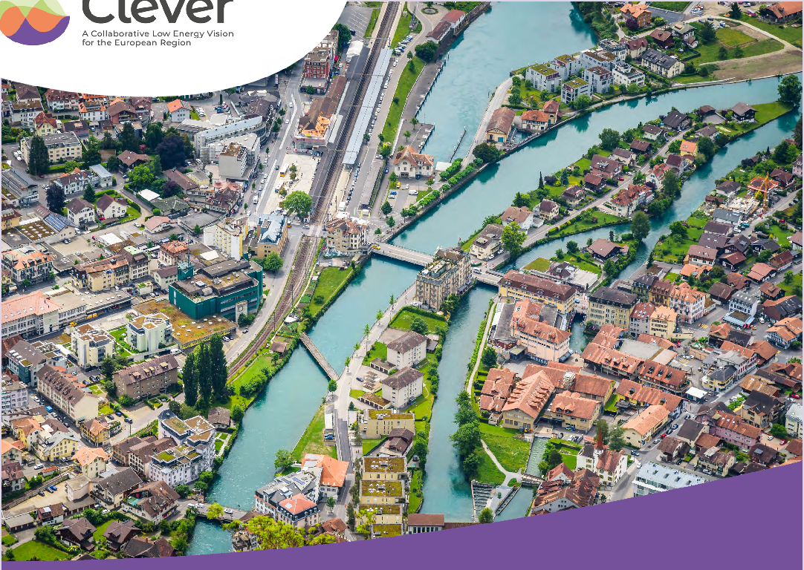

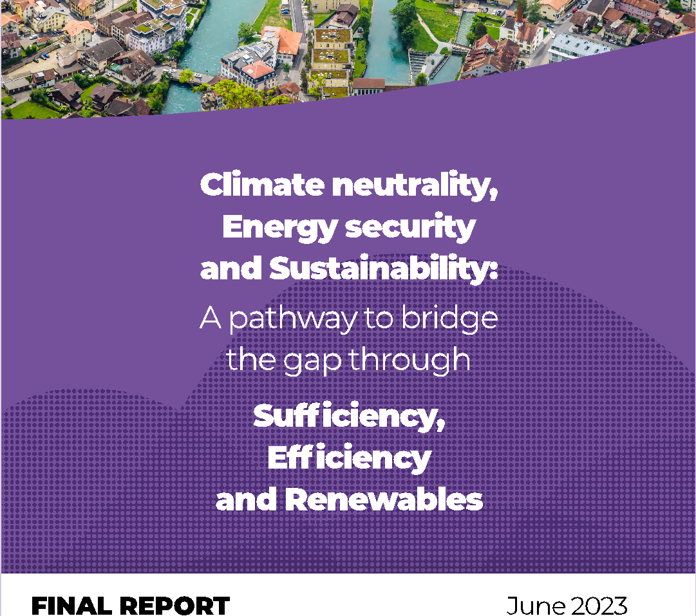

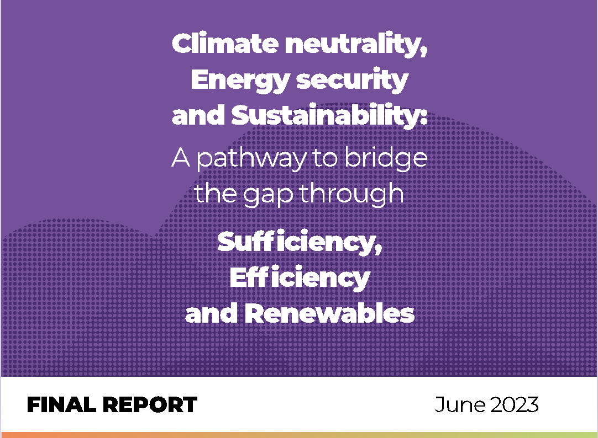

## Climate neutrality, Energy security and Sustainability: A pathway to bridge the gap through Sufficiency, Efficiency and Renewables

FINAL REPORT June 2023

| 3

# About

#### The CLEVER network

This scenario has been built by the following network of European organisations: The following report was written by the project leader, négaWatt Association. It was proof-read by the CLEVER network project leaders and Naomi Walker.

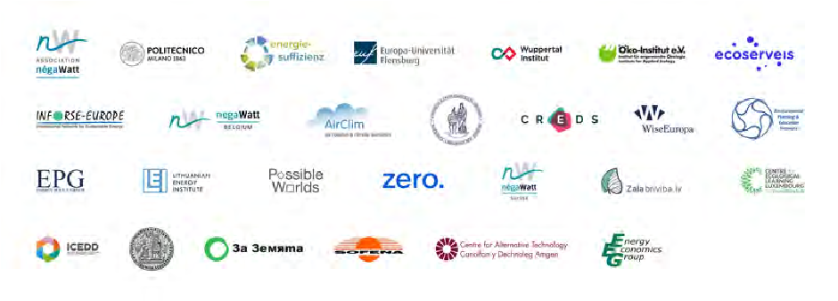

Report drafting (négaWatt Association)

Stephane Bourgeois, Nicolas Taillard, Emile Balembois, Adrien Toledano, Alexandre Gabert, Yves Marignac, Fabien Baudelet, Sébastien Teysset

Project coordination (négaWatt Association)

Stephane Bourgeois

Design (négaWatt Association)

Stephane Larue-Bernard

#### A project supported by:

Cover picture: pexels.com/fr-fr/@vikramdeo/

Updated: 30 October 2023

4 | CLEVER: a Collaborative Low Energy Vision for the European Region | 5

# Contents

# Introduction

In the next 20 years, Europe needs to achieve double the GHG emissions reduction in s that it has in the past 30 – to say nothing of the actions required to safeguard energy security, restore biodiversity and address other environmental disruptions. The next 10 years will be critical in this regard. Low-carbon technologies such as nuclear power and Carbon Capture and Storage (CCS) – quite apart from the sustainability hazards that they generate and their cost – cannot deliver within the required time scale. And although renewables are already showing great advances, they alone cannot rise to the challenge. The “energy efficiency first” principle still needs to be fully implemented, but rebound effects and upward consumption trends attest to the fact that efficiency alone cannot realise all of Europe’s resource savings potential. It is therefore time for sufficiency to come to the forefront of Europe’s energy and climate modelling and policy making. A combination of sufficiency, efficiency and renewables appears necessary so that Europe can live up to the unprecedented challenges that it faces, and set itself on a path of strong, 1.5°C-compatible resilience.

Europe is at a tipping point. More than ever before, European citizens are seeing and feeling the direct consequences of the dramatic climate emergency in their everyday lives: giant forest fires, winter droughts, summer heat waves and torrential rains have become a reality that is set to intensify on the continent.

Introduction............................................................................................................................5

Meanwhile, the Russian Federation’s invasion of Ukraine has deeply reshuffled the cards of Europe’s energy policy, putting energy security at the forefront and bringing the sense of urgency generated by energy security in line with that generated by the climate emergency. The impact on energy prices and beyond are widening already deep inequalities. At the global level, 6 of the 9 planetary boundaries have already been crossed1, putting human life on earth at risk.

- 0. Building the CLEVER vision.........................................................................................7

- 0.1 The CLEVER vision ...................................................................................................................................................................................................8
- 0.2 The CLEVER methodology ..............................................................................................................................................................................10

- 1. Sufficiency, efficiency and renewables deliver a swift and equitable response to the climate and energy crisis..................................15

- 1.0 Introduction: living up to the climate urgency..................................................................................................................................16
- 1.1 Sufficiency, efficiency and renewables are the levers which can and must be mobilised now..................20
- 1.2 Europe can be freed from its dependence on energy imports ..........................................................................................22
- 1.3 Europe can be GHG neutral in 2045 and fully renewable by 2050....................................................................................24

- 2. Sufficiency and efficiency guarantee an effective and fair decarbonisation of consumption sectors...............................................29

- 2.0 Introduction ...............................................................................................................................................................................................................30
- 2.1 Buildings: the deep renovation imperative must be complemented with sufficiency....................................34
- 2.2 Transport: shorter trips and lighter modes should be at the heart of the transition ..........................................41
- 2.3 Industry: sufficiency and circularity should be the basis of decarbonisation..........................................................49

- 3. Renewable energy sources are the backbone of a resilient European energy system.....................................................................55

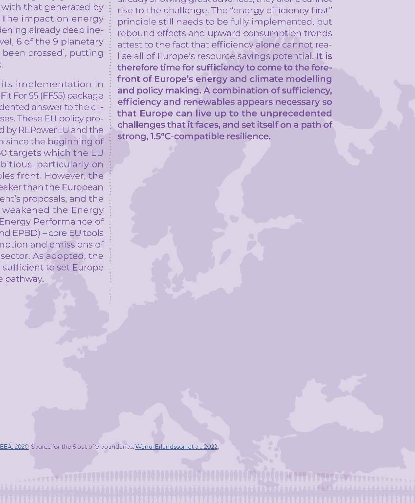

The EU Green Deal and its implementation in European law through the Fit For 55 (FF55) package have provided an unprecedented answer to the climate and sustainability crises. These EU policy proposals have been reinforced by REPowerEU and the numerous initiatives taken since the beginning of the energy crisis. The 2030 targets which the EU is committing to are ambitious, particularly on the climate and renewables front. However, the energy savings target is weaker than the European Commission and Parliament’s proposals, and the Council of Ministers has weakened the Energy Efficiency Directive and Energy Performance of Buildings Directive (EED and EPBD) – core EU tools to address energy consumption and emissions of Europe’s major emitting sector. As adopted, the FF55 package may not be sufficient to set Europe on a truly 1.5°C-compatible pathway.

- 3.1 Matching supply with demand and meeting strong sustainability criteria 57
- 3.2 Electrification is critical, but must be kept within reach to improve the likelihood of a successful transition 65
- 3.3 Bioenergies, hydrogen and PtX can play a key role in applications with few alternatives 70

Conclusion............................................................................................................................77

Annexes.................................................................................................................................78

List of figures & tables.....................................................................................................84

1 | EU impact on planetary boundaries EEA, 2020. Source for the 6 out of 9 boundaries: Wang-Erlandsson et al., 2022.

References ...........................................................................................................................86

6 | CLEVER: a Collaborative Low Energy Vision for the European Region | 7

# 0. Building the CLEVER vision

This report is the result of 4 years of collaborative work between European experts from the academia and civil society of 20+ European countries, under the leadership of the négaWatt Association. The CLEVER scenario, which covers 30 countries (EU27 plus United-Kingdom, Norway and Switzerland2), is based on a unique approach that combines sufficiency, efficiency and renewables and aims to reconcile longterm climate and sustainability imperatives with short-term energy security constraints.

While EU energy and climate scenarios are often built top-down with little national granularity, CLEVER is a fully bottom-up aggregation of national trajectories. It proposes a transformation pathway for Europe, the EU and its Member States, which is feasible – and deeply enshrined into national contexts, with equity and European integration as core values.

###### Country Organisation Country Organisation

End-use Efficiency Research Group – Politecnico di Milano

AT EEG TU Wien IT

négaWatt Belgium ICEDD

LT Lithuanian Energy Institute (LEI) BG Za Zemiata; Sofena LU Consortium Cell/List CH négaWatt Switzerland LV Green Liberty – Zala Briviba CZ Charles University Environment Centre NL Possible Worlds

BE

EnSu (Wuppertal Institut für Klima, Umwelt, Energie, Europa-Universität Flensburg, Öko-Institut)

PL WiseEuropa DK INFORSE Europe PT ZERO ES Ecoserveis Association RO Energy Policy Group (EPG) FR négaWatt Association SE Air Clim Coalition EL National Observatory of Athens (NOA) UK

DE

CREDS Center for Alternative Technologies (CAT)

Environmental Planning and Education Network (EPEN)

HU

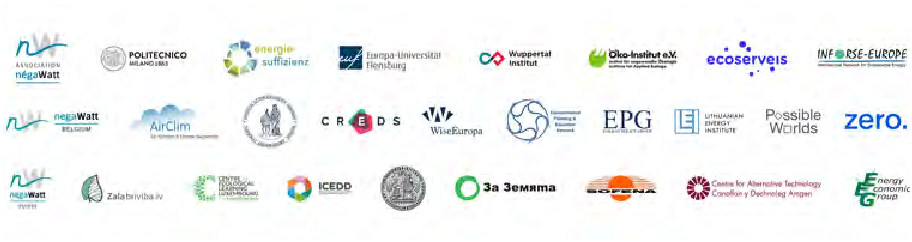

2 | Although the scenario and its global results stand true for this set of 30 countries, many of the results presented in this report relate to the EU27 level, which is specifically mentioned.

8 | CLEVER: a Collaborative Low Energy Vision for the European Region Building the CLEVER vision | 9

The CLEVER project was driven by a sense of urgency regarding the need to strengthen energy and climate action on the European level, and the conviction that a bottom-up construct based on harnessing demand reduction potential at the national and EU level could contribute to meeting the challenge.

increasing number of “behavioural” or “lifestyle” changes as adjustment measures, with a view to increasing ambition. However, these concepts tend to place the burden on individuals and thus be self-discrediting. Sufficiency implies societal and policy changes towards infrastructures which work as key enablers for change, and is intrinsically linked to equity, targeting unsustainable or insufficient consumption rather than everyone’s lifestyle.

###### What does sufficiency involve?

This intention led to the elaboration of a common vision of a sustainable approach and set of objectives. The tools and methodology developed in CLEVER were tailored to match this ambition.

Sufficiency means redesigning collective and individual infrastructures and practices to minimise demand (energy, materials, land, water and other natural resources) while delivering human well-being for all within planetary boundaries4. It differs from efficiency in that the reduction is based on prioritising and rescaling the level of services, while efficiency reduces the level of resources for a defined level of service5. It focuses on quality of life instead of quantity of services and material goods, and puts an emphasis on demand-side measures. And, it is very much related to a vision of equitable transition as illustrated by the doughnut economics theory6.

### 0.1 The CLEVER vision

The CLEVER scenario was built to correct this underrepresentation of sufficiency potentials and underline the potential of redesigning collective and individual practices to harness further emissions cuts, deeper sustainability and increased equity in Europe. By placing sufficiency at the core of its approach, CLEVER’s vision is to demonstrate how this concept is both necessary and desirable – and what it has the potential to deliver3.

The CLEVER scenario is guided by a clear ambition: shaping a long-term, desirable vision, which is consistent on the European level and meaningful in each national context, is strongly in line with climate and energy security objectives, and can be implemented through a realistic, intelligible pathway.

The CLEVER scenario’s ambition, based on these long-term objectives and this systemic framework, is also to ensure that the scenario translates into a safe pathway, where safe signifies feasible and acceptable, from at least three perspectives:

#### Bridging short-term urgency and long-term sustainability

▶ Sufficiency, which encompasses collective and individual action at the level of use by prioritising and rescaling rendered services (as detailed in the box below);

The goal of the CLEVER scenario is to bridge short-term responses to the current crisis with the double imperative of accelerating the pace of climate action and reducing dependency on fossil fuel imports towards more profound changes, ensuring climate neutrality and European energy security. The scenario’s elaboration was therefore guided by two paramount objectives on the aggregated level of the 30 countries covered, agreed upon amongst partners:

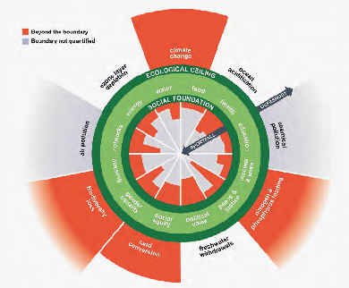

▶ First, this implies establishing a sound balance between what can be called the realism of ambition and the realism of action. While the insufficient pace of change, in the face of climate scientific evidence, calls for raising objectives, the inertia of even the most voluntarist transformations and the availability of resources must be taken into account. The most affordable, diffuse and scalable options must be prioritised.

▶ Efficiency, which reduces the level of resources required to serve a certain level of energy service by improving technical performances (reducing losses) at all stages of processing;

▶ Renewables, which are not only low-carbon options, but intrinsically based on tapping into natural flows and as such, when used in the right conditions, are more sustainable than stock-based energy resources.

▶ reaching net zero GHG emissions as soon as possible, with an initial emissions limitation set to 2050 at the very latest, and the key criteria of keeping cumulated emissions below a 1.5 °C-compatible carbon budget, which brings the net zero deadline closer to 2040;

▶ The pathway must not only be safe on an aggregated level, but also ensure a socially-just transition on different levels. The CLEVER vision seeks a meaningful and fair distribution of efforts and benefits between countries, and within each country.

Doughnut economics illustration from K. Raworth, bounding a sustainable economy between a social foundation and an ecological ceiling (defined by planetary boundaries).

Bringing the level of energy services to a judicious level through sufficiency, taking into account needs and limitations, and combining this adjustment with increased efficiency is essential to control the level of energy demand, so that the development of new, more sustainable energy supply may more quickly replace – rather than add to – dominant energy sources. As such, the SER approach – and its particular emphasis on clarifying the role of sufficiency – has the potential to maximise both substitution and the pace of substitution (and therefore also cumulative impacts).

▶ reaching 100% supply by local renewable energy, minimising reliance on imported, higher risk, still unproven or less sustainable supply options.

▶ Finally, the kind of deep changes considered cannot be assessed only through energy demand, supply and GHG emission criteria. The transformations are likely to have much more systemic implications on other environmental issues (biodiversity, land use, depletion of materials, etc.) as well as on social, economic and societal issues. Although these aspects are not directly covered through modelled quantification in the CLEVER scenario, the scenario was built with a constant concern for such a strong sustainability.

###### Sufficiency has the potential to renew the economy

Reaching such objectives requires deep changes in the energy system on both the supply and demand sides. The approach chosen by CLEVER to reflect on these systemic changes is based on the pioneering work of the négaWatt Association, which developed the Sufficiency, Efficiency, Renewables (SER) framework through its elaboration of energy transition scenarios for France. The SER framework can be described as a systematic, socio-technical implementation of change to the energy system, designed as a three-layer set of actions and transformations to better deliver energy services to end-users:

Together with the rationale for reinforcing redistribution effects, sufficiency proposes a restructuring of society that, when combined with efficiency measures and renewables deployment, has in a number of studies7 been shown to increase employment in the long term.

Sufficiency potentials have been well defined and assessed in the latest IPCC report1. However, until 2022, the concept has remained absent from most public policies and political discourse, including at the European level, and has – to date – been underrepresented in energy and climate scenarios2. Scenarios and policies are incorporating an

- 3 | A comprehensive review of the literature on the necessity, desirability and possibility of sufficiency has been provided by FULFILL, 2023 (EU-funded project).

- 4 | IPCC, 2023, p.31 and Toulouse et al., 2017.

- 5 | See this briefing note on sufficiency: CLEVER, 2022.

- 6 | Raworth, 2017

- 7 | The positive impact of energy and climate transition pathways based on sufficiency in France have been assessed in 3 different scenarios: négaWatt, 2017,

- 1 | Different sufficiency measures (modal shift, avoidance of demand, etc.) are assessed in the AR6’s SPM IPCC, 2023, p.31.

- 2 | See the CLEVER, 2022 briefing note on sufficiency’s integration into climate and energy strategies.

10 | CLEVER: a Collaborative Low Energy Vision for the European Region Building the CLEVER vision | 11

###### A physical modelling approach based on the bottom-up aggregation of national trajectories

provided that our economic systems are redesigned to prioritise well-being over simple material growth, and consider new parameters (such as happiness, decent living standards and environmental indicators) to guide the economy in addition, or as alternatives, to GDP.

Sufficiency also provides multiple co-benefits, such as health improvements, and pollution reduction, which have a positive impact on living conditions and the economy, and can make the economy more resilient to global risks and shocks.

construct that allows the implementation of levers to be described. The construct’s mode of operation is illustrated in Figure 01.

To begin with, in order to be consistent with the systemic optimisation approach just described, the modelling itself, using simulation rather than optimisation tools, relies on a bottom-up, physical

Sufficiency can be compatible with economic growth, as illustrated at the global level by the IPCC’s Shared Sustainable Pathway SSP1 (the most ambitious pathway in terms of greenhouse gas emissions, based on the most ambitious sufficiency narrative),

CLEVER results will be assessed in relation to the amount of investment required and the funding necessary in a ‘Road to net zero’ study conducted by the Institut Rousseau think tank, with results planned for Autumn 2023.

Figure 01: The modelling approach, based on the Sufficiency, Efficiency, Renewables (SER) framework

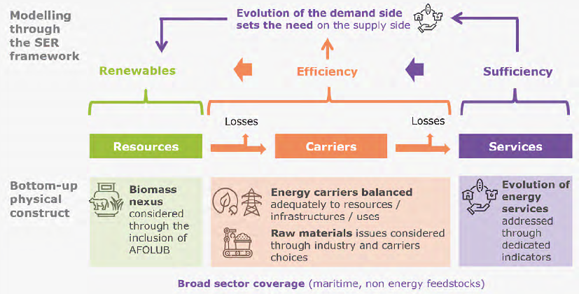

### 0.2 The CLEVER methodology

CLEVER’s systemic ambition translates into an ad hoc, systemic methodology, the principles of which were duly discussed and agreed upon within the network of partners.

#### Systemic optimisation embedded in UN Sustainable Development Goals

trade-offs. For instance, energy sufficiency and efficiency related options, and electric renewables reach much better scores than nuclear power or Carbon Capture and Storage (CCS)8. This input was combined with other criteria, such as the affordability of different options for various stakeholders, their granularity, and their lead-time. More innovative options were examined through a maturity scale, taking into account both their technological and manufacturing readiness and the remaining degree of uncertainty regarding their potential environmental or social impacts.

The process of agreeing on the main objectives started before modelling. Indeed, while the main objectives related to climate neutrality and 100% renewables supply, it was clearly agreed that significantly reducing energy demand, through implementation of sufficiency and efficiency, was not only a means to target these objectives, but a goal in itself on the path towards strong sustainability.

The principle underlying the modelling is to start with a characterisation of the level of energy services and their evolution, based on dedicated indicators, and to then address all the conversions and transformations occurring through the energy chains, and work back up to the required primary resources.

Based on the SER framework, further analysis was conducted in order to address the potential of the various options to transform the energy system and make it more sustainable. In its special report on 1.5°C, the IPCC insisted on the need to consider the impact of climate mitigation options on other sustainability issues: it provided a comprehensive literature review of the possible impact of the 23 most significant GHG emission reduction actions on each of the United Nations’ Sustainable Development Goals (SDGs), thereby pointing to the potential for synergies as well as the risk of

Next, the modelling tools were tailored to develop the CLEVER scenario through an iterative process (illustrated Figure 02).

Not only is this approach consistent with the SER framework, it also addresses important issues such as the balance between energy carriers, with the objective of optimising adequacy between resources and use, taking into account multiple different constraints, such as existing or required infrastructures and raw material issues (see figure 01), as further described in Section 3.1. As an example, this bottom-up approach and the inclusion of agricultural forests and land-use in the construct’s scope of application enable the very complex issue of the biomass nexus to be addressed. In line with the systemic approach, the scope also covers all sectors, including maritime transport and non-energy feedstocks.

This analysis served as a basis for prioritising certain levers such as sufficiency in mobility, thermal retrofitting and photovoltaïcs, for ruling out some options such as new nuclear power or CCS, and for raising awareness about the need for and constraints of other options, such as the use of biomass. This logic provided common ground for discussing the trajectories.

A key feature of the approach was to start from the national level, so that the resulting European scenario is eventually formed by national trajectories that make sense within each country’s context. Existing prospective work available to partners was used as input and made comparable – despite its diversity in scope, terms, ambition and level of detail – through a common dashboard. For the countries for which no specific trajectory was provided by partners, the same tool was used to develop national trajectories with a standardised methodology, using a common set of indicators related to potentials, pace and depth of actions.

part 6 ; ADEME, 2022 (“Frugal Generation” scenario) ; and The Shift Project, 2021. In the UK, CREDS, 2021 used least-cost optimisation models that showed that scenarios with strong reductions in demand were less costly.

8 | Marignac et al., 2021

12 | CLEVER: a Collaborative Low Energy Vision for the European Region Building the CLEVER vision | 13

The modelling work could then focus on harmonising and reinforcing these national trajectories, through a thoughtful technical and policy dialogue. While consistently keeping track of national specificities in terms of potentials, constraints and preferences, this allowed the options and level of ambition of all trajectories to be further aligned. An important part of this discussion consisted in setting so-called “corridors of consumption”, based on the consideration of different levels of energy

services in the different countries and the way they could converge towards a common goal within agreed boundaries, as described in Chapter 2.

Figure 03: Map of the CLEVER network and the different levels of partner involvement

Finally, based on the aggregation of these harmonised national trajectories on the European level, the last step was to build a consistent European vision, integrating exchanges and energy flows between countries, the sharing of effort with due consideration of national limitations and remaining potentials, and the convergence of policy strategies.

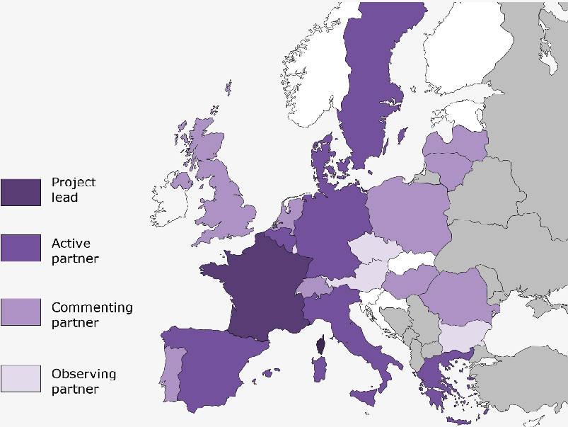

Figure 02: The 3 stages of the CLEVER bottom-up construct process

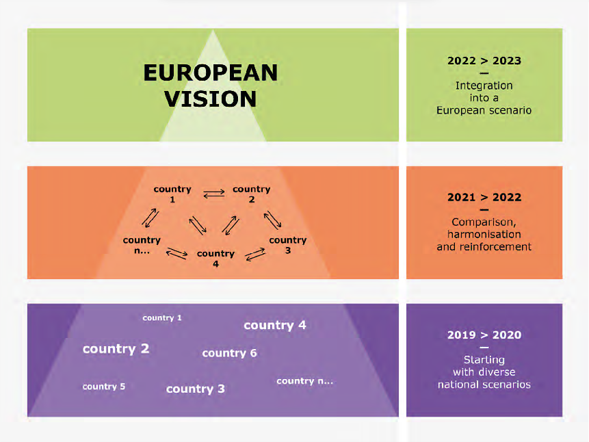

This maps shows the different levels of partner involvement in the project: Active partners worked on bottom-up trajectories: they built their own national trajectory, often based on existing trajectories, in a technical dialogue with the project leader (négaWatt) with a view to harmonising assumptions.

Commenting partners worked on top-down trajectories: they commented on a trajectory for their country in a technical dialogue with the project leader, with a view to making the trajectory solid, and matching it to local circumstances and realities. These trajectories were built by the project leader on the basis of existing literature and the bottom-up comparison and harmonisation of active partner trajectories.

Observing partners participated in the broader project exchanges. These partners sometimes gave the project leader insight into key national issues which should be considered in their country’s trajectory or were prevented from building or fully commenting on a trajectory because of insufficient available national data and expertise for a number of sectors.

Countries in white were covered by CLEVER’s top-down standardised modelling.

and CH). These partners were composed of active partners who contributed to the elaboration of a bottom-up trajectory, commenting partners who helped to refine a proposed trajectory, and observing partners who participated in broader project exchangest, all partners ensuring that the collective and collaborative European vision proposed by CLEVER remained rooted in national contexts.

As a result of this complex and fertile process, the CLEVER scenario, and the associated set of policy recommendations, owe a lot to the network partners’ contributions and fruitful discussions. Altogether, the network includes 26 partners (think-tanks, research institutes, technical universities, civil society organisations, etc.) from 20 European countries (18 EU members, the UK

| 15

1. Sufficiency, efficiency and renewables deliver a swift and equitable response to the climate and energy crisis

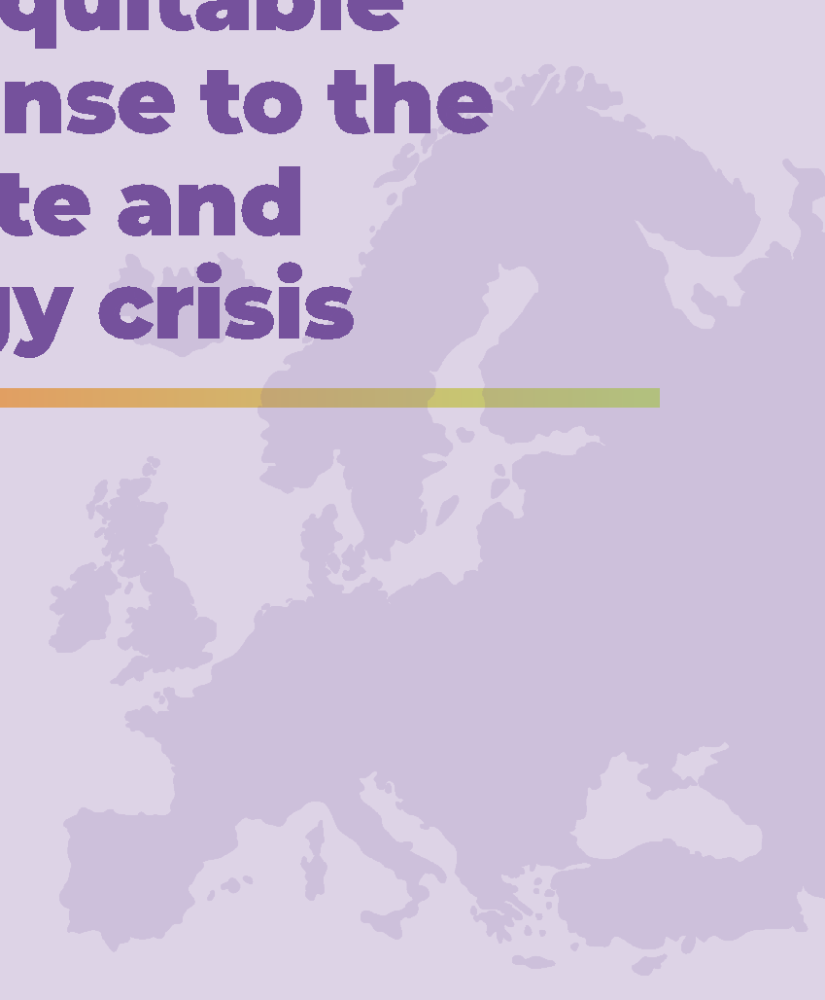

16 | CLEVER: a Collaborative Low Energy Vision for the European Region Sufficiency, efficiency and renewables deliver a swift and equitable response to the climate and energy crisis | 17

### 1.0 Introduction: living up to the climate urgency

In CLEVER, Europe’s 1.5°C-compatible carbon budget (for the 2020-2050 period) is defined on the basis of a particular level of probability of staying below 1.5°C on a global scale and a particular logic of effort sharing. As detailed in the next box, with an estimate of 26-28 GtCO2 as the maximum EU CO2 budget for the period between 2020 and 2041 (year of CO2 neutrality), the CLEVER scenario sets Europe on track towards a fair contribution to limiting global warming below 1.5°C. This European contribution is achieved through a consistent set of actions, targeting both short-term, low-hanging fruit reductions and long-term structural reductions, with sufficiency providing key potential in both the short and and the long term.

security, and Europe cannot afford to waste any time with weak implementation, delays or risky technological gambles.

When the high level of uncertainty inherent to carbon budget calculation (due to correlations with the speed of reduction of other GHGs and with carbon sinks) is taken into account, wasting any time at all appears even more inconceivable. While CLEVER modelling does address all GHG emissions from all sectors, the overall 1.5°C budget for all GHG emissions at the global scale is not available in IPCC documents, hence our focus here on carbon budgets. The CLEVER modelling does enable the corollary quantification of methane emissions, which remain approximately 25% below 1.5°C IPCC2 trajectories. Adopting a cautious and realistic approach, CLEVER reduces reliance on carbon sinks to a minimum, excluding technological sinks by 2050, and retaining a level of natural sinks at the lower-end range of existing assumptions.

CLEVER’s purpose is to reconcile the climate imperative with both the practical feasibility of transformation and broader sustainability constraints. Compliance with the 1.5°C goal is therefore a key objective.

Remaining below a 1.5°C-compatible carbon (CO2) budget is of critical importance. However, this alone is insufficient, as cumulative GHG emissions must be monitored.

Figure 04: Cumulative CO2 emissions in CLEVER for the EU27 from the beginning of 2020

However, the margin is very thin. By 2030, over three quarters of Europe’s carbon budget will have been emitted and, by 2040, it will have been almost completely consumed. Any delay in implementation steepens the required carbon budget reduction curve further. Whether the 2030 targets just agreed upon by the EU in its Fit For 55 package are compatible with such a trajectory is far from certain. REPowerEU reinforcement in response to the energy crisis is certainly an additional step. However, the CLEVER trajectory, which itself appears barely 1.5°C-compatible (see box), is more ambitious in terms of energy consumption and GHG emissions reduction by 2030. What is certain is that the coming years will be the most critical in terms of both decarbonisation and energy

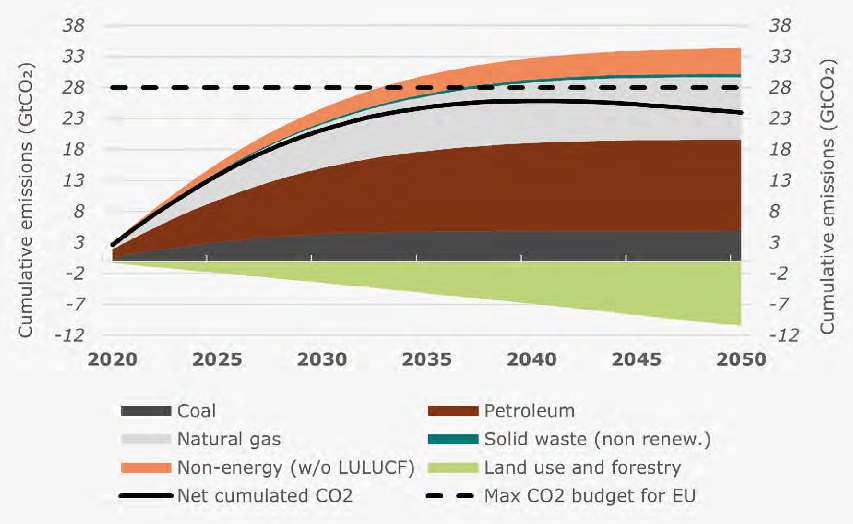

Thus, in light of the above, CLEVER’s ambitious climate and energy targets for 2040 should be embraced as minimum – not maximum – targets for the EU.

This first chapter will begin by detailing why sufficiency, efficiency and renewables are the answer to this emergency and present global results with regards to increasing energy security and achieving energy and climate objectives.

This graph shows how quickly CLEVER’s CO2 budget, barely compatible with a 1.5°C trajectory, is consumed for the EU1. The definition of the CO2 budget presented for Europe is explained in the box below.

2 | Based on SSP1-1.9 and population accounting for the EU. Beyond energy-related CO2, CLEVER covers all GHGs through a simplified, top-down accounting of all sectors, including industrial processes and product uses, waste management and agriculture.

1 | This graph does not include international maritime transport.

18 | CLEVER: a Collaborative Low Energy Vision for the European Region Sufficiency, efficiency and renewables deliver a swift and equitable response to the climate and energy crisis | 19

###### Carbon budgets and sinks

###### Minimising the carbon sinks gamble

###### Taking carbon budgets seriously

CLEVER does not gamble with carbon sinks. Recent LULUCF carbon sink (or negative emissions) projections have been severely discredited by the reality of the climate emergency experienced by Europe’s forests. Indeed, in France in 2019, only 12 MtCO2e of the expected 40 MtCO2e were actually absorbed.

Given these observations and uncertainties concerning the capacity of Europe’s forests to positively adapt to climate disruptions such

Indeed, population is one of the essential criteria in the pursuit of a fair and equitable share6 and a common but differentiated responsibility7 in international-level climate mitigation. The population criteria was chosen for CLEVER because of its simplicity and relative convergence towards equity8.

CLEVER strives to enforce the 1.5°C goal, by remaining within a carbon budget for Europe defined on the basis of:

- as heat waves, droughts, forests fires and the spread of diseases and parasites11, CLEVER assumptions remain at the lower boundary of sink projections (LULUCF) for EU27,
- at -325 MtCO2e/year in 2030 (consistent with the EU LULUCF regulation at -310), and up to

500-550 GtCO2 as the global carbon budget remaining from the beginning of 2020: this

budget is in line with the most ambitious IPCC scenarios (median of C1a scenarios3) and a 50% probability of remaining below 1.5°C by 2050 (which also corresponds to an 83% probability of remaining below 1.7°C by 2050)4.

CLEVER is based on 2015 historical data, with 2020 emission levels being very close to actual EUROSTAT data9. However, because there was as yet no post-2020 emissions data at the time of modelling and CLEVER implementation begins rapidly with -5%GHG/year from 2020, one should be vigilant with Paris-compatible carbon budgets, as any delay in implementation steepens the curve.10

-360 MtCO2e/year in 205012 (above -425 in the European Commission’s Climate Target Plan,

see Figure 06).13

Europe’s fair share of global emissions in proportion to its population (per capita approach, corresponding to 5.1% of global emissions as an average between 2020 and 20505).

Figure 06: Scenarii comparison for EU27 net greenhouse gas (GHG) emissions from Land Use, Land-Use Change and Forestry (LULUCF).

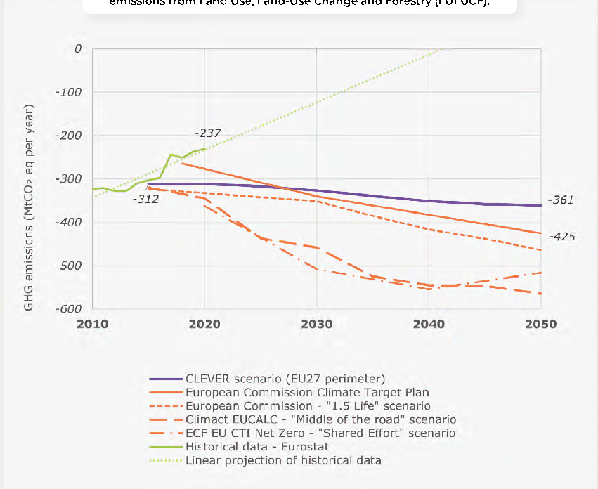

Figure 05: Comparison between CLEVER’s modelled cumulated net EU27 CO2 emissions between 2020 and 2050 and available 1.5°C and 1.7°C budgets, based on different modes of calculation.

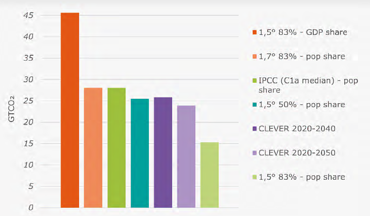

The above EU budgets are calculated based on the IPCC world values for available CO2 budgets to limit global warming to 1.5°C and 1.7°C with 50% or 83% probability. Two modes of calculation for the EU share were used, based on each country’s GDP or its population.

CLEVER’s trajectory for carbon sinks remains at the lower boundary of the different EU scenarios33’s sink projections. This choice was dictated by a risk-limiting approach and the consideration of the current observed decline in sinks (see Eurosat data and its linear projection).

- 3 | IPCC, 2022, p. 20

- 4 | IPCC, 2021, p. 29

- 5 | Average over 2020-2050, as Europe’s share of global population is due to decrease in the coming years.

- 6 | Holz et al., 2017

- 7 | Zhang, 2022

- 8 | Truly equitable (i.e. honouring the common but differentiated responsibilities principle, one of the Framework Convention’s "core principles") integration of a “fair and equitable” EU contribution to the global carbon budget for the coming decades is an intrinsically complex endeavour. More detailed international work is needed on this complex subject. In addition to the population accounting approach – which implies ambitious domestic reductions – CLEVER encourages the partial relocation of Europe’s industrial production (and therefore its related emissions) and all of its energy production to the European continent, which also contributes to the solution (integrated approach). Nevertheless, financial support to the global South remains critical in order to further strengthen this approach.

- 9 | 2.78 net GtCO2, halfway between the Eurostat values for 2019 (3.05) and 2020 (2.69), 2020 being an “unusually” low emission year as a consequence of the Covid pandemic.

- 10 | IPCC, 2021 p.38

- 11 | For explanations of the carbon sink decrease in France: Citepa, 2022, p. 471.

- 12 | This projection was modelled by the Solagro Association, and the main results are presented in CLEVER, 2023.

- 13 | EUCalc, ECF/Climact, 2018, European Commission, 2018

20 | CLEVER: a Collaborative Low Energy Vision for the European Region Sufficiency, efficiency and renewables deliver a swift and equitable response to the climate and energy crisis | 21

### 1.1 Sufficiency, efficiency and renewables are the levers which can and must be mobilised now

#### Sufficiency, efficiency and renewables make new nuclear and CCS avoidable

Beyond emergency sufficiency measures, structural sufficiency, efficiency and renewables can and should be activated in order to set Europe on a 1.5°C-compatible pathway. These measures and technologies are based on existing solutions that have been tested for their operationality, effectiveness and low risks – such as deep renovation, wind and solar electricity, and societal change, for which

European society appears ready19 – and that should be driven by regulation, such as mobility modal shift, new spatial planning and sharing incentives (cohabitation, carpooling).

With an immediate and ambitious rollout of these measures, GHG emissions can be sufficiently reduced to keep Europe on a 1.5°C-compatible trajectory.

Sufficiency, efficiency and renewables are the levers which must be activated and can deliver now as a response to the climate emergency. Emergency sufficiency measures, which address the level of services used, can deliver substantial energy savings both immediately and in the long term. More structural sufficiency measures, like efficiency and renewables, require infrastructure and policies that must be implemented as soon as possible in order for these measures to deliver their full potential in the middle and long-term. Given the urgency of the context, socially-just transition and equity principles should be applied to smoothen the transition. An initial strategy to do so is by implementing sufficiency in accordance with doughnut economics, as defined in the introductory chapter, as this can facilitate fair effort sharing. However, this should be supplemented by social policies at the national level.

Figure 07: Acceptance of sufficiency measures in Europe20

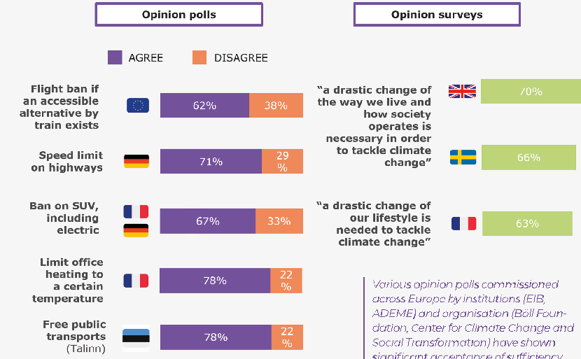

#### Emergency sufficiency measures can alleviate pressure ahead of the 2023-2024 winter

Emergency sufficiency measures can be activated immediately through regulations and incentives. They have already emerged in the political debate as a result of the energy crisis and, in particular, of the European Union’s voluntary 15% gas consumption reduction target for the August 2022 – March 202414 period. The European Commission15 and various national plans16 recommend emergency sufficiency measures. However, few projected strategies and plans actually use the term “sufficiency” or have effectively resulted in the implementation of sufficiency measures. The CLEVER scenario and methodology offer the potential to build on these initial emergency measures with a broader sufficiency framework that can safely steer Europe through the 2023-2024 winter and further increase Europe’s energy independence.

Here are some examples of measures integrated into CLEVER:

▶ Speed limits: Regulation of speed limits in all EU countries to 110 km/h on highways and 80 km/h on country roads17.

▶ Hot water: Rapid deployment of boiler insulation and water flow restrictors.

▶ Heating: Reduction of indoor temperature to 19°C in 30%-40% of households.

Various opinion polls commissioned across Europe by institutions (EIB, ADEME) and organisation (Böll Foundation, Center for Climate Change and Social Transformation) have shown significant acceptance of sufficiency measures and in contrast a mistrust of technological solutions.

These measures could rapidly contribute to reductions of final energy consumption18. The EU’s initial attempts to address emergency sufficiency confirm the relevance of CLEVER’s vision of better future crisis mitigation. The earlier we shift towards sufficiency, efficiency and renewables, the higher our resilience to future risks.

In the CLEVER scenario, no new nuclear power or CCS plants need to be built, and the SER approach enables the phase-out of existing nuclear power plants so that Europe becomes fully renewable by 2050, as seen in Sections 1.3 and Chapter 3.

On the contrary, decarbonisation levers such as new nuclear or Carbon Capture and Storage (CCS) remain uncertain in terms of both the risks they generate, their deployment pace and their costs. They cannot deliver before 2035 at the earliest21, by which time most of the carbon budget will have been consumed. Investing in these technologies deviates investments from safer, already available and more acceptable SER levers and significantly jeopardises the safe achievement of the 1.5°C trajectory.

- 14 | This target was achieved for the August 2022 to March 2023 period (Bruegel, 2023 ; Eurostat, 2023) and extended by the EU Commission in March 2023 to March 2024.

- 15 | The “Playing my part campaign” identifies 9 emergency sufficiency measures that citizens can take, targeting modal shift and rescaling of consumption to the needs in particular, while the REPower EU Annex “Implementing the EU action plan” identifies the measures that can be taken on a European level.

- 16 | Such as the French energy sufficiency plan, which aims to reduce France’s overall energy consumption by 10% by 2024.

- 17 | These measures are already in place for highways in the UK and the Netherlands and for country roads in France and the Netherlands.

- 18 | Speed limits could immediately reduce the final energy consumption of cars by at least 4%(equivalent to 5% of EU 2021 Russian oil imports in 2021). Hot water tank insulation and water flow restrictors can lead to an important reduction in hot water energy consumption for hot water of 5-7% in 2025 and 30% by 2030 (equivalent to 2% and 6% respectively of EU 2019 Russian gas imports in 2019). 30%-40% of households reducing indoor temperature to 19°C can deliver a reduction of 5% of space heating consumption (equivalent to 6% of 2019 EU 2019 Russian gas imports). The impact of an additional 51 further emergency sufficiency measures has been assessed for France by the néegaWatt Association. These additional measures, resulting in a potential 13% reduction in final energy consumption of 13% by 2024. See French presentation of the measures presentation in French.

- 19 | Significant evidence of social support for structural sufficiency measures has been compiled in a dedicated CLEVER note on sufficiency and is currently being studied in the EU’s FULFILL funded research project.

- 20 | Sources for opinion surveys: CAST, 2021, ADEME, 2022 and opinion polls: EIB, 2022, Böll, 2023 (FR, DE), Gabaldón-Estevan et al., 2019.

- 21 | Of all the solutions presented by the IPCC’s AR6 for 2030 (IPCC, 2023, Figure SPM.7) nuclear and CCS have the lowest mitigation potential to 2030.

22 | CLEVER: a Collaborative Low Energy Vision for the European Region Sufficiency, efficiency and renewables deliver a swift and equitable response to the climate and energy crisis | 23

### 1.2 Europe can be freed from its dependence on energy imports

#### By 2050, Europe can be independent from all forms of energy imports

CLEVER achieves an almost complete phase-out of energy imports from non-European countries through a shift in focus to more locally available sources of production.

The CLEVER scenario proposes a trajectory which makes fossil fuel imports redundant in the short and medium term, and risky and costly imports of Power to X (PtX, see Chapter 3) avoidable in the longer term. This increases the likelihood of decarbonisation and reduces the cost of adapting infrastructures and fossil energy supply chains to the consequences of climate change. Although total EU energy independence in the sense of autarky is not in the spirit of the CLEVER scenario, the SER framework can make Europe truly resilient, in terms of geostrategic dependencies and international-level risks.

The 3 levers (sufficiency, efficiency, renewables) have the potential to free Europe as soon as possible from all forms of energy imports, and first and foremost from fossil fuels.

Indeed, energy imports (mainly fossil fuels) – equal to 11 000 TWh in 2019 (oil 5 200 TWh, gas 3 800 TWh, uranium 2 000 TWh, coal 1 800 TWh) – decrease in the CLEVER scenario, to 6 400 TWh by 2030 and 2 000 TWh by 2040. All forms of energy imports disappear almost completely by 2050.

#### Europe’s fossil gas consumption can be halved before 2035, without reverting to coal

Conversely, local production sources gradually take over, rising from 4 600 TWh in 2020 to 7 400 TWh in 2050, i.e. a 60%increase, making it possible to supply a decreased energy demand, lowered through consumption reduction efforts.

In the CLEVER scenario, fossil fuel consumption for energy purposes is eradicated from the EU in 2050. Coal, in particular, is eliminated by 2035, fossil gas by 2045 and oil by 2050.

remaining in 2035 is of domestic and biogas origin. 30% of distribution network gas is used for industry, 25% for residential use and 15% for transport.

Concerning fossil gas in particular: its primary consumption is halved before 2035, without leading to an associated increase in the use of coal or oil, and half of the total gas consumption

From 2040 onwards, fossil gas imports and consumption cease22 , as shown in the following section for EU27.

Figure 09: Evolution of EU27 energy imports in CLEVER

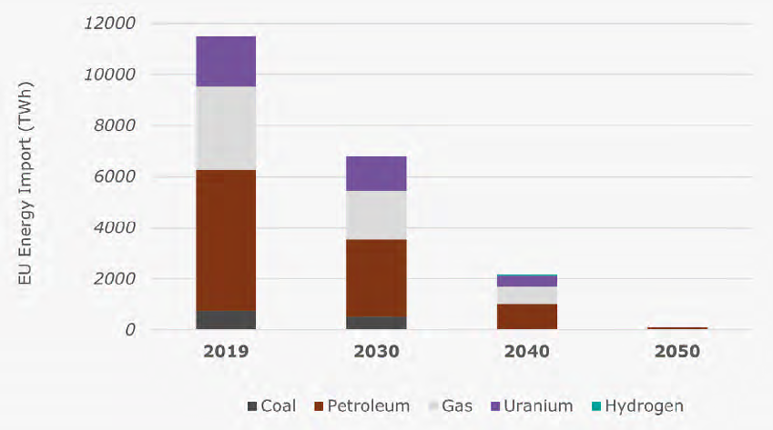

Figure 08: Evolution of primary consumption of fossil fuels for the EU27 in the CLEVER scenario

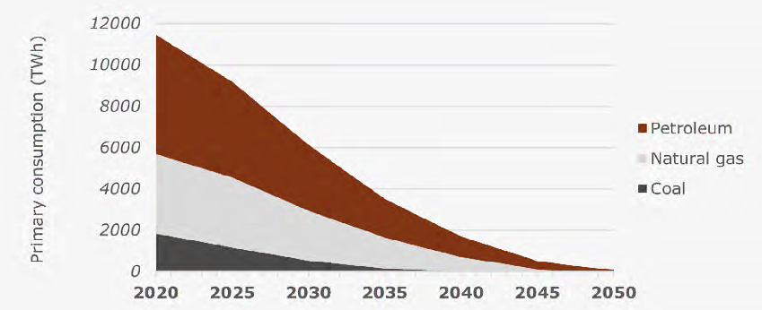

Fossil fuel consumption in CLEVER falls from 76% of the mix in 2020 (11000 TWh) to 54% in 2030 (6000 TWh), 19% in 2040 (1700 TWh) and completely disappears by mid-century. In particular, primary gas consumption is halved between 2020 and 2035 (from 3860 TWh to 1424 TWh).

Energy imports are drastically reduced from 11 000 TWh (of which 9 500 TWh for fossil fuels) in 2019 to 120 TWh in 2050 (mostly imports from Norway)

CLEVER thus highlights a trajectory towards energy independence and resilience to shocks, in which Europe responds to the energy crisis without reverting to diversification of fossil fuel imports or coalfired power production.

Some of the numerous recent deals on fossil gas diversification and infrastructure may appear as redundant, further lock in European emissions, and become stranded investments in the medium term.

22 | 2040 is a realistic horizon to meet this objective through the global ambitious changes envisaged by CLEVER. Achieving such an objective earlier through more focused action could be considered, however potential adverse effects on other objectives would need to be assessed.

24 | CLEVER: a Collaborative Low Energy Vision for the European Region Sufficiency, efficiency and renewables deliver a swift and equitable response to the climate and energy crisis | 25

- Figure 11: Evolution of the share of renewable, fossil and uranium energy sources in CLEVER

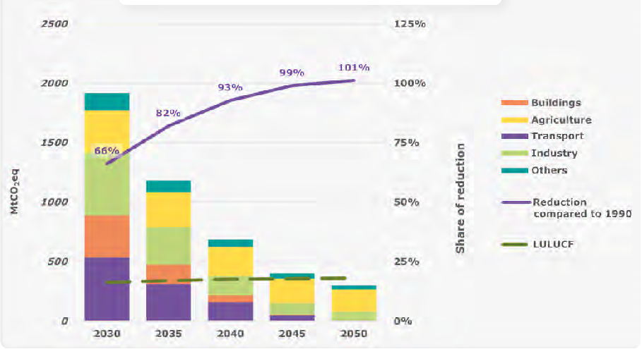

- Figure 12: GHG emissions for EU27 over 2030-2050

### 1.3 Europe can be GHG neutral in 2045 and fully renewable by 2050

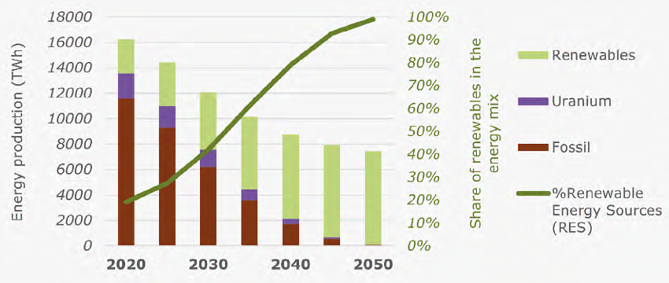

#### Europe can halve its energy consumption

Europe’s final energy consumption (FEC) is reduced from 11091 TWh in 2019 to 4961TWh in CLEVER in 205023. CLEVER thus achieves a FEC reduction of -55%24 (2050) compared to 2019 levels and of -46% in 2040. This is up from -25% in 2030 in comparison to 2019 (-18% if compared to the EED’s

-11.7% objective in comparison to the 2020 reference scenario) and -37% in 2035. As detailed in the next chapter, this is in line with other demand-focused scenarios and about half of the reduction can be attributed to sufficiency, depending on sectors and countries.

Figure 10: Evolution of the final energy consumption for the EU27 in the CLEVER scenario23

#### Europe can reach neutrality in 2045, with -90% net GHG in 2040 as a major milestone along the way

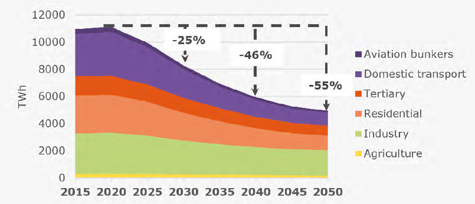

Because of the uncertainties regarding sinks, gross targets should be referred to in the overall net target. In the upcoming 2040 debate, -90% net should be a minimum if Europe wants to remain a climate leader and contribute its fair share to the global climate mitigation cake.

CLEVER reaches climate neutrality in 2045. In 2040, an -86% gross reduction in GHG compared to 1990 levels is reached (corresponding to 689 MtCO2e). With rather conservative assumptions on sinks (see box in this chapter’s introduction), this leads to -93% net GHG emissions (338 MtCO2e)28. These levels are up from 3477 MtCO2e in 2019, -66% net GHG emission reductions in 2030 (1592 MtCO2e) and -82% in 2035 (848 MtCO2e).

#### Europe can be fully renewable

CLEVER reaches a 100% renewable energy system by 2050, with renewable energy sources providing 80%25 of Europe’s gross final energy consumption in 2040 (42%26 in 203027 and

61% in 2035). Renewable energy sources already provide for almost 100% of Europe’s electricity consumption in 2040.

- 23 | Energy Efficiency Directive (EED) perimeter (EU27 including international. aviation, excluding ambient heat and international. maritime)

- 24 | This figure depends on the FEC perimeter. Within the EED perimeter , CLEVER’s 2050 reduction compared to 2019 is -55%. Within a EU30 (EU27 plus UK, NO and CH) perimeter including international aviation and maritime and ambient heat (defined as “Final energy consumption (Europe 2020-2030)” EUROSTAT), CLEVER’s 2050 reduction compared to 2019 is -51%.

- 25 | 75% including international maritime transport (“bunkers”).

- 26 | 42% in CLEVER corresponds to the 42,5-45% RED target, as the CLEVER scenario does not rely on imported biofuels or hydrogen (H2), contrary to what is currently intended and planned in the RED negotiations. REPowerEU considers renewable H2 imports at approximately 2% of consumption in 2030.

- 27 | This does not include imported H2 and bioliquids, as opposed to the EU approach.

28 | These figures do not include emissions from international maritime transport (“bunkers”). The net emission reduction in 2040 modelled in CLEVER when international maritime transport is included is 92%

26 | CLEVER: a Collaborative Low Energy Vision for the European Region Sufficiency, efficiency and renewables deliver a swift and equitable response to the climate and energy crisis | 27

#### Equity between countries and European integration are major enablers

Figure 14: Evolution of final energy consumption (FEC) per capita in key CLEVER national trajectories

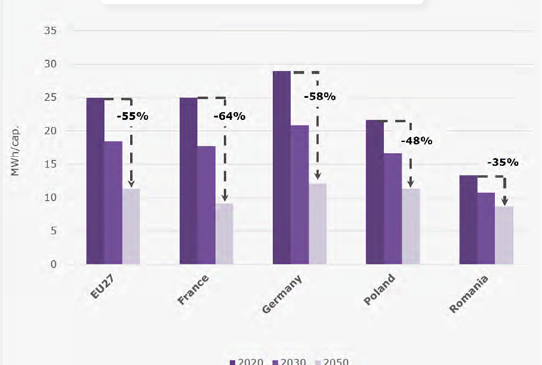

Although energy imports from outside Europe may no longer be necessary, energy exchanges between EU countries will be major enablers for climate ambition reinforcement and renewable energy deployment optimisation (see Figure 13 below).

###### Figure 13: Net exports by country in 2050 for 4 carriers: renewable gas, electricity, solid biomass and renewable hydrogen.

Net exports of electricity in 2050 Net exports of renewables in 2050

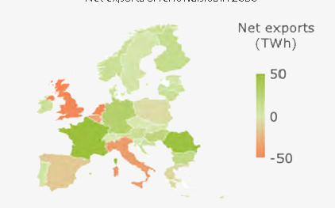

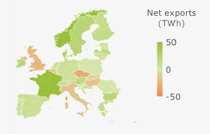

Net exports of green H2 in 2050 Surplus of solid biomass in 2050

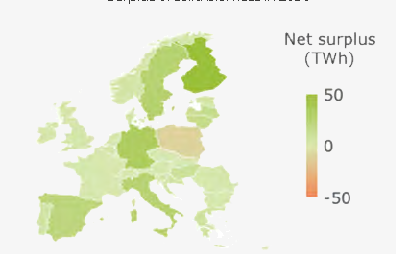

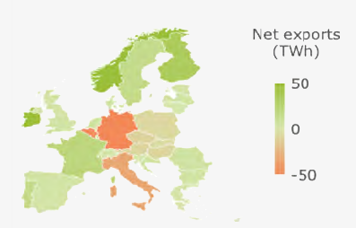

This figure illustrates the different degrees of demand reduction used to facilitate a more equitable transition at EU level. Indeed, France’s effort between 2020 and 2050 is a final energy consumption reduction of 65%, while Poland’s effort is 50% and Romania’s is 40%. These differences leave space for increasing certain types of consumption towards decent levels in the countries that have not as yet reached decent levels (as detailed in the next chapters).

This graph shows the different level of solidarity required in the EU for various energy carriers to stay in a 1.5°C budget and be 100% renewable in 2050. A positive number means the country exports the carrier (e.g. France exports renewable gas). A negative number means the country imports the carrier (e.g. Germany imports hydrogen). In the specific case of solid biomass, imports from other countries are not necessary. In this case, the figures presented must be seen as the difference between consumption and sustainable potential. They are therefore referred to as "surplus".

With regards to consumption, the convergence of consumption levels between countries, with varying degrees of reduction, depending on the different initial situations and room for manoeuvre specific to each country, facilitates a smoothing of the transition at the EU level (see Figure 14 below). This convergence is particularly enabled by the sufficiency corridors described in the introduction of the next chapter.

Furthermore, in terms of GHGs emissions, greater solidarity enables better effort sharing towards carbon neutrality: pooling of natural sinks, with widely varying potentials between countries, facilitates avoidance of risky carbon removal technologies such as CCS.

Main policy recommendations

In the very short-term, Member States should unlock emergency sufficiency measures in order to safely navigate the coming winter. They should avoid any lock-in or stranded investments in gas or coal. The EU should demonstrate leadership and encourage the adoption of fossil fuel subsidy phase-out deadlines at the national level29. Taking care of the communities at risk from the fossil fuel to renewable energy shift must be a priority and socially-just transition policies should be developed to ensure that all countries, regions and income groups are able to participate in the energy transition.

CLEVER’s analysis targeting the 2050 horizon shows not only that the achievement of milestones in 2040 is crucial, but also that the deployment of sufficiency, efficiency and renewables is needed now to secure Europe’s safe and sustainable Paris-compatible decarbonisation.

In its upcoming 2040 Communication and Climate Law revision, the European Commission should propose a net GHG emissions reduction target of over -90%, relying on gross reductions of at least -85% as well as conservative carbon sinks assumptions. In doing so, the Commission should increase the 2030 net target to at least -65% and integrate a milestone reduction target of at least -80% net reductions for 2035, as these are minimum levels on a Paris-compatible pathway. The European Commission should make sure that its carbon budget calculations are as fair as possible and integrate per capita projections until 2050, and should address the issues of imported emissions and global financial compensation.

In order to keep Europe on a 1.5°C – compatible trajectory, 2030 targets and Fit For 55 legislation implementation should be kicked off immediately and in the most ambitious manner, in particular at national level. The following chapters can provide guidance in this regard.

Beyond the answer to the multiple challenges Europe faces today, the transition will provide Europeans with multiple benefits in terms of health, well-being and social justice. All stakeholders will have to be mobilised to enable change and concrete implementation at all levels of governance. This change, as well as the necessary evolution of social standards will have to be steered and accompanied. Given the challenges ahead, it appears urgent that the EU ensure its funding is sufficient to meet the transition needs and that all funding streams (including the streams targeting other sectors) be aligned with Europe’s climate goals. The EU should also increase the transparency of the funds currently being allocated. A fundamental shift in European funding targeting the required transformation is essential.

2040 targets of -45% energy savings compared to 2019 levels and 75% renewable energy should serve as the basis for legislative proposals in the upcoming legislature.

The European Commission should also explicitly integrate sufficiency into its modelling and assumptions, not as an adjustment measure, but as a lever working in synergy with efficiency and renewables in the various sectors (from buildings to transport, to industry and materials, and food and agriculture). To this end, the Commission should properly assess the EU’s sufficiency potential and, with Eurostat, make sufficiency data at the EU and national level available. In addition, the European Commission should make proposals for the integration of a sufficiency chapter in the upcoming revision of the Energy Union’s governance towards 2040 and in National Energy and Climate Plans (NECPs). In their current revision of NECPs, Member States may use the following chapters as guidance.

29 | Europe Beyond Coal, 2017

| 29

2. Sufficiency and efficiency guarantee an effective and fair decarbonisation of consumption sectors

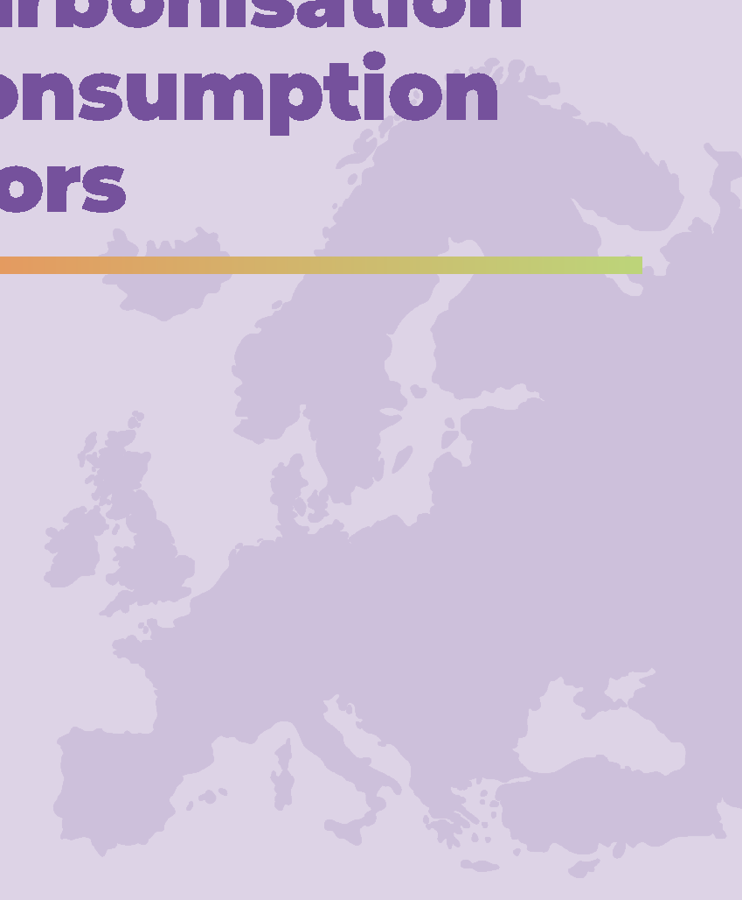

30 | CLEVER: a Collaborative Low Energy Vision for the European Region Sufficiency and efficiency guarantee an effective and fair decarbonisation of consumption sectors | 31

### 2.0 Introduction

###### Figure 16: Contribution of each sector in the EU27 Final Energy Consumption (TWh) reduction modelled in the CLEVER scenario between 2019 and 20505

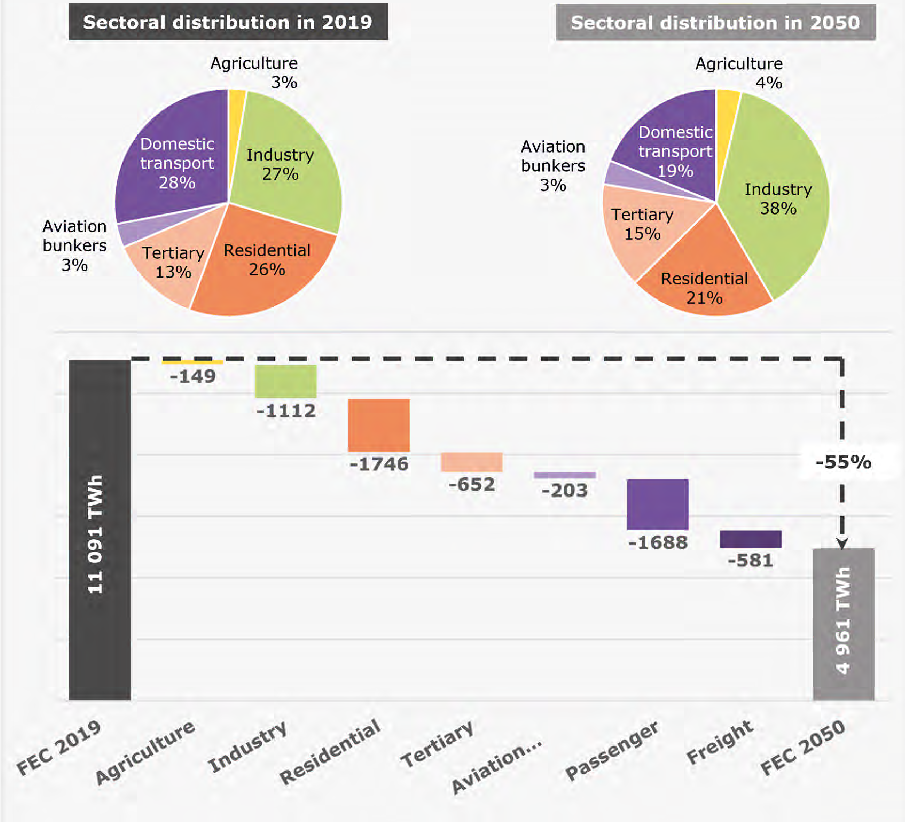

Today, three sectors are the main drivers of EU energy consumption and GHG emissions, with relatively equivalent weights: buildings, transport and industry (see Figure 15 below).

As described in the previous chapters, the first and foremost step of CLEVER’s decarbonisation strategy is to harness Europe’s energy savings potentials.

Figure 15: Final EU27 energy consumption (FEC) and greenhouse gas (GHG) emissions of each sector in 20191

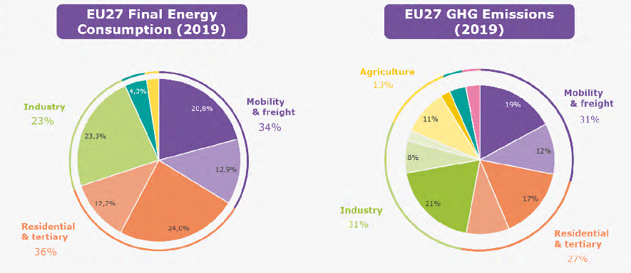

Three sectors are the main drivers of EU energy consumption and GHG emissions (percentages given for 2019):

Buildings, through the residential sector (24% of final energy consumption and 17% of total greenhouse gases) and tertiary sector,

Transport, through mobility (21% of final energy consumption and 19% of greenhouse gases) and freight,

Industry (23% of final energy consumption and 31% of greenhouse gases).

Here, final energy consumption is equivalent to that defined in the EU Energy Efficiency Directive6. Ambient heat, non-energy consumption, the energy production sector (except blast furnaces) and maritime bunkers are excluded from the total. Overall population is expected to remain stable in the EU according to EUROSTAT average projections, which were used for most countries.

A technical note was published on the CLEVER website for the agriculture sector (together with Forestry and Land Use (AFOLUB)), which is not further detailed in this report4.

The CLEVER trajectory enables a final energy consumption reduction of 50% to 55%2 in 2050, compared to 2019 levels. This reduction is comparable to those of other major national and international demand-focused scenarios3 and stems mainly from the transformation of the 3 key sectors (buildings, transport and industry). The following sections of this chapter will focus on these 3 sectors.

###### Sufficiency makes up for about half of the FEC reduction by 2050, compared to 2019 levels, with variations between countries and sectors. Overall,sufficiency is responsible for between 20% and 30% of FEC reduction in 2050 compared to 2019 levels, again with variations between countries and sectors.

- 1 | Energy consumption data originates from EUROSTAT database. Associated greenhouse gas emissions were computed by négaWatt by distributing energy sector (i.e. electricity/heat) GHG emissions to each sector in proportion to their electricity/heat FEC.

- 2 | This figure depends on the FEC perimeter. It represents -55% within the EED perimeter, see the first footnote in Section 1.3.

- 3 | CREDS, 2022

- 4 | CLEVER, 2023, pp.23-24

- 5 | The shares in the diagrams are calculated within the EED perimeter (first footnote in Section 1.3) and do not include ambient heat.

- 6 | Council of the EU, 2023, Chapter 1, Art.5(2).

32 | CLEVER: a Collaborative Low Energy Vision for the European Region Sufficiency and efficiency guarantee an effective and fair decarbonisation of consumption sectors | 33

Table 01: Share of energy consumption reduction in each key sector between 2019 and 2050 and associated contribution of sufficiency for France, Germany and the United Kingdom (based on CLEVER partner country analyses)

###### Main policy recommendations

NECPs should have a specific chapter dedicated to sufficiency and the future newly elected Commission should make proposals to enable this in the revision of the Energy Union’s governance towards 2040. Corridors of convergence may prove useful to guide EU action in this regard.

Based on these corridors, the CLEVER trajectory provides concrete guidance and recommendations, particularly at national level, for decarbonisation of each consumption sector.

Total FEC reduction

FEC reduction due to sufficiency

Total -50 to -55% -20 to -30%

Trajectory assumptions and recommendations should enable Member States to properly implement the 2030 EU targets and legislation adopted in the EU Fit For 55 legislative package, on track for 1.5°C. Member States may use the following chapters as guidance when revising their National Energy and Climate plans (NECPs).

As shown in the next figure, NECPs already include sufficiency measures. However, these are nowhere near the level that is necessary and recommended by citizens’ assemblies.

Buildings (residential and tertiary)

-50% -13 to -25%

Transports (passenger mobility and freight)

-65 to -70% -20 to -39%

-25 to -45% -13 to -36%

Industry

Figure 17: Share of sufficiency policies in all mitigation policies in citizens’ assemblies (CA) reports and National Energy and Climate Plans (NECPs)10

The CLEVER approach to sufficiency consisted in the definition of national consumption corridors towards 2050 for major indicators, on the basis of the bottom-up construct and in-depth accounting of national specificities.

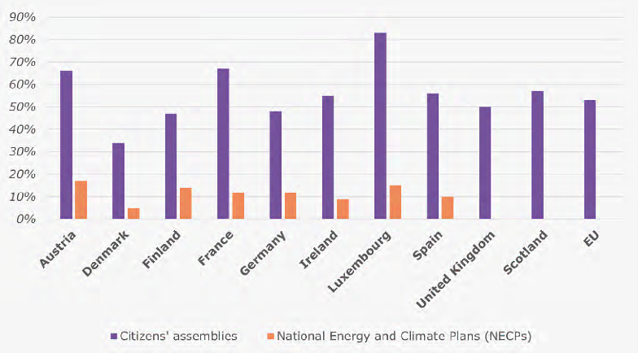

The corridors are bounded by two thresholds for consumption towards which country trajectories converge in their approach to 2050:

▶ A lower threshold based on «decent living», as defined by several studies7,

▶ an upper threshold representing a level of services compatible with a 1.5°C global warming trajectory.8

Corridors aim to foster a decent and comfortable standard of living for all within planetary boundaries.9

NECPs already include sufficiency measures, but at a much lower level than national citizens’ assembly report recommendations, illustrating the gap between people’s acceptance of sufficiency, when its context is made explicit, and its actual implementation in national policies.

- 7 | Such as Millward-Hopkins et al. (2020)

- 8 | Such as Grubler et al (2018)

- 9 | Detailed publications on CLEVER convergence corridors for each sector are available here.

10 | Analysis to be published by CLEVER partner EnSu.

34 | CLEVER: a Collaborative Low Energy Vision for the European Region Sufficiency and efficiency guarantee an effective and fair decarbonisation of consumption sectors | 35

### 2.1 Buildings: the deep renovation imperative must be complemented with sufficiency

In 2019, the residential sector represented 24% of EU27 total final energy consumption (FEC) and 17% of its greenhouse gas (GHG) emissions.

The residential sector is characterised by a number of key energy uses – heating, domestic hot water, specific electricity, cooling and cooking – that are considered separately to model this sector. Each key use comes with its own sustainability challenges (how to achieve decent use for all with limited impact) and technical feasibility issues (especially for deep renovation rates). In order to be able to address these challenges and issues with national partners, so-called “convergence corridors” were defined for each individual use.

Deep renovation and sufficiency give this sector a huge energy consumption reduction potential (up to -50% in 2050). Building decarbonisation is also very much a social policy issue, as Europeans are increasingly affected by energy poverty and huge disparities in living space.11

##### CLEVER scenario key lessons

#### Deep renovation is the key and must begin immediately

Therollout of heat pumps and heating networks is critical to remove fossil fuels from the residential sector and should be integrated into the deep renovation strategy.

Thelarge-scale roll-out of deep renovation is the key and needs to begin immediately.

Sufficiency is the indispensable complement to deep renovation, ranging from short-term responses to the energy crisis to structural changes encompassing dwelling size as well as consumption patterns within dwellings.

practices have proven to be cost-effective while limiting the risk of lock-in effects14. However, to date, most renovations in Europe have been shallow15: a change of method generalising deep renovations is therefore crucial.

For buildings, CLEVER translates first and foremost into a massive deep renovation12 plan. Evidence suggests that only well-coordinated deep renovations, conducted in no more than one to three steps, may reach the required level of energy savings13. Such best

Figure 18: Evolution of the final energy consumption (FEC) and greenhouse gas (GHG) emissions of the building (residential and tertiary) sector at the EU27 level

###### Accelerating the pace of deep renovation is urgent

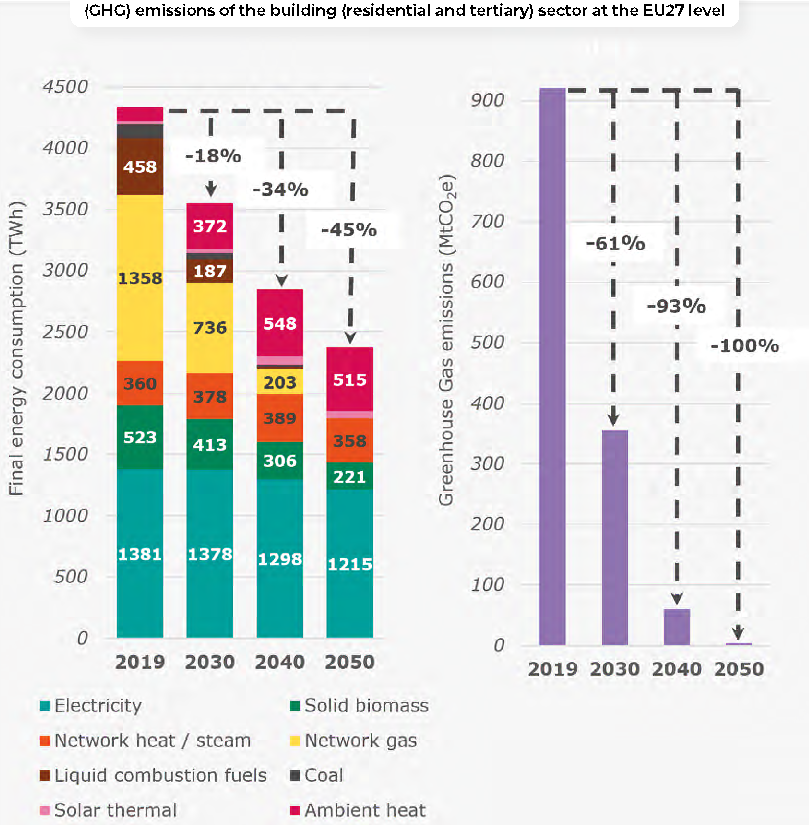

The current pace of renovation (0.2 % on average in the EU) is completely insufficient to achieve the necessary decrease in consumption.16 Therefore, CLEVER has adopted a target of a minimum of2% of buildings deeply

renovated each year by 2030 in the different countries, which translates into at least 60% of buildings deeply renovated by 2050 (see Figure 19).

Figure 19: Average historical and modelled deep renovation rate in incremental 5-year periods (%/year) for a selection of CLEVER national trajectories

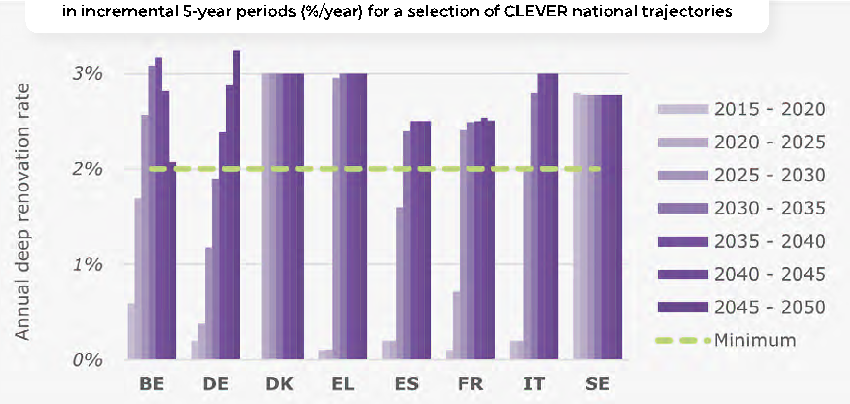

Average deep renovation rates increase sharply in CLEVER national trajectories, reaching 2% by 2030, in contrast with actual – insufficient – renovation rates

- 11 | Millward-Hopkins and Jonhson, 2023 analysed that the UK’s energy transition is currently taking place in a context of growing energy and income inequalities, which could persist in the absence of sufficient efforts to achieve a decent standard of living. The analysis showed that the introduction of high-efficiency technologies (such as heat pumps) could lead to massive energy inequalities if these measures are not accompanied by a levelling of floor space between income groups.

- 12 | CLEVER defines deep renovation as follows: renovation that results in an annual primary energy use below 80kWh/m²/year (for the following uses: heating, cooling, domestic hot water, ventilation and in-built lighting) that does not endanger occupant health, protects the building from any construction-related pathology and ensures thermal and acoustic comfort in summer and winter. It is possible to adapt this definition to climatic zones, as defined in Annex III of the EPBD recast proposal. See CLEVER, 2022.

- 13 | ADEME, Dorémi, Enertech, 2020.

- 14 | Under certain requirements, crucial to the success of these practices: Saheb, 2018.

- 15 | European Commission, 2019.

- 16 | BPIE, 2021.

36 | CLEVER: a Collaborative Low Energy Vision for the European Region Sufficiency and efficiency guarantee an effective and fair decarbonisation of consumption sectors | 37

###### Heating goes fossil-free

###### Main policy recommendations

The rollout of heat pumps and heating networks is critical to remove fossil fuels from the residential sector. However, since heat pumps are fully efficient only in renovated homes17, heating

appliances need to be replaced during or after a deep renovation. The associated evolution of energy carriers forecast by CLEVER modelling is presented in Figure 20.

All Member States should scale up their efforts to reach a minimum of 2% of deep renovation a year by 2030.20

Translate an ambitious deep renovation imperative into the implementation of the Energy Performance of Buildings Directive (EPBD)

To this end, EU and national financial, fiscal, administrative and technical support must be allocated to deep renovation21, and should include specific funding for lower-income households. Training capacities to support construction professionals should also be greatly increased. A phase-out of fossil fuels in space heating is indispensable and should be integrated into the deep renovation imperative. This requires putting and end to the sale of boilers that use exclusively fossil fuels, as of 2035 at the latest.22

Deep renovation should be clearly defined, with energy and GHG emissions (through the Whole Life-Cycle emission indicator18) requirements based on the objective of achieving zero-emission buildings as soon as possible. Each deep renovation item must be clearly defined, as proposed by the European Parliament.19

Figure 20: CLEVER’s forecasted evolution of final energy consumption and carriers for space heating (total EU30 in TWh).

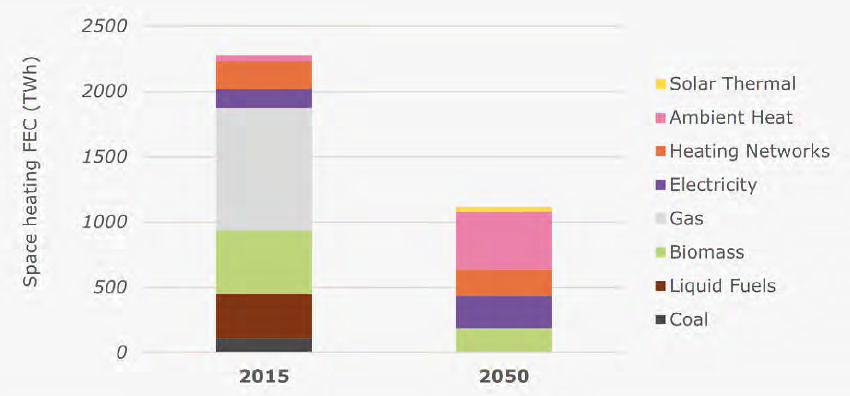

The most important technological change modelled in CLEVER for space heating is a strong increase of heat pumps, to reach approximately 50% of total heating sources in 2050. Thus, the use of electricity mainly supplies heat pumps. This rollout of heat pumps is combined with an increasing share of district heating, while the share of biomass remains stable. These different choices made it possible to avoid the use of biogas in buildings, which was prioritised for other uses in the CLEVER scenario (see Section 3.2). Uncertainties may remain for a marginal share of buildings where these different energy carriers might not be ideal.

- 18 | Which includes, in particular, embedded energy and emissions of building material: BPIE, 2022.

- 19 | “Wall insulation, roof insulation, low floor insulation, replacement of external joinery, ventilation and heating or heating systems and treatment of thermal bridges”, see Article 2, parliament EPBD recast proposal.

- 20 | This effort could be stimulated by strong Minimum Energy Performance Standards (MEPS) defined in the EPBD (see BPIE, 2023, p.10).

- 21 | Harmonisation of the Energy Performance Certificate is essential for coherent MEPS implementation, and is requested by the ECB as integral to the financial incentive process. See the Unlock coalition requests made to the ECB to help make deep renovation accessible by allowing lower interest rates.

- 22 | See CLEVER, 2022 (p.40) for explanations on the urgency of phasing out new sales in order to synchronise renovation and the complete phase-out of fossil fuels.

17 | négaWatt, 2023 and BPIE, 2022

38 | CLEVER: a Collaborative Low Energy Vision for the European Region Sufficiency and efficiency guarantee an effective and fair decarbonisation of consumption sectors | 39

###### The unchecked growth of living space areas can be curbed

###### Figure 22: Evolution of floor area per capita for key national CLEVER trajectories

Therefore, residential sector sufficiency will be critical to reduce new construction needs and unlock full savings potential while ensuring decent living conditions for all.

Between 1990 and 2018, energy efficiency gains in EU buildings were almost completely offset by increases in floor area23: this means that deep renovation alone may be insufficient to address unsustainable or unfair levels of energy and space consumption.

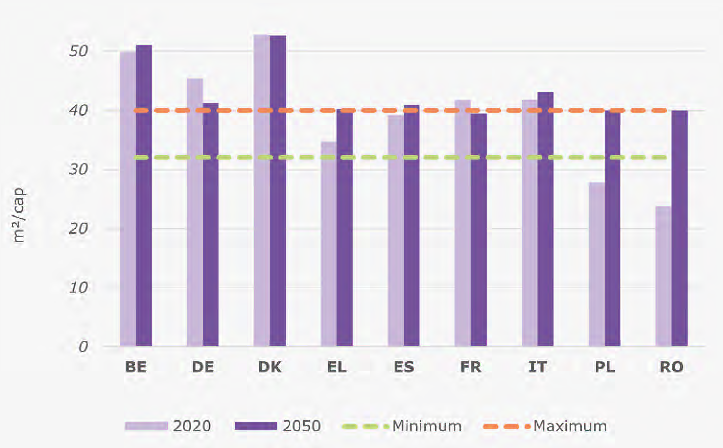

###### Figure 21: Evolution of energy consumption and living space per capita in the German residential sector between 1990 and 202024

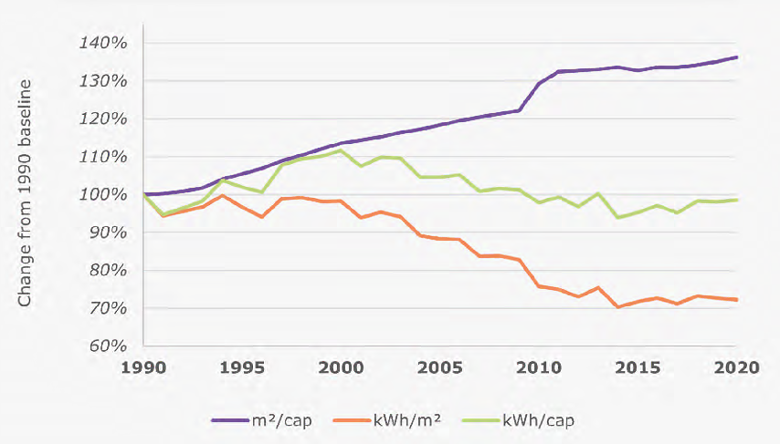

CLEVER’s suggested floor area per capita convergence corridor for 2050 ranges from 32 m²/capita to 40 m²/capita. Thus, in the modelling, living space per capita increases in countries currently below the decent standard (e.g. Poland, Romania) and is stabilised or reduced in most countries currently above the sustainable standard (e.g. Denmark, France, Germany). The bottom-up dialogue with national partners led to the consideration of exceptions to include national specificities (e.g. slight increase in Belgium and Italy). These exceptions relate to building stock evolution inertia and an expected decrease in the number of people per household.

###### Household and appliance consumption can be reduced

To achieve energy and materials savings, sufficiency can also be implemented in the way building equipment and appliances are used and calibrated. When adequately informed and sufficiently motivated, both building users and system installers can contribute to:

In CLEVER’s analysis, the above levers of action are translated through the definition of fair and sustainable consumption corridors for key parameters26:

Despite efficiency improvements, overall stability of the average kWh/person was observed in German dwellings over the last 3 decades. This clearly illustrates how efficiency gains can be undermined by insufficient trends.

###### ▶ 18 to 25 litres per person per day for hot water.

▶ 500 to 700 kWh per person per year for electricity used by appliances and electronics.

▶ Reducing consumption levels, by, where decent energy access allows, setting thermostats to 19°C in winter and 26°C in summer, lowering hot water setpoints to 50°C-55°C25, and installing water flow restrictors.

Addressing floor area per capita is a priority to enable the application of sufficiency principles. It will enable:

▶ Progress towards achieving a minimum decent living standard for everyone.

▶ Avoiding waste, by completely turning off appliances when and where not needed.

▶ The reduction of heating and cooling needs.

▶ The reduction of the residential sector’s ecological footprint (materials, biodiversity, etc.) via the reduction of new constructions.

▶ Improving appliance calibration to match actual needs and uses.

As shown in Figure 22, CLEVER defined a convergence corridor of consumption for floor area per capita.

- 25 | In certain marginal and specific cases, operators must check whether additional legionella testing is required.

- 26 | See CLEVER, 2022 for details of CLEVER’s national implementation of these corridors in CLEVER.

- 23 | EEB and OpenEXP, 2021

- 24 | Gräbner-Radkowitsch et al., 2022

40 | CLEVER: a Collaborative Low Energy Vision for the European Region Sufficiency and efficiency guarantee an effective and fair decarbonisation of consumption sectors | 41

### 2.2 Transport: shorter trips and lighter modes should be at the heart of the transition

###### Main policy recommendations

▶ Financial incentives, such as tax exemptions for multi-family housing, or relocation into smaller premises or non-tourist subleases, and the proportional increase of property taxes with living space30.

Sufficiency should be defined in EU legislation27 in order to support the integration of sufficiency policies into national energy and climate plans. Policies at national and local levels should be implemented in order to limit living space footprints.

##### CLEVER scenario key lessons

This should include:

Finally, there is a need to support household energy sufficiency. This requires:

▶ Strong governance on Land Take limitation (towards a binding zero Net Land Take target by 2050 at the latest. At the EU level, this could be implemented through an ambitious Soil Health Law28, which could be facilitated by (national and local) policies systematically targeting the refurbishment and use/reuse/ reconversion of existing buildings, structures and built-up land.

▶ The acceleration of the adoption of product regulations and labels integrating sufficiency to encourage correct calibration and reasonable use of appliances.31

The emergence of asmaller, lighter and increasingly shared and pooled fleet of electric cars, together withbiogas trucks, enables an alleviation of thepressure on critical resources such as lithium for vehicle batteries.

Sufficiency is a no-regret option that needs to be combined with other levers, especially electrification, which cannot sustainably deliver alone.

Modal shift in particular is key and a sharpdrop in air travel is required, coupled with an increase in rail travel.

▶ The fast roll-out of water flow restrictors at national and local levels, combined with their inclusion in EU tap and shower head product regulations.

Figure 23: Summary – Evolution of the final energy consumption (FEC) and greenhouse gas (GHG) emissions of the transport (mobility and freight) sectors at the EU27 level

▶ Creation of local agencies dedicated to supporting collective housing29 and/ or the integration of sufficiency into the mandate of building renovation one-stop-shops.

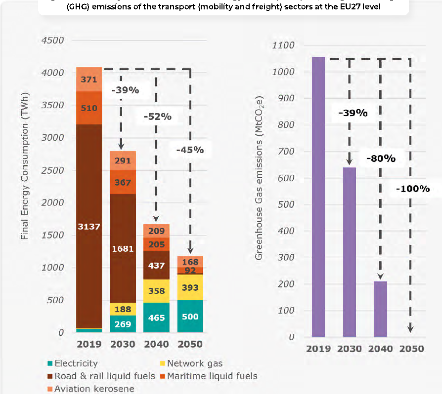

▶ Incentives for energy suppliers to propose contracts and offers favouring low consumption to their customers, in order to encourage reduced consumption and to promote equity.

###### The tertiary sector should comply with deep renovation and sufficiency imperatives

▶ Floor area convergence: to provide decent public services while limiting environmental impact.

In the CLEVER scenario, tertiary sector transition follows the same patterns as residential sector transition. This transition is based upon 3 pillars:

▶ Sufficiency measures within buildings: in particular in order to limit specific electricity (through correct dimensioning and use of appliances) and indoor temperature.

▶ Deep renovation: at an ambitious pace similar to that of the residential sector.

###### Main policy recommendations

Policies for deep renovation and sufficiency measures within tertiary buildings are similar to the measures detailed in the residential section.

Limiting tertiary sector floor area could be achieved in particular by measures prohibiting the expansion of commercial areas32 (that leads to soil sealing) and increasing home working (see mobility measures below).

- 27 | As formulated by the EU Parliament in the EPBD recast, see also EEB, 2023 (note supported by several CLEVER network members).

- 28 | As requested by around 280 organisations in March, 2023.

- 29 | Such agencies already exist in Hamburg and Frankfurt.

- 30 | This is already the case in Italy for example. Further financial mechanisms aiming at reducing floor area are explained in EEB, 2022, p.7.

- 31 | More details are provided in the policy recommendations of Chapter 2.3’s first section.

- 32 | Prohibition implemented in France for all project over 10,000 m2 (Legifrance, 2021 – art 215).

42 | CLEVER: a Collaborative Low Energy Vision for the European Region Sufficiency and efficiency guarantee an effective and fair decarbonisation of consumption sectors | 43

In 2019, the mobility sector represented 21% of EU27 final energy consumption (FEC) and 19% of its greenhouse gas (GHG) emissions. It is a sector that is today still almost entirely dependent on oil imports (98% in the EU27 in 2019). This sector also faces health challenges (mainly related to air pollution, but also to noise exposure, sedentary lifestyles and road accidents) and social problems (mainly related to access to mobility).

The corridors made it possible to define achievable, decent and low energy objectives for overall passenger traffic, as well as for each mobility mode33, shaping a comprehensive vision of how EU citizens will travel in 2050. Figure 24 below illustrates this approach through the example of the evolution in distances travelled, which is one of the key levers for decarbonising mobility. This was modelled by defining a decent minimum mobility need while assessing potentials for shortening daily trips (e.g. through better service accessibility thanks to city planning, home working, etc.) as well as leisure trips (e.g. by promoting local tourism, discouraging frequent flyers, etc.). The figure shows significant disparity between the European countries in 2015. For each country, assumptions were made through technical dialogue between CLEVER partners to ensure that passenger traffic in 2050 is within the defined corridor.

#### Main levers of passenger mobility decarbonisation

Mobility decarbonisation in the CLEVER scenario is first and foremost based on the gradual reduction of the distance travelled for commuting and personal reasons (as described in the previous paragraph). As a result, the share of public and active transport increases significantly, reducing the share of car and air travel. Remaining car trips are mainly

made by carpooling, with lower speeds and efficient electric cars better suited to uses (smaller cars on average, development of micro-cars in urban areas and car sharing). Figure 25 below summarises the CLEVER scenario’s main levers in the mobility sector and the associated convergence corridors and 2050 targets, if any.

In the last decades, most EU and national infrastructure and policies have continued to favour car and air mobility. This trend must be reversed to meet European mobility challenges. Sufficiency will play a key role in this transformation.

Figure 25: Main levers of mobility decarbonisation in the CLEVER scenario

The CLEVER harmonisation methodology, based on consumption convergence corridors defined between national partners, played a central role in the modelling of CLEVER’s mobility trajectory.

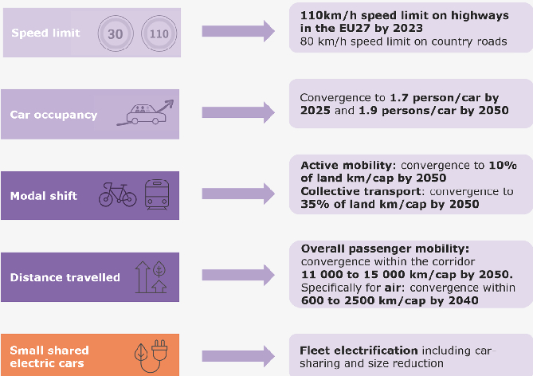

Figure 24: Evolution of the average distance travelled per capita per year (km/cap/year) in several EU27 countries34

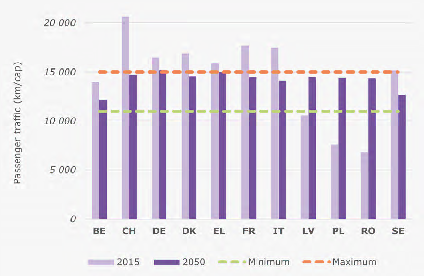

3 types of lever were identified: emergency sufficiency (in light purple), structural sufficiency (in dark purple) and efficiency (in orange)

The result of these different measures is a reduction of total passenger traffic in the EU27 by 21% in 2050 compared to 2019. This reduction is summarised in Figure Y: the share of road and air traffic is strongly reduced, accompanied by a significant increase in rail and active mobility. These changes have several co-benefits, e.g. on health (see the box on sufficiency, Section 0.3). For the specific case of car mobility, which still represents almost half of passenger traffic in 2050, the combined contribution of carpooling, speed reduction and the emergence of small efficient electric cars leads to a very strong reduction in final energy consumption.

The combination of all sufficiency levers plays a key role in the passenger mobility energy transition and – in synergy with rational vehicle electrification – enables a 77% reduction in the sector’s FEC and its decarbonisation.

To model the evolution of distance travelled per capita, a convergence corridor was set between 11,000 km/cap and 15,000 km/cap. A technical dialogue between CLEVER partners made it possible to achieve this corridor in each national trajectory despite the disparity, visible in 2015, between countries. In some countries, modelling followed an environmental imperative to reduce travel below the upper limit (e.g. France and Italy), while in other countries, it followed a social imperative to increase travel above the lower limit (e.g. Romania, Poland).

- 33 | All CLEVER convergence corridors for mobility are available in CLEVER, 2023.

- 34 | For CLEVER commenting partners, a conservative target of 14,500 km/cap/year by 2050 was considered.

44 | CLEVER: a Collaborative Low Energy Vision for the European Region Sufficiency and efficiency guarantee an effective and fair decarbonisation of consumption sectors | 45

###### Figure 26: Evolution of passenger traffic and its final energy consumption between 2019 and 2050 according to the CLEVER scenario35

###### Main policy recommendations

This translates into spatial planning that facilitates active mobility36 and proximity to services37, incentives for an increase in home working38 (to reduce commuting and business travel) and sustainable travel as opposed to unsustainable travel patterns. Many levers should be mobilised to obtain a major shift towards collective transport.

The passenger mobility decarbonisation trajectory should be supported first and foremost by measures and infrastructures enabling European citizens to live less energy- and travel-intensive lifestyles. Decarbonised mobility should be accessible to all, reduce the travel burden on households and serve today’s landlocked regions.

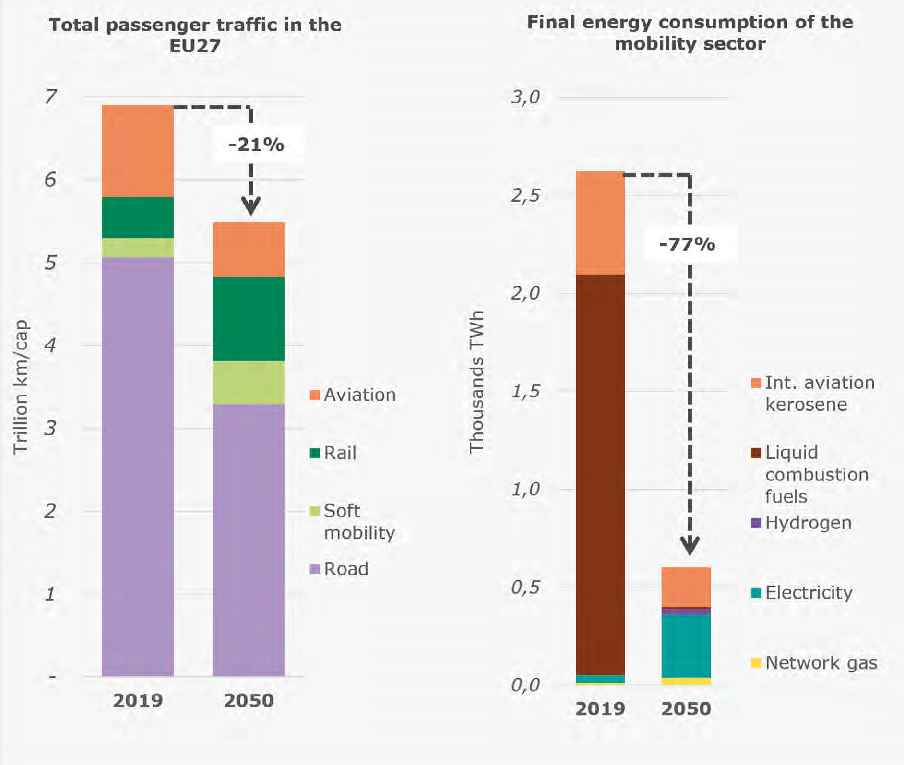

This requires:

▶ Introducing fiscal policies such as a

▶ Developing the collective transport network and services by ensuring

frequent flyer levies41 and VAT policies (increases42 for flights and decreases43 for trains and public transport).

a qualitative EU-wide train network (through the TEN-T regulation) and funds for local transport development.

▶ Strongly regulating unsustainable modes of transport: banning flights where there is an under 5 hour rail alternative banning cars in city centres well served by public transport and active mobility, and banning advertisements for airlines and heavy vehicles such as SUVs.

▶ Making collective transport39 more accessible for all through fair tariffs and user-friendly services.40

The diagram on the left shows that European passenger traffic is reduced by 21% between 2019 and 2050. Road and aviation travel in particular are reduced, leaving room for rail and active mobility.

The diagram on the right shows the evolution of energy carriers in EU27 mobility, as well as the strong reduction of mobility FEC made possible by sufficiency and electrification. While liquid combustion fuels are predominant in the 2019 mix, electricity becomes the main energy carrier for 2050 mobility.

- 36 | Developing a EU cycling strategy as requested by the European Parliament.

- 37 | This could be guided by the 15-minute principle, Moreno et al., 2021.

- 38 | Through legal insurance (see Commissioner Schmit position) and financial support.

- 39 | Excluding aviation

- 40 | E.g. single-price climate tickets, as in Austria and Germany or free transport, as in Spain and Luxembourg.

- 41 | New Economics Foundation, 2021

- 42 | At EU level: ending the exemption status in the ETD and including CO2 and non-CO2 warming effects in the ETS and at national level.

- 43 | Recommended decrease to 5.5%. A good example of VAT reduction for trains (down to 7%) is found in Germany: T&E, 2020 and public transport fee reductions can also be found in Spain.

35 | pkm/cap corresponds to the average km travelled per person in a year.

46 | CLEVER: a Collaborative Low Energy Vision for the European Region Sufficiency and efficiency guarantee an effective and fair decarbonisation of consumption sectors | 47

#### Electric cars can be smaller and shared to reach strong sustainability objectives

#### Freight can be decarbonised through sufficiency, modal shift and cleaner vehicles

vehicles (and associated batteries) and along with vehicle size reduction, limits the need for mining (as recycling, though essential, will be insufficient for a growing market). These changes also bring about social benefits by making electric vehicles more accessible for all.

Sufficiency is also essential to achieve strong sustainability and limit other socio-environmental impacts, such as the impacts of lithium, cobalt and other critical materials mined for electric vehicle lithium-ion batteries.44 Reducing the need to travel by car and increasing carpooling and car-sharing diminishes the production of

By 2050, the freight sector reduces its final energy consumption by 52%. This transition follows the same patterns as passenger mobility, based upon 3 pillars:

###### Figure 27: Share of tonnes-kilometres transported by truck in 2050 following motorisation in key CLEVER national trajectories.

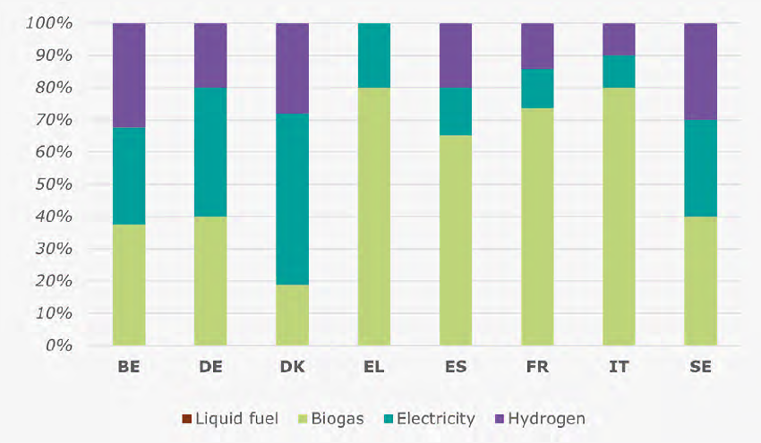

###### Main policy recommendations

▶ Introducing life cycle assessments (LCAs) for each type of car, taking into account energy, CO2 and raw material consumption in vehicle construction and use. LCA principles should be introduced:

Policy measures should foster a shift in car mobility towards lighter, shared and high -occupancy electric cars. In practical terms:

▶ Increasing carpooling through regulations (creating High Occupancy Vehicle lanes and tolls45), dedicated infrastructures (such as parking slots and signalling), services (such as well-designed mobile apps) and incentives46.

- • In car regulations: at EU level, in the EU Clean Car Directive energy consumption limits for each type of car and through removal of the mass utility parameter.47
- • In bonus/penalty systems at the national level by offering incentives and purchase taxes, indexed to LCA. These systems could both encourage manufacturers to increase their supply of light and efficient electric cars and make these vehicles more readily available to consumers.48

▶ Increasing car sharing through the creation of dedicated infrastructures (parking slots with charging facilities, well-designed apps) and promotion of car-sharing associations and companies.

This heavy truck trajectory is achieved thanks to the use of biogas for long-distance freight (over 150 km), while electric trucks are used for distances of up to 300 km (to minimise battery size) and especially for urban freight (to minimise pollution and noise).

▶ A renewal of the road freight fleet towards biogas, electricity and hydrogen for both trucks and LCVs. The share of these 3 energy carriers is highly variable between countries. Biogas plays a key role in the CLEVER trajectory (in 2050, between 37% and 60% of tonnes of truck transported goods depending on country) in order to limit the impact of electric vehicle-related raw material extraction and refining (e.g. lithium and cobalt) (see following box, and box on energy carriers for freight in Section 3.3).

▶ A reduction in demand (10% reduction in tonnes of goods transported per year) in most countries, through the application of sufficiency measures to different industrial sectors (in particular, by reducing the need for industrial products, as described in the next chapter, but also by reducing the need to transport fossil energy products, such as oil for road mobility).

▶ A strong modal shift towards rail freight: reaching the EU’s ambitious objective of a greater than 50% shift of actual over-300 km road freight towards rail.49

- 44 | négaWatt, 2023

- 45 | Experimented with positive results in Spain (Schjins et Eng, 2006, p.188), Italy, Sweden and the UK (Croci, 2016).

- 46 | E.g. the French Government Premium, part of a 150 million euros plan to increase carpooling.

- 47 | German Zero, 2021 p.204 and ICCT, 2018.

- 48 | This mechanism exists in France (bonuses and maluses) but is not ambitious enough.

49 | EU Commission, 2011, p.10

48 | CLEVER: a Collaborative Low Energy Vision for the European Region Sufficiency and efficiency guarantee an effective and fair decarbonisation of consumption sectors | 49

### 2.3 Industry: sufficiency and circularity should be the basis of decarbonisation

###### Main policy recommendation50

An increase in the ambition of legislation on new heavy-duty vehicle CO2 emission performance standards52 should enable the sale of fossil fuel-driven trucks to be banned by 2040 at the latest. CO2 emission legislative requirements should include biogas as a carbon-neutral fuel.53

Sufficiency measures in consumption sectors are the first and foremost lever for reducing freight transport demand. They need to be combined with financial measures to accelerate modal shift. A kilometre-based duty for heavy good transport51 is an effective tool to encourage this shift, as well as the acceleration of cleaner vehicle deployment.

##### CLEVER scenario key lessons

.

Sufficiency and circularity are essential levers of industry decarbonisation, which make Carbon Capture and Storage (CCS) avoidable.

Direct electrification is crucial to increase energy efficiency and ensure energy carrier balancing.

Hydrogen is very judicious for specific applications: primary steel production and production of ammonia and olefins (as a feedstock).

###### Mitigating the risks of metal resource depletion

The demand for and extraction of lithium and other critical materials such as cobalt, class 1 nickel and copper, which are essential materials for these batteries, is set to increase drastically over the next few years, mainly due to the growth of electric vehicles. Today, approximately 60% of the lithium extracted worldwide is used in electric vehicles, and this share is expected to increase further. Some projections estimate that by 2040, annual lithium consumption for electric vehicles alone will be 8 times greater than actual global mining production.58

The European Union represents only 6% of the global population but consumes 25%30% of the metals produced in the world, raising the question of equity in global resource consumption. The accelerated growth in metal resource consumption and resulting increase in resource exploitation poses a major risk to local communities and biodiversity, contributes to climate change and generates health impacts, as highlighted by the OECD54 and UNEP55.

Figure 28: Summary – Evolution of the industry sector’s final energy consumption(FEC) and greenhouse gas (GHG) emissions at the EU27 level

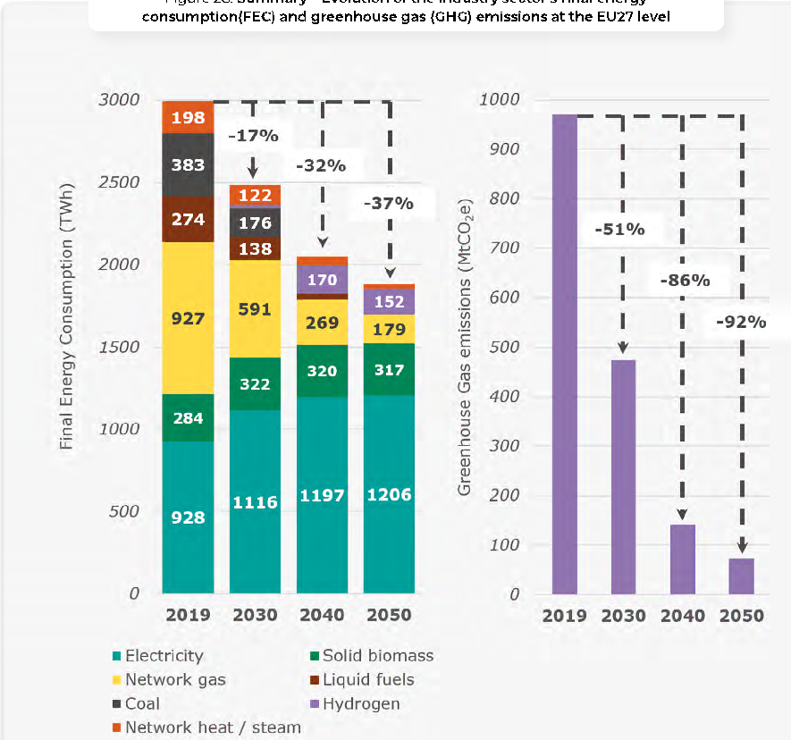

The issue of resource exploitation and engendered impacts must be integrated in order to ensure social justice and the preservation of biodiversity throughout the ecological transition.56

The answer to this new challenge is not out of reach, but it requires combining the electrical revolution with a revolution in our means of transport, through sufficiency measures and energy carrier diversification. This is what the CLEVER scenario proposes, with softer and more participatory mobility, reduced demand for road freight and a considerable role attributed to the use of biogas for freight vehicles in order to reduce the need for lithium and other metals in batteries (as described in Section 3.3). Ensuring a share of renewable gas in transport reduces Europe’s material footprint on critical metals since the electrification of other sectors – industry, residential, tertiary – does not require batteries.

The CLEVER scenario incorporates an alternative approach to the use of raw materials, through the establishment of an industrial ecosystem that prioritises demand reduction (in raw materials consumption, in particular), reuse of goods, increase of product life span and, finally, recycling, rather than primary resource extraction, as seen in the next section.

Transport electrification, made possible by lithium-ion batteries, is at the heart of this material challenge57.

- 50 | See also boxes on materials in Section 3.1.1, and on carriers for freight in Section 3.

- 51 | Already adopted in several EU countries (de Bok et al., 2022).

- 52 | See the EU Commission proposal.

- 53 | In the EU Commission proposal, these are defined at the tailpipe and not through life-cycle assessments.

- 54 | OECD, 2019

- 55 | UNEP, 2020

- 56 | As presented in the négaWatt Association’s Response to call for evidence – Critical Raw Materials Act.

- 57 | The négaWatt scénario for France in 2022 included a thorough modelling of materials production and consumption up to 2050 and highlighted this specific risk related to lithium.

- 58 | EA, 2022, p.97.

50 | CLEVER: a Collaborative Low Energy Vision for the European Region Sufficiency and efficiency guarantee an effective and fair decarbonisation of consumption sectors | 51

In 2019, the industry sector represented 23% of EU27 final energy consumption (FEC) and 31% of its greenhouse gas (GHG) emissions. The sector relies heavily on fossil gas as an energy carrier (31% in the EU27 in 2019, reaching 34% in Italy and 36% in Germany).

Industry is a complex sector as it is composed of a multiplicity of sub-sectors that can be very specific and whose characteristics are particular to each country. Nevertheless, it is possible to group industries into main sectors. In Europe, four of industrial sub-sectors(steel, cement, chemicals and pulp & paper) account for over 55% of final energy consumption.

Figure 29 below illustrates the application of this methodology to the steel industry. All three levers (sufficiency, circularity and efficiency/technological substitution) are considered in the steel sector’s transformation, reducing the sector’s FEC by 47%

from 562 TWh in 2015 at EU27 level to 295 TWh in 2050. Sufficiency, circularity and efficiency/technological substitution respectively enable a 63 TWh, 116 TWh and 88 TWh gain.

Figure 29: Contribution of the different levers to the final energy consumption reduction of the EU27 steel sector in the CLEVER scenario

#### The SER framework applied to industry

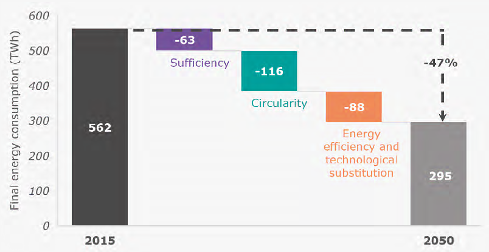

low-demand scenarios59, defining industrial production, industry process energy intensity and recycling share for each main sector. The corridors60 enabled partners to define specific targets consistent with both their national industrial context and the specific assumptions made in the other sectors.

To model industry decarbonisation, the CLEVER scenario integrates a specific corridor-based approach, defining the levers of sufficiency, circularity, and efficiency while ensuring coherence with the other sectors that generate industry demand (e.g., residential, transport, etc.). These industry corridors were built through a topdown approach based on European and national

###### The SER framework is implemented in the industry sector as follows:

▶ Efficiency & technological substitution: By reducing the energy intensity of production through technology changes, fuel and material substitution and the dissemination of best available practices.

▶ Circularity: By optimising product life cycles through more durable design, longer use and higher recycling rates. The two first strategies lead to a reduction in demand for materials and therefore in production, while the third strategy leads to a shift from raw materials to recycled materials, whose production is generally less energy intensive.

▶ Sufficiency: By rescaling material demand in the various industrial sectors. This means adjusting the nature and intensity of the demand to cover the needs for services with a minimum of material. This generally leads to a reduction in production and hence in energy consumption in the given industrial sector.

The following hypothesis was modelled for these levers: Sufficiency: Translating the decrease in steel needs due to assumptions in other sectors (e.g. fewer new constructions, reduction in car traffic).

Circularity: Increasing the share of recycled steel production via electric arc furnaces that require 4 to 6 times less energy to produce than primary steel.

Efficiency and technological substitution: Disseminating best available techniques in Europe and converting remaining primary steel production to direct reduction of iron by (green) hydrogen (HDRI).

This framework attributes a fundamental role to sufficiency and circularity as levers for the reduction of industry consumption, prior to all other measures.

#### Reducing material consumption is critical to a low-carbon industrial transition

▶ Paper demand decreases by 14% between 2015 and 2050 and the increase of the share of recycled pulp enables the process’ energy intensity to be reduced while limiting wood demand (which is mainly imported at the EU level, except in the case of some countries such as Sweden and Estonia). The paper industry’s FEC is reduced by 40%.

▶ Steel demand declines by 15% between 2015 and 2050, as new construction and car traffic (and thus car manufacturing) – among other variables – decrease. Increasing the share of recycled steel from 41% in 2015 to 56% in 2050 reduces energy intensity and mining needs, while green hydrogen technology decarbonises the remaining primary steel production.

▶ The chemical sector’s FEC is reduced by 23% between 2015 and 2050, in line with a reduction in plastic and fertiliser needs and an increase in the share of recycled plastics.

▶ Cement demand decreases by 38% between 2015 and 2050 reducing the FEC by 53%. The reduction of the quantity of clinker in cement production enables associated process emissions to be reduced.

- 59 | Fraunhofer ISI, 2021 for the EU, Unwelt Bundesamt, 2019 for Germany, négaWatt, 2022 for France.

- 60 | Detailed in CLEVER, 2022.

52 | CLEVER: a Collaborative Low Energy Vision for the European Region Sufficiency and efficiency guarantee an effective and fair decarbonisation of consumption sectors | 53

###### Overall the EU27 industry’s FEC is reduced by 34% between 2019 and 205061 (as shown in Figure 30 below). Sufficiency and circularity play a key role, as they represent the majority (between 50% and

80% depending on sector) of FEC reduction for countries such as Germany, France and the United Kingdom.

###### Main Policy recommendations

Sufficiency requires reducing the demand for industrial materials upstream. For instance, a «Net Zero Land Take» policy (as recommended in chapter 2.1) will enable a decrease in cement needs, and a shift towards light, high-occupancy cars (as recommended in chapter 2.2) will reduce the demand on steel and critical raw materials. Moreover, all measures improving the product lifespans are essential.62

More precisely, implementation of the 3R principle should be maximised for all products:

Figure 30: Evolution of industry’s final energy consumption, share of energy carriers and GHG emissions between 2019 and 2050 according to the CLEVER scenario

Reusability: by defining ambitious reuse targets in the legislation63 to be reached by the development of deposit systems, second-hand markets and a ban on planned obsolescence.

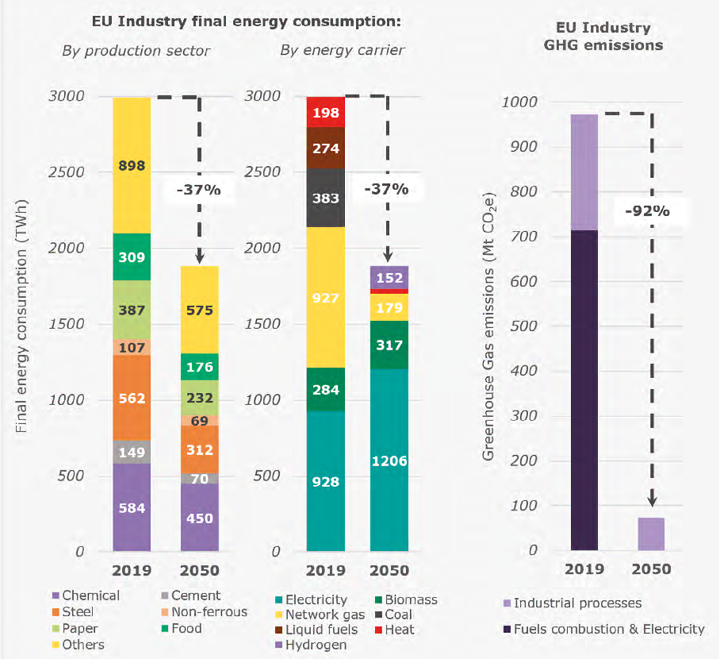

Reparability: by defining a “right to repair” for consumers, ensuring affordable repairs64 and obliging manufacturers to offer affordable spare parts for repair for a period of at least 5 to 10 years.65

Applying sufficiency and circularity to industry requires strong product regulation, e.g. through the “Ecodesign for sustainable products regulation” (ESPR) revision. This legislation should greatly improve product life cycle assessment monitoring.

Recyclability: by defining minimum recycling rates66 and restricting use of non-recyclable materials in production.67

#### Direct electrification and hydrogen are key elements of a broader long-term industrial strategy

###### Decarbonisation based on direct electrification and hydrogen

In the CLEVER scenario, industrial sector electrification ensures an energy balance between all sectors, while increasing energy efficiency68. This electrification consists in massive deployment of heat pumps for low to medium temperatures, deployment of heat pumps and electric boilers for heat, and the use of other electric processes (such as electric arc furnaces, microwaves and plasma) for medium and high temperatures.

for European primary steel production via the HDRI process.

By 2050, all energy carriers are decarbonised and emissions from industrial processes (mainly from clinker production) are reduced by a factor of 3, resulting in a 92% reduction of EU27 industry GHG emissions.

Hydrogen also plays a key role in industry’s non-energy consumption69 and in particular for the chemical industry’s feedstocks (corresponding to 650 TWh in 2019 at EU27 level). By 2050, feedstock needs are reduced by 22% (480 TWh), all ammonia is produced from green hydrogen and olefin production is mainly based on the MTO (methanol-to-olefins) process using hydrogen for methanol production. Thus, by 2050, hydrogen will represent 78% of the chemical industry’s feedstocks.

Thus, the share of electricity in the industry energy mix increases from 32% in 2019 to 64% in 2050. Use of gas is greatly reduced to specific processes and, in particular, to high temperature processes in certain industrial sectors. Indeed, the share of gas in the industry energy mix decreases from 31% in 2019 to 10% in 2050. Biomass remains a significant carrier in industry, while coal is phased out before 2040. In 2050, approximately 190 TWh of hydrogen (considered as energy use) are required

The diagram on the left represents the evolution of energy carriers in EU27 industry. The transformation of the industry from a high-carbon industry to a low-carbon industry reduces its FEC by 34%. This transformation relies mainly on renewable electricity and – to a lesser extent – on biomass, renewable gas and hydrogen associated with steel production via HDRI.

The diagram on the right shows that, in 2050, industry GHG emissions are reduced by 92% without CCS. There are no GHG emissions associated with fuel and electricity because all energy carriers are decarbonised in 2050. Process emissions are divided by 3.

- 62 | Especially, measures prohibiting the destruction of unsold products as proposed by EU Parliament amendments (p.3).

- 63 | This is an overall objective that should underpin the EU’s circular economy strategies (ECOS, 2019). The EU Commission reuse targets for packaging proposed in November 2022 are a good start that should be more ambitious (first draft).

- 64 | As currently proposed by the European Commission, there is a lack of regulations and incentives for making repair affordable (R2R, 2023).

- 65 | As legally binding in France (for a period of 5 years) for different products (household appliances, digital equipment) in the 2020 circular economy law (art. 19).

- 66 | The same ambition as that presented for raw materials in the Critical Raw Material Act (target of 15% recycled raw material by 2030) should be used for all materials (and especially steel and paper).

- 67 | Bans and higher fees proposed in Ireland’s NECP, p.74.

- 68 | Madeddu et al., 2020

- 69 | Not included in the previous figures, which refer only to energy consumption.

61 | The assumptions modelled in CLEVER for the other industrial trajectories are available in CLEVER, 2022.

54 | CLEVER: a Collaborative Low Energy Vision for the European Region | 55

3. Renewable energy sources are the backbone of a resilient European energy system

###### A long-term industrial strategy is essential for a sovereign and sustainable Europe

The overall reduction in industrial production (notably in the cement, steel and paper industries) does not translate into deindustrialisation, which would be inconsistent with a global decarbonisation goal. The CLEVER scenario integrates the emergence of new strategic industrial sectors

(e.g. a lithium-ion battery value chain integrating recycling) and reshoring (e.g. textile, health products and renewable energy technologies such as photovoltaics70), thereby safeguarding European employment and industrial sovereignty.

###### Main Policy recommendations

To ensure competitiveness and sovereignty and drive European industry efficiency improvements, effective carbon taxation, including at EU borders, is needed. The revised Emissions Trading System (ETS) and Carbon Border Adjustment Mechanism (CBAM) are steps in the right direction, but should be reinforced in the next legislature.

As part of its Green Deal Industrial Plan, the EU is focusing on ensuring European production of clean technologies by developing strategic value chains (e.g. solar panel, batteries, electrolysers). This work to ensure EU sovereignty on clean energy production is substantial. However, by focusing on production sectors, it omits the energy demand reduction step.

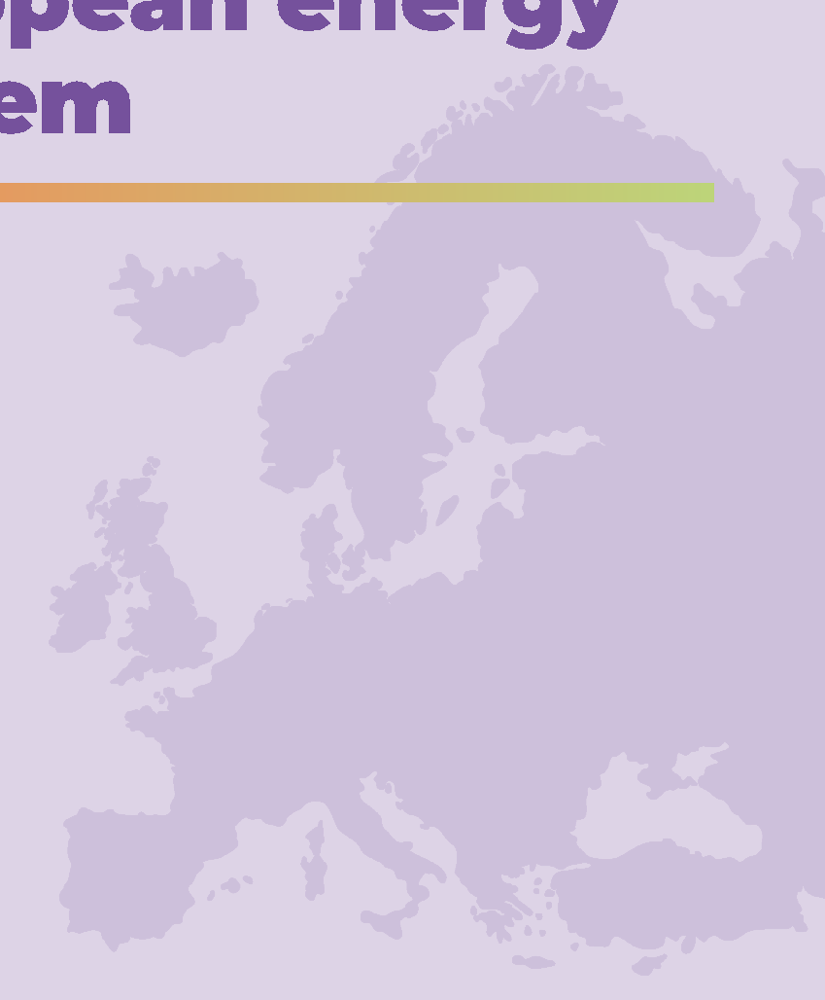

Indeed, this plan should also fund a boost to energy efficiency and technological substitution in major European industry sectors, such as steel, cement and chemicals71, with a focus on mature technologies that are ready to be scaled up72:

▶ Direct electrification for energy efficiency gains.

▶ Use of green hydrogen in the industrial processes that need it most (steel, olefins and ammonia) – this should be prioritised over other possible hydrogen uses.

- 70 | Textiles for local employment, health products for health sovereignty (e.g., mask and breathing apparatus shortage during Covid crisis), renewable energy technologies for energy and industrial sovereignty.

- 71 | E3G, 2023

- 72 | Madeddu et al., 2020.

56 | CLEVER: a Collaborative Low Energy Vision for the European Region Renewable energy sources are the backbone of a resilient European energy system | 57

### 3.1 Matching supply with demand and meeting strong sustainability criteria

Following the harnessing of Europe’s energy savings potential as described in the previous chapter, energy supply was modelled in CLEVER with the objective of meeting the remaining energy demand through the application of strong sustainability principles, applied to all possible energy sources. This modelling process results in an EU27 trajectory reaching 100% renewable energy supply by 2050 through a balanced allocation of carriers, including significant but feasible electrification, and solidarity between EU countries.

An overview of this trajectory is provided in Figure 31 below.

Figure 31: Evolution of primary energy supply by source and share of renewables in final energy consumption for the EU27 in the CLEVER scenario

###### Once the level of energy demand has been defined (see Chapter 2 on energy consumption), two steps are necessary in order to model the energy production required to match this demand:

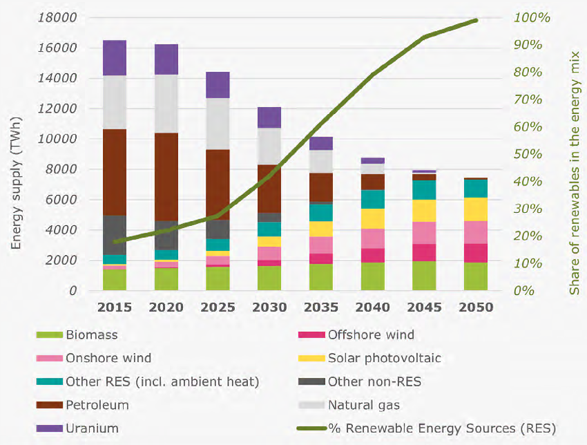

▶ An analysis of the possible share of a carrier in a sub-sector. Several results of this analysis have already been provided in Chapter 2. The first subsection below presents the overall methodology, based on techno-economic assessments.

▶ An analysis of the sustainable potentials and deployment needs of renewable energies (presented in the second subsection) and the combination potential provided by conversion technologies (presented in the third subsection).

The third and final step involves bringing the above elements together in the process of matching supply with demand, as explained in the box at the end of this section.1

#### Defining carrier share corridors for each consumption sector

EU level enabled the definition of minimum and maximum shares for each carrier. Subsequently, carrier share corridors were adapted through exchanges and iterations conducted throughout the project (final corridors are shown in Figure 32).

An evaluation was carried out to define the possible shares of each energy carrier (gas, liquid fuels, hydrogen, solid biomass, district heat, electricity) in each consumption sector. To begin with, a review of existing scenarios at national and

These are some of the main aspects considered:

▶ Technology readiness level (TRL)3: technologies with a TRL below 7 (i.e. no operational prototype in expected conditions) are unlikely to be deployed at scale before 2050, but if they are, are likely to be deployed only in limited proportion.

▶ Sectoral constraints: limited possibilities for specific industrial processes, district heating privileged in dense areas, etc.

▶ Material concerns: inclusion of guidelines from detailed material flow modelling for France2 (e.g. on lithium in electric vehicles or copper for electrification).

▶ Cost: for example, light, hydrogen-powered vehicles are expected to remain more expensive than other vehicles.

This chapter begins with an overview of the development of renewable energy production technologies as modelled by CLEVER to match energy demand and meet feasibility and strong sustainability criteria

- (Section 3.1). It then details the choices that this production implies in terms of energy system electrification
- (Section 3.2) and deployment of bioenergy, hydrogen and Power to X (Section 3.3).

- 1 | The following sections focus on 2050 to simplify explanations.

- 2 | négaWatt, 2022, p.69 and Rauzier et Toulouse, 2022.

- 3 | IEA ETP database, 2022

58 | CLEVER: a Collaborative Low Energy Vision for the European Region Renewable energy sources are the backbone of a resilient European energy system | 59

###### Bioenergies7

Figure 32: Main corridors for the share of a carrier in a subsector in 2050 (eg for electricity in cars the corridor is between 60 and 100%)

The climate change mitigation potential of bioenergies is very important, especially for the decarbonisation of certain sectors with few credible alternatives to gas, liquid fuels or solid biomass. However, various challenges can affect the sustainability of bioenergy production: food security (and more generally social and societal issues) climate and biodiversity issues, to which only a systemic approach8 can provide solutions.9

In CLEVER’s evaluation (see Figure 33 below):

▶ Biogas production increases due to the development of cover crops and crop residues (80% of production in 2050), but there is no dedicated arable land for biogas. As a result, the sustainable biogas production potential was evaluated at 325 TWh in 2030 and 605 TWh in 2050 at the EU27 level.14 This potential is in line with REPowerEU objectives for 2030.15

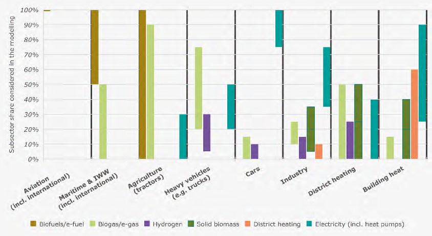

The evaluation conducted by Solagro for CLEVER10 integrated such a systemic approach, leading to 2250 TWh (LHV11) of sustainable potential of bioenergy in 2050 in EU27+UK. This figure is very close to some of the lowest evaluations from the EU:

▶ Solid biomass from forest wood and liquid

biomass both remain constant.

▶ Other solid biomass energy sources increase slightly and stem mainly from by-products (wood waste, straw etc.) following the cascading principle of use.

▶ The lower boundary of the JRC bioenergy potential,12

▶ the bioenergy supply in the European Commission’s 1.5LIFE scenario.13

Figure 33: Sustainable bioenergy production potentials in CLEVER for EU27+UK (TWh/year)

This figure illustrates the results of the multiple trade-offs made in the CLEVER modelling in order to define carrier shares. These trade-offs included, for example:

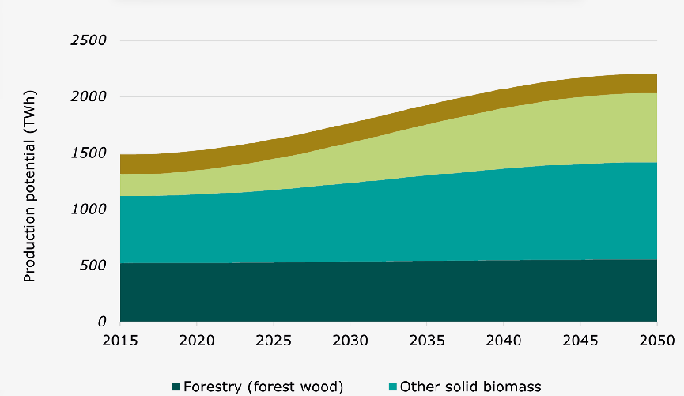

For aviation: at the moment, the only credible energy carrier is liquid fuel (biofuel or e-fuel). Indeed, no other option can be delivered at industrial scale soon enough because TRLs are too low (TRL around 3-4, meaning technology is still in the conceptual or early prototype stage4).

For space heating in buildings5: heat pumps can equip many buildings (which explains a lower limit of 25% use for this technology), but there are potential installation and/or acceptance issues in some cases (which explains why the maximum is 80%-90%). Other carriers can play a role (especially in situations in which heat pumps are not well suited) but have other limitations: maturity, cost, network availability (district, hydrogen and possibly gas or electricity for heat pumps in some countries/areas), air pollution (e.g. for solid biomass due to inefficient wood stoves), etc. Due to these different limitations, the selected corridors for gas, solid biomass and district heating in buildings are respectively 0-15%, 0-40% and 0-60%.

#### Defining the sustainable potential and deployment of renewable energy

The CLEVER bottom-up construct enables an analysis of renewable energy potentials at the national level that takes into account physical characteristics, population density and land use issues6, as well as past and present national ambition and infrastructures. This construct has been critical to

the process of adjusting national production to overall European demand, highlighting the benefits of Europeanisation and solidarity described in Section 1.3. In the interest of clarity and simplification, potentials and deployment targets are provided at the EU level in this section.

- 7 | See CLEVER AFOLUB note for more details (CLEVER, 2023).

- 8 | CLEVER, 2023, p.8 and 28

- 9 | CLEVER, 2023, p. 9

- 10 | Ibid

- 11 | A fuel’s Lower Heating Value (LHV, also known as net calorific value) is defined as the amount of heat released by combusting a specified quantity of the fuel (initially at 25°C) and returning the temperature of the combustion products to 150°C, which assumes that the latent heat of vaporisation of water in the reaction products is not recovered.

- 12 | Ruiz Castello et al., 2015

- 13 | EU Commission, 2018

- 14 | 620 TWh at the EU27+UK level. This appears to be a rather conservative value compared to other evaluations of potentials, among which JRC-ENSPRESO, GasForClimate, 2022, Magnolo et al., 2021.

- 15 | Combined with biomass gasification (discussed below), CLEVER evaluated biomethane’s sustainable potential for the EU27 at 334 TWh in 2030, in line with the RePowerEU objective of 35 billion cubic metres (bcm) of biomethane in 2030.

- 4 | IEA ETP database, 2022, technologies in the aviation sector.

- 5 | More details and explanations of space heating carrier corridors can be found in CLEVER, 2022, p.39.

- 6 | CLEVER output data is currently been assessed by the Renewable Grids Initiative (RGI) for its impact on land use, in RGI’s workstream dedicated to Energy & Space – the Comparative Analysis of Spatial Requirements of Different Decarbonisation Scenarios

60 | CLEVER: a Collaborative Low Energy Vision for the European Region Renewable energy sources are the backbone of a resilient European energy system | 61

###### Solar PV and wind

###### Other renewables

The technico-economic potentials of solar photovoltaics (PV) and wind are growing in many publications. Recent evaluations, such as the JRC evaluations16, tend to show very high potentials: over 1500 GW of PV on buildings, over 1500 GW of offshore wind (low restrictions scenario) and over 2000 GW of onshore wind (high restrictions scenario). Furthermore, stakeholder confidence with regard to the possible fast roll-out of PV and Wind is rising, as demonstrated by the recent considerable increase in the ambition of public (e.g. in Germany) and private players.

Herein lies the value of the CLEVER scenario’s approach, in which PV and wind deployment increase drastically, yet the required level remains feasible, thanks to sufficiency and demand-focus (detailed results in Figure 34 below):

Hydropower capacities and production at EU level are considered stable between today and 2050.

rather limited effect on global results (see Figure 34), they were integrated into the modelling as they can have non-negligible roles at the sectoral and national/local level.

Although other renewables (solar thermal, ocean energies, CSP, deep geothermal, waste heat/fatal heat, etc.) were not detailed here as they have a

▶ 468 GW of installed wind power capacities for the EU27 by 2030 and 874 GW by 2050. These figures are slightly below the REPowerEU targets and political commitments for offshore wind in the North Sea.19

###### Major policy recommendations

▶ 600 GW of solar photovoltaic capacities by 2030 and 1366 GW by 2050, which is very close to the REPowerEU target.20

In order to accelerate the deployment of renewable electricity sources at the required pace, the following measures appear necessary and should be implemented at the national and local level with a view to delivering on the ambitions of the Renewable Energy Directive (RED) and REPowerEU in terms of renewable electricity deployment and grid development:

Some uncertainties remain regarding possible speed of deployment17, for example in relation to the structuration of the renewables sector or the development of electric networks to connect renewables. The lower the electricity demand, the lower the supply needs, and therefore the lower any uncertainties relating to achievement of a clean electricity supply and its potential impacts.18

▶ Ensuring the integration of multi-level planning and mapping of renewables production potential, in order to optimise the local use of RES. More geographic sites for renewable projects should also be identified and grid expansion planned adequately across different voltage levels. To this end, Member States should provide easily accessible information regarding available locations, as well as existing site constraints, including online maps (at different territorial/governance levels) and the corresponding databases.21

▶ In order to allow for faster and smoother administrative procedures, Member States should reinforce competent staff in the permitting authorities and ensure that experts are correctly trained. The responsibilities of different ministries as well as regional and local authorities should be clarified to prevent overlapping competences.23

Figure 34: Cumulated installed capacities in the CLEVER scenario for solar PV, onshore wind and offshore wind for the EU27 and comparison with REPowerEU target

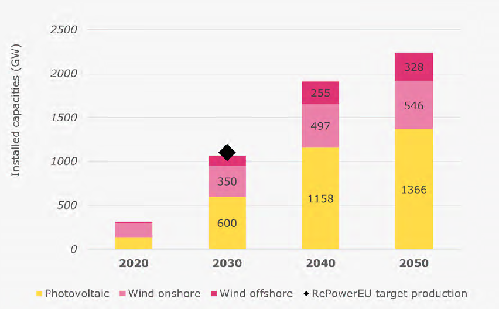

▶ In large countries, territorialising support mechanisms in order to favour balanced development of renewable energies throughout the territory and in all regions. Support mechanisms should also be adapted to sites, e.g. higher support for solar PV on rooftops or already built-up areas.

▶ Accelerating permitting and significantly reducing the length of the process. Efforts to further expedite permitting processes and deadlines for all renewables, repowering, grids and storage, without compromising on either system security or the environmental quality criteria of the projects need to be encouraged. That could include also the regulations related to connection to the grid. Permitting process digitalisation also plays an important role to speed up and better coordinate the process by different stakeholders and ensure that deadlines are easier to meet.22

- 16 | Ruiz Castello et al., 2019

- 17 | In the CLEVER scenario, installed capacities in 2030 are very close to REpowerEU 2030 objectives

- 18 | While they are nowhere to be compared to the impact of climate change, intensive farming and land take, biodiversity issues related to the massive and rapid deployment of renewable energies exist and can be minimised by a demand-focused approach (EEB, 2022).

- 19 | REPowerEU aims for 510 GW of wind capacity by 2030. An agreement has also been reached to aim at producing 120 GW of offshore wind power in the North Sea by 2030 (versus 118 GW for the EU27 in CLEVER) and 300 GW by 2050 (versus 328 GW for the EU27 in CLEVER).

- 20 | The REPowerEU plan defined a target of 592 GW of solar photovoltaic installed by 2030.

- 21 | More detailed recommendations on this issue by Rescoop, 2022

- 22 | See also Eurelectric, Solar Power Europe, WindEurope, 2023

- 23 | EREF, 2022

62 | CLEVER: a Collaborative Low Energy Vision for the European Region Renewable energy sources are the backbone of a resilient European energy system | 63

#### Defining sustainable production levels of conversion technologies: Hydrogen, Power to X and gasification

###### Promoting citizen participation in RES projects to release their full development potential and support social acceptability

To allow for the accelerated development of renewable energies, measures at national level to increase local acceptability are indispensable. These measures will also guarantee an energy transition that is fair and as close as possible to population needs:

###### Hydrogen and Power-to-X

Hydrogen (H2) and its derivatives, often referred to as Power-to-X (PtX), will be crucial for the full

The CLEVER scenario followed the guideline that “PtX materials may have a meaningful role to play in aviation and shipping, in high-temperature applications in industry and in long-term electricity storage solutions”31, but that a priority must be given to “PtX applications with a high efficiency potential or in applications with few alternative technology options to greenhouse-gas-neutral hydrocarbons”.32

▶ Fostering the widespread establishment of Renewable Energy Communities (RECs) and Citizen Energy Communities. To ensure fairness and equality, RECs and renewables self-consumers should be able to access special assistance to obtain permits and a grid connection for local projects. Committed citizens make community life more resilient through reduced expenditure on energy and strengthened democratic processes.24

▶ Ensuring that local populations and administrations benefit economically from taking partial financial ownership in new renewable projects and are involved from the outset in plant development. Regulatory authorities should allow project promoters to dedicate an adequate amount of resources in a flexible way for a meaningful stakeholder engagement, if it can lead to an accelerated implementation of the needed infrastructure, from grids to wind, solar and other RES. This is also an important issue in terms of the transition’s social acceptability. Access to support mechanisms should be facilitated and investment and tax relief should be granted to community energy projects.27 Also, local sharing of the benefits of RES projects should be facilitated: by definition, projects are most often located in the rural world and could directly finance local public actions or services, including outside the energy sector.

decarbonisation of the economy.

However, these energy sources can also raise sustainability issues (water, GHG, CO2, land)28, which increase with consumption of PtX material (H2, e-gas, e-fuels, feedstocks, etc.). For example, in terms of required CO2 input, sustainable biomass and air are the only renewable sources that do not cause additional greenhouse gas emissions29. However, sustainable biomass sources are limited and CO2 capture from the air is still in the demonstration and development phase.

Power-to-Gas presents some advantages over Power-to-Liquids as it can be coupled with methanisation and pyrogasification installations to use associated biogenic CO2 and mutualise gas infrastructures, including gas network connections. PtG is also more mature than PtL.

▶ Implementing EU rules on individual and collective self-consumption (energy sharing), empowering citizens to produce and consume their own renewable energy and thus play an active role in the energy transition. There is also a need to simplify and reduce burdensome administrative procedures, in order to remove barriers at national levels.25

PtX technologies have good technological maturity (TRL of 6-7), but are not yet commercially operational: the possible level of deployment in the short term must therefore be carefully considered.

CLEVER achieves a sustainable H2 production of 140 TWh in 2030 for the EU27 (with no green H2 imports needed, see Section 1.2) (see Section 3.3). This differs widely from REPowerEU objectives targeting over 600 TWh of H233 in 2030 (see comparison in Figure 38, Section 3.3), which appears unrealistic and unnecessary, and which generates extra costs. Final CLEVER sustainable H2 production reaches 1030 TWh in 2050 for the EU27, with minor H2 imports from Norway (see Section 3.3).

Therefore, in most cases30 in which it presents equivalent or better overall efficiency, electrification should be preferred to PtX use.

▶ In the process of identifying priority areas for renewables, Member States should prioritise the development of the potential to involve both renewables self-consumers and RECs, in order to guarantee that consumers and communities are not excluded from designated areas and that public acceptance of renewable projects can be promoted by the local population.26

###### Biomass gasification

Biomass gasification – also referred to as pyrogasification, “bio-synthetic natural gas (bioSNG) route”34 and “thermal gasification”35 – is a process that produces CH4 from “biomass with a high lignocellulosic content (e.g. wood, straw, forestry and agriculture residues, municipal solid waste)”. One of the technology’s advantages is that it “can process feedstocks with low anaerobic biodegradability, such as sustainable woody biomass and solid wastes”.36

tion, but it still needs to reach commercial availability. A maximum deployment potential of 350 TWh in 2050 for EU2738 was considered, beginning mostly in 2030.

However, the main limitation was related to solid biomass availability at national level and prioritisation of solid biomass use in buildings, industry and district heating.

This results in 214 TWh of syngas production in 2050 for EU27 in the CLEVER scenario.

This technology is mature (TRL of 737), as it has reached the stage of pre-commercial demonstra-

- 28 | Öko-Institut, 2019

- 29 | Öko-Institut, 2019, p.21

- 30 | There are some sectors where other constraints (networks, costs, materials, etc.) can justify not retaining electrification.

- 31 | Öko-Institut, 2020

- 32 | Öko-Institut, 2019, p.21

- 33 | The EC’s REPowerEU Communication (p.2) targets 20 million tonnes of H2 in Europe by 2030, half of which will be imported (equivalent to 666 TWh of energy).

- 34 | IEA ETP database, 2022, technologies in the biofuel sector.

- 35 | Gas for climate, 2022

- 36 | Gas for climate, 2022, p.4

- 37 | IEA ETP database, 2022, technologies in the biofuel sector.

- 38 | Gas for climate, 2022, p.9

- 24 | EREF, 2022

- 25 | EREF, 2022

- 26 | EREF, 2022

- 27 | Interreg Europe, 2018

64 | CLEVER: a Collaborative Low Energy Vision for the European Region Renewable energy sources are the backbone of a resilient European energy system | 65

###### Insights into the supply-to-demand matching process

### 3.2 Electrification is critical – but must be kept within reach to improve the likelihood of a successful transition

CLEVER’s chosen approach consists in beginning with the most critical sectors39 and an analysis of whether these sectors can be supplied by one of the suitable carriers respecting the previously-defined corridor. If so, the required amount of energy is withdrawn from the available renewable resource. If not, another carrier must be used. The process then continues on to the next critical sector and ends with the least critical sector and least critical carrier (electricity).

Between 2020 and 2023, CLEVER elaborated its scenario through: several iterations of this simplified linear process, thorough technical dialogue to adapt specific aspects (carrier share corridors, the potentials of electric renewables, etc.) and a number of consistency checks (e.g. electric renewables needs). Through this process, the scenario’s bottom-up construction led to the harnessing of higher potentials in some countries in order to increase the ambition of some trajectories and upgrade European energy system adequacy.

As in many ambitious scenarios, electricity plays a key role in CLEVER to achieve the climate objectives. Electricity production and final consumption increase respectively by 79% and over 22% between 2015 and 2050, with large disparities between countries. In Romania and the Netherlands, for example, final electricity consumption increases by up to 90%.

The process described above has been simplified in order to make it easier to understand.

Some conclusions are presented in the Table 02 below.

However, this increase is relatively limited compared to other scenarios targeting carbon neutrality (see Figure 35 below), such as the TYNDP40 (Distributed Energy and Global Ambition) or the Commission scenarios (1.5TECH, 1.5LIFE41, EC-PRICE42).43

CARRIERS

Table 02: Insights into the results of the supply-to-demand matching process

Electricity (incl. heat pumps)

Biofuels/ e-fuels

Biogas/ e-gas

Solid biomass

District heating

H2

###### Figure 35: Comparison of the evolution of electricity consumption and production between 2015 and 2050 in CLEVER, TYNDP and EU Commission (EC) scenarios.

Aviation (including international)

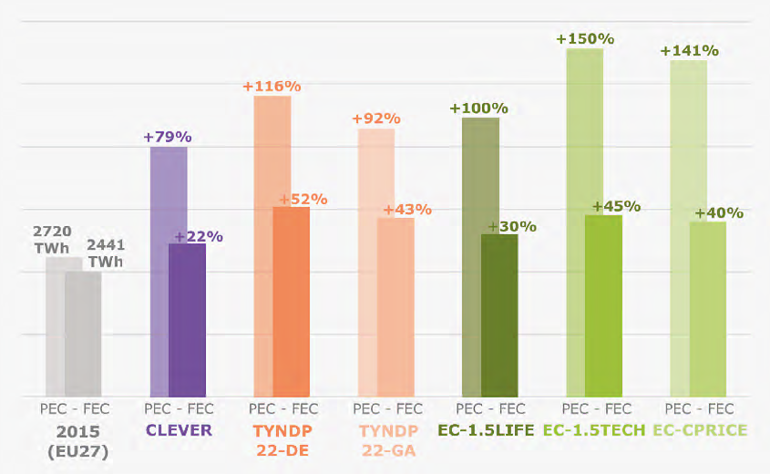

Maritime & IWW (including international)

Agriculture (tractors)

Peak power production

Heavy vehicles (e.g. trucks)

SECTORS

Cars

Industry

Feedstocks

District heating

Building heat

The CLEVER scenario models a more cautious electrification than the EC and TYNDP scenarios both in terms of: Gross production ofelectricity, increasing by 90%150% (e.g multiplied by 1.9 to 2.5) over 2015-2050 in EC and TYNDP models and by 79% in CLEVER.

Electric final energy consumption, increasing by 40%-52% over 2015-2050 in EC and TYNDP models, except for 1.5LIFE which shows only a 30% increase “due to combined penetration of e-fuels and effects of consumer choices”.43 Electric FEC increases by 22% in CLEVER.

Carrier not relevant for this sector

Carrier relevant for this sector but sustainable resources were prioritised in other more critical sectors

Carrier used in this sector with low share (inf. to 20% in 2050)

Carrier used in this sector with significant share (sup. to 20% in 2050)

Columns represent the different carriers. Rows represent the consumption sectors, including carriers for peak power production and district heating. Cells indicate whether a carrier is judicious for a sector and whether it was used in this sector in the CLEVER scenario. For example, CLEVER’s supply-to-demand matching process led to gas (biogas and e-gas) being considered judicious in all sectors except aviation.

- 40 | Ten-Year Network Development Plans: ENTSO-E and ENTSOG, 2022.

- 41 | EU Commission, 2018, p.74

- 42 | EU Commission, 2020, pp. 57-58

- 43 | EU Commission, 2018, p.74

39 | A sector is considered critical usually because only a limited number of carriers are suited to it (e.g. only liquid fuels are suited for aviation).

66 | CLEVER: a Collaborative Low Energy Vision for the European Region Renewable energy sources are the backbone of a resilient European energy system | 67

#### Europe’s electricity system can be clean by 2040, with a fair distribution of effort between countries

#### Electrification kept within reach thanks to sufficiency, efficiency and bioenergies delivers major benefits for Europe

Solidarity among EU countries is an important enabler of this ambition, as higher production levels in some countries allows to alleviate others with lower potentials or specific transition-related challenges, which import renewable electricity in 2040.

The swift deployment of PV and wind enables CLEVER to reach 95% RES in the electricity system by 2040 in EU27, after phasing out coal in 2035.

Any electrification generates associated challenges, among which:

This strong but controlled increase of electricity production and electrification, without cutting back on climate and strong sustainability ambition, is mainly enabled by:

▶ Adaptation of electricity networks.

▶ Matching supply and demand at all times with an increasing share of variable energy sources (wind and solar).

▶ A 55% reduction in energy demand compared to 2020 thanks to sufficiency and efficiency.

▶ The possible need for increased peak power

Figure 36: Evolution of electricity production by source and associated share of renewables for the EU27 in the CLEVER scenario

▶ A sound use of bioenergy meeting over 20% of primary or final needs, within the limits of its sustainable potential.

capacities.

▶ The rhythm of system renewal/deployment (heat pumps, electric vehicles, electric renewables, etc.).

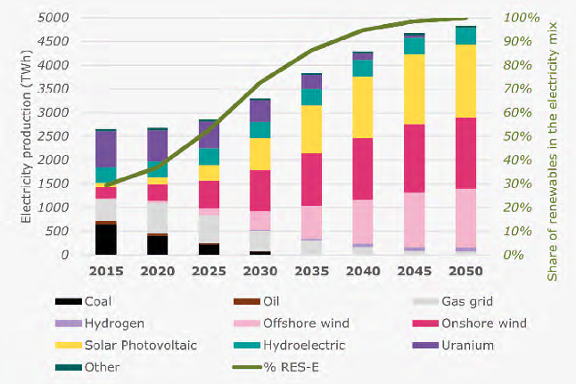

▶ Limitation of H2 and PtX to uses for which they are the most judicious choice or are essential, thereby also limiting the need for electricity production.

▶ Material needs (e.g. lithium, nickel, cobalt, copper, etc.).

Keeping electrification within reach allows a lowering of the constraints associated with these challenges and an increase in resilience. Furthermore, it increases the likelihood of decarbonisation and minimises decarbonisation costs.44

Moreover, the greater the electrification, the greater the associated costs, but also the greater the environmental impacts and acceptability issues and therefore the greater the challenges to achieve a clean electricity system.

###### Ensuring the EU market design is fit for 100% RES

Although CLEVER increases in electricity production and consumption levels are lower than in most scenarios, the strong development of renewable capacities, combined with the increased need for interdependence, make an integrated and balanced electricity market necessary.

This graph summarises the results of the key assumptions made for electricity production as detailed in Section 3.1, especially Figure 34 for wind and solar photovoltaic (PV) development.

In the context of the EU electricity market reform, the following elements appear necessary in order to achieve the CLEVER objectives:45

###### Figure 37: Local production coverage ratio for electricity in 2020 (on the left) and in 2040 (on the right).

▶ CfDs should be exclusively reserved for RES, and should not be indexed to the spot price. Moreover, this system should not be directly financed by consumer electricity bills.

▶ In considering future market design,

the ultimate objectives of any energy policy should be borne in mind in relation to the Sustainable Development

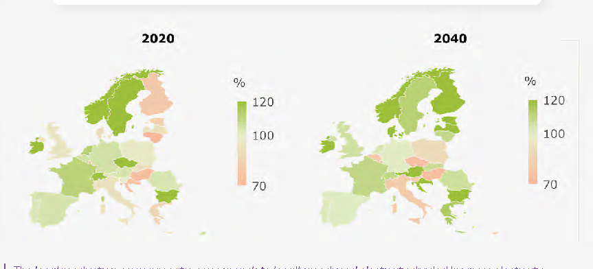

Goals (energy security, sustainability and carbon neutrality, peace and social justice).

▶ Targeted schemes for vulnerable consumers are necessary. The level of vulnerability should complete the level of consumption as an indicator for defining state aid.

▶ PPAs (Power Purchase Agreements) and CfDs (Contracts for Difference) are two different types of long-term contracts that should co-exist. Their perimeters must be precisely defined and risk sharing between parties must be clarified.

The local production coverage ratio corresponds to locally produced electricity divided by gross electricity consumption. The evolution between these two graphs shows that countries with a high potential for renewable electricity production (e.g. the Baltic States and Scandinavia) produce surplus electricity, which is then exported to countries where the potential is lower or more difficult to exploit (e.g. Italy, Czechia).

- 44 | For example, in the French négaWatt scenario, which follows the same principles as the CLEVER scenario:

- • Peak power consumption is reduced from 100 GW today to 63 GW in 2050, while final electricity consumption decreases slightly (-15%).
- • The association of sufficiency, efficiency, recycling and biogas (for long distance travel) enables a consumption of materials in line with France’s fair share of the world’s resources.

- 45 | For more details, see the négaWatt policy contribution to the European Commission’s consultation on this topic: négaWatt, 2023 – EN version to be published soon.

68 | CLEVER: a Collaborative Low Energy Vision for the European Region Renewable energy sources are the backbone of a resilient European energy system | 69

###### Securing system adequacy

###### Table 03: Benchmark of selected scenarios comparing dispatchable production, including CLEVER51

|Scenario|Scope|Target Year|Power Demand (TWh)52|Power Production (TWh)53|P/D54|Dispatchable production w/o hydro reservoir (TWh)55|Dispatchable production with estimate of hydro reservoir (TWh)|Share of flexible production over total demand w/o hydro reservoir|Share of flexible production over total demand with estimate of hydro reservoir|Battery production over total demand56|
|---|---|---|---|---|---|---|---|---|---|---|
|Quirion & Shirizadeh|FR|2035|480|648|135%|52|67|11%|14%|3,0%|
|négaWatt 2022|FR|2050|367|550|150%|15|29|4%|8%|0,8%|
|Rescue  – UbA|DE|2050|465|745|160%|21|45|5%|10%|1,3%|
|Agora 2045|DE|2045|789|992|126%|79|93|10%|12%|3,0%|
|Zero Carbon Britain, CAT|UK|2050|473|808|171%|28|36|6%|8%|2,5%|
|Transform  – CREDS|UK|2050|334|489|146%|37|43|11%|13%|0,0%|
|System Change – Ember|EU27|2050|3102|4826|156%|169|463|5%|15%|1,0%|
|CLEVER|EU27|2050|2990|4867|163%|31957 (214)*|54158 (436)*|10.7% (7%)*|18%59 (15%)*|3,0%|

A dispatchable production corridor (as a percentage of final electricity demand excluding storage) was estimated and, as a precaution, the higher country-scale value (14%) was used to size country-scale production. A grid simulation might lead to the reduction of this value, as some scenarios assume less dispatchable production, and as larger grids (EU level, in this case) and excess annual generation may reduce flexibility needs.50

Several scenarios – both at country and EU levels – demonstrate how power grids may be fully supplied by a mix of renewable energy sources (RES). In the absence of an hourly electricity grid simulation (such an analysis based on CLEVER sectoral demand assumptions is currently under investigation46), CLEVER relies on a benchmark of recent existing scenarios to size flexibility needs. Because a reduced power demand allows for fewer operationally flexible dispatchable sources47, only low-demand48 100% RES scenarios were considered. In order to be conservative, the remaining nuclear production in 2050 present in a few scenarios was considered completely dispatchable.49

Flexible power production in CLEVER includes methane and hydrogen thermal plants, hydro power (reservoir and pumped) and batteries. Imports could provide a further source of flexibility. However, in order to increase the approach’s robustness, imports were not considered as such to size country-scale dispatchable production.

*without consideration of CHP (Combined Heat and Power) as contributing to flexible production

With the same perimeter, CLEVER presents higher dispatchable production (especially when not considering reservoirs) than Ember System Change, even though CLEVER’s power demand is 4% lower. Its relative share of dispatchable production is larger than that of other major scenarios.

- 52 | Total final electricity consumption excluding storage, hydrogen production, losses.

- 53 | Total electricity production including production from storage capacities.

- 54 | Production divided by demand.

- 55 | This distinction was made because reservoir data is not always available, or partial.

- 56 | Includes utility-scale and vehicle-to-grid.

- 57 | Includes 105 TWh of electricity from CHP.

- 58 | Idem

- 59 | 14% was used as a minimum for each country, but some countries might go above this (for example, if they own a lot of hydro power). Thus, hydro results at EU27 level add up to more than 14%.

- 46 | Research carried out by the University of Liege in Belgium using the PyPSA-Eur-Sec model (generation and transmission optimal dispatch model).

- 47 | RTE 2022, Chapter 7, section 7.11.

- 48 | Scenarios including strong demand reduction measures.

- 49 | If nuclear is considered to contribute100% to balancing in analysed scenarios (not in CLEVER), then total dispatchable production is maximised, increasing its share in %, thereby increasing the upper value of the corridor used to size CLEVERS’s country-scale dispatchable production.

- 50 | Tong et al., 2021

- 51 | Scenario analysed from top to bottom: Quirion et Shirizadeh, 2020, négaWatt Scenario Sankey Diagram, 2022, Unwelt Bundesamt, 2019, Prognos, Öko-Institut, Wuppertal Institut, 2021, Centre for Alternative Technology, 2019, CREDS, 2021, Ember, 2022

70 | CLEVER: a Collaborative Low Energy Vision for the European Region Renewable energy sources are the backbone of a resilient European energy system | 71

### 3.3 Bioenergies, hydrogen and PtX can play a key role in applications with few alternatives

###### Water freight needs

Water freight (international maritime, often referred to as “maritime bunkers”, and Inland Waterways (IWW)) has very few credible/mature alternatives to liquid fuels – methanol and gas being the most advanced alternatives with some possibilities for ammonia, which is even less mature (TRL of 4-5). Electricity and hydrogen could only play a limited role for short distances. Thus, since all bioliquids are required for aviation, PtG/PtL is necessary for water freight.

In CLEVER, national water freight has been estimated at 41 TWh and is supplied with liquid fuels (e-fuels and remaining bioliquids).

International water freight FEC has been estimated at 193 TWh, assuming a 30% increase in efficiency and a 50% decrease in tonne-kilometres66. This FEC is assumed to be distributed between gas motorisations and “e-fuel” motorisation (ammonia, methanol and e-diesel).

However, for a number of uses, these carriers remain the only credible alternatives (for various reasons explained in Section 3.1), particularly in H2 applications with a high efficiency potential or in applications with few alternative technologies.

As seen in the section on renewable potentials, sustainability issues limit bioenergy potentials and similar considerations apply to hydrogen (H2) and PtX.

###### Amount of PtX required in the CLEVER scenario

Without strong energy savings through sufficiency and efficiency, having H2 and PtX play a significant role (in %) would represent a risky gamble on the success of the energy transition and the achievement of climate, environmental and social (including energy cost) objectives.

PtG/PtL has therefore been limited to 225 TWh/ year in 2050 for water freight transport in EU30, plus the equivalent of 415 TWh of H2 in 2050 in

EU30 forPower-to-Methanol, mainly for olefines, and Power-to-Ammonia for industry feedstocks67, as described in Section 2.3.

The order of the next sections follows the logic described in the box “Insights into the process of supply and demand matching” at the end of Section 3.1: beginning with most critical sectors and carriers where few alternatives exist.

#### Hydrogen has a major role to play, but only for specific sectors and uses

#### Sustainable biofuels: a scarce resource reserved for aviation

Furthermore, as for PtX, certain sustainability issues must be taken into account.70 In addition, the deployment of electrolysers for H2 production is still in its early stages and therefore ambition must be well calibrated – this means finding the right balance between feasible deployment and the large-scale deployment required to reach economies of scale. Therefore, H2 must be dedicated only to the uses for which it is the most judicious choice and must be used only after energy savings efforts.

Beyond its transformation into liquids and gas, Hydrogen (H2) is very promising, if not indispensable, for the decarbonisation of some sectors/uses, including steel production in particular, as detailed in Section 2.3.

Final energy needs for aviation (international and national) have been estimated at 200 TWh in 2050 assuming a 30% efficiency increase and a 40% decrease of passenger-kilometres per inhabitant through sufficiency in EU27 (1500 km/ cap/year in 2050).60

Sustainable potentials for bioliquids have been estimated at 210 TWh (see Section 3.1).

As aviation is the most critical sector with no mature alternative to liquid fuels (see Section 3.1)61, bioliquids are prioritised for this sector and 95% of these are consumed by aviation.

H2 could also be considered as an option in some other sectors.68 However, in most cases, H2 faces one of the following issues:

▶ H2 technologies are not mature enough (TRL below 6), e.g. hydrogen for aviation.

#### Power to X: restricted to water freight and the chemical industry, where they are indispensable

▶ Strong uncertainties remain regarding H2

In the CLEVER scenario, peak power production, certain modes of heavy transport (truck and rail) and certain industries use H2, as they are mature enough, can be geographically concentrated (along an H2 transport network or with large on-site production) and have no satisfactory alternative option (electrification, biogas/biomass, district heating).

technology’s potential cost competitiveness compared to other carbon-neutral technologies, e.g. passenger cars.

###### Opportunities and limits of PtX

▶ H2 has a poor overall efficiency compared with direct electrification (e.g. transport, space heating, low to medium temperature and even high temperature processes in industry69).

efficient option in most sectors. Furthermore, PtX has a moderate maturity (TRL of 6-7) and possible sustainability issues63, including water, land and carbon supply (see 3.1)64. Power-to-Gas presents some advantages over other PtX65, in terms of the issues previously mentioned.

E-gas and e-fuels may seem to be a promising decarbonisation option for many sectors as they would enable the replacement of fossil gas and petroleum without any major changes in consumption systems (energy savings, systems’ renewal, etc.). However, with PtX efficiencies of approximately 55% LHV62, electrification is a much more

▶ Some uses may require costly associated distribution networks (e.g. residential space heating).

- 60 | See methodology and proposed corridors in the mobility note: CLEVER, 2023.

- 61 | In fact those could potentially be e-fuels (PtL described in the next section), but it was estimated that aviation being more decentralised bioliquids could be more relevant

- 62 | Lower heating value

- 63 | Öko-Institut, 2019

- 64 | There is increasing consensus for considering that there is no net CO2 emission from using e-fuel or e-gas when the CO2 to produce these fuels is captured from the air or from sustainable biomass sources.

- 65 | See paragraph “Hydrogen and PtX” in Section 3.1.3.

- 66 | This decrease is based on the following evaluations for fossil fuels, agriculture/forestry, ores and remaining products: CLEVER assumes that they represent respectively 35%, 12%, 7% and 42% of maritime tonne-kilometres and that they can be reduced respectively by at least 95% (100% renewable Europe in 2050), 50% (according to Solagro for CLEVER, 2021, and ongoing study), 45% and 15% (following industry assumptions).

- 67 | accounted for as H2 in final energy consumption for non-energy use in CLEVER datasets.

- 68 | IDDRI, 2022

- 69 | Agora and AFRY, 2021, p.12-13

- 70 | Especially, relating to on the ability to decarbonise the electricity sector decarbonisation potential, see Öko-Institut, 2019.

72 | CLEVER: a Collaborative Low Energy Vision for the European Region Renewable energy sources are the backbone of a resilient European energy system | 73

#### Biogas has a limited but essential role in the decarbonisation of road freight, industry, agriculture and peak power production

Figure 38: Evolution of green H2 consumption and production for the EU27 and comparison with REPowerEU target

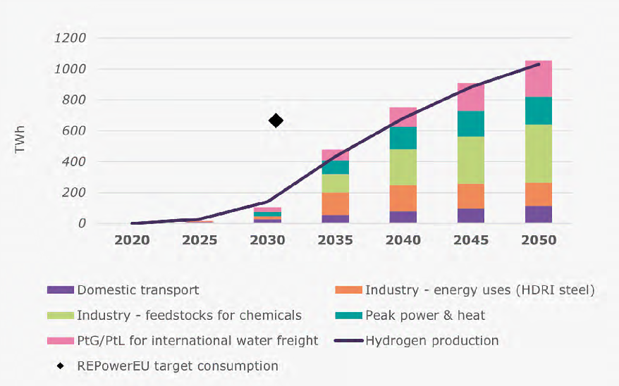

Biogas has a rather limited sustainable potential. In the CLEVER scenario, it represents for the EU27 817 TWh in 2050 and 334 TWh in 2030 (including thermal gasification). These values are in line with the REPowerEU 2030 objective of 35 billion cubic metres (bcm) for biomethane72.

As seen in Section 3.1, some sectors or uses have few credible alternatives to gas:

▶ Long distance road freight (trucks and light commercial vehicles),

▶ peak power and heat production,

▶ certain high temperature industrial processes,

▶ certain uses in agriculture, mainly tractors.

Iterative exchanges with partners and analysis of the equilibrium at EU level led to the consumption of biogas by use detailed in Figure 39 below. This consumption is below the estimated sustainable production potential.73

###### Figure 39: Biogas consumption level in CLEVER and sustainable production potential for the EU27 in 2050

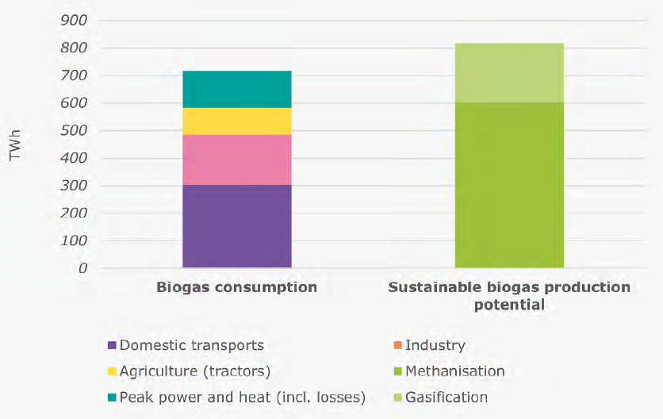

H2 consumption is broken down by final consumption sector. The H2 ‘imports’ between 2035 and 2050, visible through the differences between production and consumption, are mainly imports from Norway, as a result of model extension to EU30. Furthermore,H2 imports represent only 25 TWh in CLEVER in 2050 versus 350 to 900 TWh in TYNDP2022 in 2050.71

CLEVER’s modelled biogas consumption of 715 TWh in 2050 is driven mainly by long distance road freight and industry needs. It is below the sustainable production potential established at 815 TWh in 2050 (biomethane from methanisation and gasification as described in Section 3.1.) Renewable methane from Power-to-Gas is not represented here as results are detailed in the previous section.

- 72 | European Commission, 2022, p.3

- 73 | Bioenergy potentials in CLEVER tend to be rather conservative (as described in Section 3.1). This is true for biogas: an additional 100 TWh in line with some of the latest studies (JRC-ENSPRESO GasForClimate, 2022, Magnolo et al., 2021) and cover crop potentials could have led to a slightly different distribution of gas in buildings, transport and electricity production.

71 | ENTSO-E and ENTSOG, 2022, pp.44-45

74 | CLEVER: a Collaborative Low Energy Vision for the European Region Renewable energy sources are the backbone of a resilient European energy system | 75

###### Road freight transport74 as an example of carrier allocation

#### Sustainable solid biomass can complement electrification to facilitate full decarbonisation of industry and buildings

In order to decarbonise road transport, a massive change must take place to shift from an almost 100% liquid fuel based sector today (and more than 90% fossil fuel based)75 to 100% RES in 2050. A few renewable carriers can replace fossil fuels in heavy transport: electricity, hydrogen and biogas.

Trolley trucks are often mentioned as an alternative to BEV for trucks travelling long distances and there are already some demonstration installations. However, trolley truck deployment would generate huge infrastructure needs (lines and substations) and associated costs for transport corridors along which trains should be privileged. A review of scenarios led to the limitation of trolley trucks to 5% of freight tkm.

If strong energy savings are applied to FEC, pressure on solid biomass can be reduced. In the CLEVER scenario, solid biomass is prioritised in sectors where its use is the most judicious choice: buildings (mainly residential), certain industries (e.g. paper and pulp) and district heating (feeding mainly buildings).

peak electricity demand), and/or by providing an alternative in cases in which electrification is more complex to implement.

The needs for these sectors are significantly below sustainable production potentials (1100 TWh after thermal gasification), which in the CLEVER scenario, as mentioned in the Section 3.1, are mainly by-products of biomass as a material (e.g. for construction).

Battery electric vehicles (BEV) are very wellsuited for short distances and for uses requiring low power as they have major assets relating to particle emission, noise and efficiency. However, they are confronted with several obstacles: limited autonomy; a slow charging times (8 hours) with a moderate impact on the electrical network, fast charging times (1/2 hour) or even ultra-fast charging times (about 10 minutes) with a very high power demand and possible impacts on the network; and material impacts of batteries, which increase with required autonomy76. The CLEVER scenario assumed that electric trucks could be a judicious option for distance classes up to 150 km, and possibly even for distance classes up to 300 km.

This complement to strong industry and buildings electrification can facilitate the decarbonisation of these sectors by reducing the industrial ramp-up of production (e.g. heat pumps) by reducing the pressure on electric networks (e.g. by reducing

Because of considerations related to cost, network (transport and distribution), efficiency and material issues related to platinum, hydrogen is limited to very long-distance road traffic. In this case, the use of hydrogen is modelled assuming a dedicated transport network with adequately located refuelling stations. As a result, a maximum of 20% of tkm are run on fuel cell vehicles.

In addition, most countries do not need solid biomass imports and no country needs to import more than 10% of its needs.

Figure 40: Solid biomass consumption level in CLEVER and sustainable production potential in 2050 for the EU30.

This is why 37% to 60% of heavy vehicle tkms in the CLEVER scenario run on biomethane. Today, the methane used as fuel is almost exclusively of fossil origin (CNG). However, it can also be produced using various renewable source (bioNGV)-based processes. With millions of CNG-fuelled vehicles in the world, and a well-developed gas transport and distribution network in most EU countries, the deployment of a large fleet of CNG vehicles does not come up against any major technical or industrial obstacles. However, the expansion of CNGfuelled vehicles must be coupled with an ambitious policy for the development of sustainable renewable methane. The European Commission’s proposals for REPower EU implementation are much awaited in this regard.

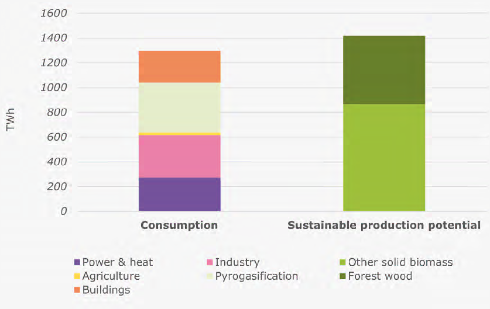

Table 04: Share of tonne-kilometres travelled by truck by distance class.

###### EU27 2018 2050

Less than 50 km 7% 10%

From 50 to 149 km 15% 21%

From 150 to 299 km 19% 27%

From 300 to 499 km 18% 13%

From 500 to 999 km 22% 16%

- From 1 000 to 1 999 km 14% 10%
- From 2 000 to 5 999 km 5% 3%

Because of sustainability concerns around materials for batteries, and lithium in particular, further study is being carried out in order to confirm that such levels of electrification in passenger vehicles, LCVs and HCVs do not exceed Europe’s fair consumption share of global sustainable resources.78

We roughly estimated shares of total tkm by distance class by country, based on historical values77 and assumed modal shift to train/IWW for 50% of trips above 300 km. This led to an estimated 30% of tkm with distance class below 150 km and 48% below 300 km. Considering that a portion of these trips would also be made by vehicles designed for longer distances, a 20%-30% range (maximum of 45% in some specific countries) was estimated for BEV trucks.

“Power & heat” refers only to uses of solid biomass for cogeneration and boilers feeding district heating. CLEVER’s modelled solid biomass consumption of 1295 TWh in 2050 is well below the sustainable production potential established at 1415 TWh in 2050.

- 74 | Road freight transport includes light commercial vehicles (LCV) and heavy duty vehicles. CLEVER’s approach for trucks is detailed here. The CLEVER assumption is that LCV are an intermediate between passenger cars (see CLEVER, 2023, car share of motorisation indicator) and trucks.

- 75 | Eurostat data for FEC in road transport

- 76 | Eurostat data for FEC in road transport

- 77 | Eurostat data on annual road freight transport by distance class

- 78 | A detailed analysis of lithium needs was carried out for the French négaWatt scenario (négaWatt, 2023). It showed that it was possible to remain just below a fair threshold (defined as France’s fair share of global resources in proportion to its share of global population) thanks to sufficiency, recycling and limited electric vehicle deployment. However, in comparison to the CLEVER scenario, this analysis assumes fewer electric vehicles in 2050 for passenger cars (65% vs 90%-95%), light commercial vehicles (35% vs 50%-65%) and trucks (12% vs 15%-40%). A similar assessment for CLEVER is undergoing.

76 | CLEVER: a Collaborative Low Energy Vision for the European Region | 77

# Conclusion

Sufficiency, efficiency and renewables will be essential to the implementation of the Fit For 55 package and the achievement of our 2030 energy and climate targets – the aim being to surpass these targets in order to keep Europe on a truly Paris-compatible and strongly sustainable trajectory. However, 2030 is just around the corner, and investors are already looking for security beyond this horizon. And, not just the major energy investors, but also the construction industry and local authorities in charge of building the infrastructures – from rail networks to cycling lanes – that will deliver the benefits of structural sufficiency. To enable change, all stakeholders will have to be mobilised and engaged, and concrete implementation is required at all levels of governance. This change, as well as the necessary evolution of social standards will have to be steered and accompanied.

In this context, it is critical that the EU swiftly come forward with bold proposals for a 2040 GHG target. However, GHG reductions alone cannot deliver the required transformation and investment security, nor are they sufficient to tackle further challenges such as energy security, strong sustainability and inequalities. Energy targets have been critical in achieving Europe’s transition to date. They have provided all levels of governance and investors with the vital confidence required to to get on with the transition, and they remain indispensable in the medium to long term.

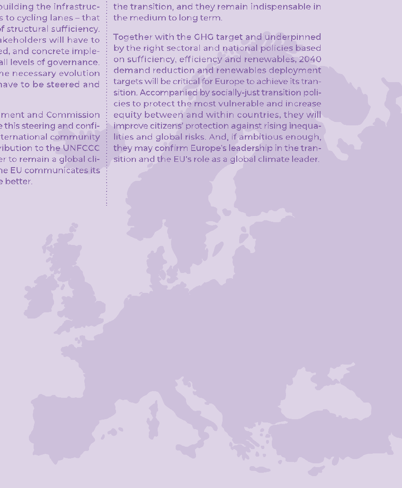

Together with the GHG target and underpinned by the right sectoral and national policies based on sufficiency, efficiency and renewables, 2040 demand reduction and renewables deployment targets will be critical for Europe to achieve its transition. Accompanied by socially-just transition policies to protect the most vulnerable and increase equity between and within countries, they will improve citizens’ protection against rising inequalities and global risks. And, if ambitious enough, they may confirm Europe’s leadership in the transition and the EU’s role as a global climate leader.

The next European Parliament and Commission will be expected to provide this steering and confidence to investors. The international community also awaits the EU’s contribution to the UNFCCC process. Therefore, in order to remain a global climate leader, the sooner the EU communicates its 2040 GHG to the IPCC, the better.

78 | CLEVER: a Collaborative Low Energy Vision for the European Region Annexes | 79

Annexes Annex 1:Sankey diagram for the CLEVER scenario in 2015 at

the EU27 perimeter (including international maritime)

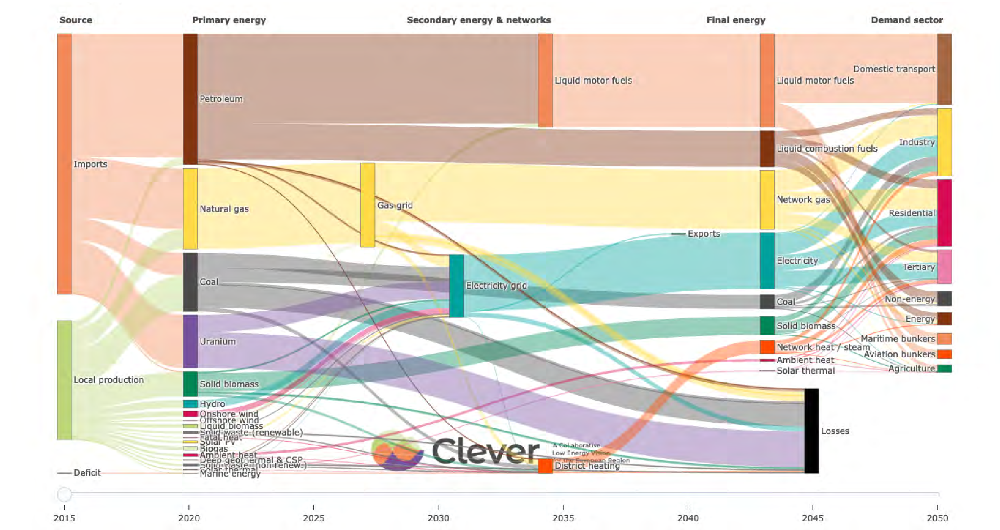

80 | CLEVER: a Collaborative Low Energy Vision for the European Region Annexes | 81

#### Annex 2: Sankey diagram for the CLEVER scenario in 2030 at the EU27 perimeter (including international maritime)

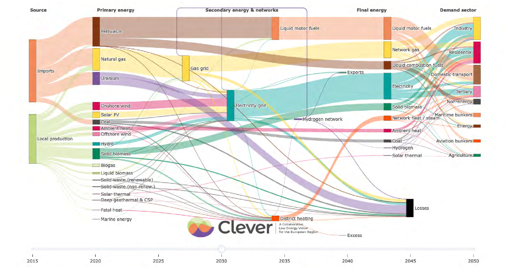

82 | CLEVER: a Collaborative Low Energy Vision for the European Region Annexes | 83

#### Annex 3: Sankey diagram for the CLEVER scenario in 2050 at the EU27 perimeter (including international maritime)

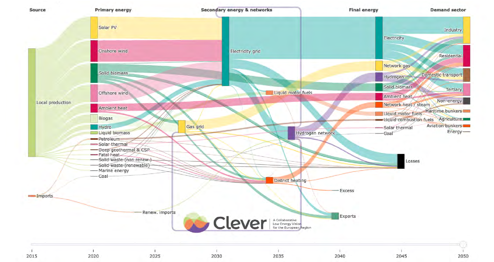

84 | CLEVER: a Collaborative Low Energy Vision for the European Region List of figures & tables | 85

# List of figures & tables

- Figure 00: Doughnut economics illustration from K. Raworth, bounding a sustainable economy between a social foundation and an ecological ceiling (defined by planetary boundaries). ......................................................................................................9
- Figure 01: The modelling approach, based on the Sufficiency, Efficiency, Renewables (SER) framework ............................11
- Figure 02: The 3 stages of the CLEVER bottom-up construct process..............................................................................................................12
- Figure 03: Map of the CLEVER network and the different levels of partner involvement ...................................................................13
- Figure 04: Cumulative CO2 emissions in CLEVER for the EU27 from the beginning of 2020 .........................................................16
- Figure 05: Comparison between CLEVER’s modelled cumulated net EU27 CO2 emissions between 2020 and 2050 and available 1.5°C and 1.7°C budgets, based on different modes of calculation. .......................................................................................18
- Figure 06: Scenarii comparison for EU27 net greenhouse gas (GHG) emissions from Land Use, Land-Use Change and Forestry (LULUCF). ......................................................................................................................................................................................................................................19
- Figure 07: Acceptance of sufficiency measures in Europe ..........................................................................................................................................21
- Figure 08: Evolution of primary consumption of fossil fuels for the EU27 in the CLEVER scenario .............................................22
- Figure 09: Evolution of EU27 energy imports in CLEVER ............................................................................................................................................23
- Figure 10: Evolution of the final energy consumption for the EU27 in the CLEVER scenario...........................................................24
- Figure 11: Evolution of the share of renewable, fossil and uranium energy sources in CLEVER .....................................................25
- Figure 12: GHG emissions for EU27 over 2030-2050 ..........................................................................................................................................................25
- Figure 13: Net exports by country in 2050 for 4 carriers: renewable gas, electricity, solid biomass and renewable hydrogen. ............................................................................................................................................................................................................................................................26
- Figure 14: Evolution of final energy consumption (FEC) per capita in key CLEVER national trajectories ..............................27
- Figure 15: Final EU27 energy consumption (FEC) and greenhouse gas (GHG) emissions of each sector in 2019 .............30
- Figure 16: Contribution of each sector in the EU27 Final Energy Consumption (TWh) reduction modelled in the CLEVER scenario between 2019 and 2050 .............................................................................................................................................................................................................................................................................31

Table 01: Share of energy consumption reduction in each key sector between 2019 and 2050 and associated contribution of sufficiency for France, Germany and the United Kingdom (based on CLEVER partner country analyses) ..............................................................................................................................................................................................................................................................32

- Figure 17: Share of sufficiency policies in all mitigation policies in citizens’ assemblies (CA) reports and National Energy and Climate Plans (NECPs) ................................................................................................................................................................................................33
- Figure 18: Evolution of the final energy consumption (FEC) and greenhouse gas (GHG) emissions of the building (residential and tertiary) sector at the EU27 level ................................................................................................................................................................34
- Figure 19: Average historical and modelled deep renovation rate in incremental 5-year periods (%/year) for a selection of CLEVER national trajectories .........................................................................................................................................................................................................35
- Figure 20: CLEVER’s forecasted evolution of final energy consumption and carriers for space heating (total EU30 in TWh). ......................................................................................................................................................................................................................................................................36
- Figure 21: Evolution of energy consumption and living space per capita in the German residential sector between 1990 and 2020..................................................................................................................................................................................................................................................38

- Figure 22: Evolution of floor area per capita for key national CLEVER trajectories ....................................................................................39
- Figure 23: Evolution of the final energy consumption (FEC) and greenhouse gas (GHG) emissions of the transport (mobility and freight) sectors at the EU27 level ....................................................................................................................................................................41
- Figure 24: Evolution of the average distance travelled per capita per year (km/cap/year) in several EU27 countries ..42
- Figure 25: Main levers of mobility decarbonisation in the CLEVER scenario .................................................................................................43
- Figure 26: Evolution of passenger traffic and its final energy consumption between 2019 and 2050 according to the CLEVER scenario ...........................................................................................................................................................................................................................................44
- Figure 27: Share of tonnes-kilometres transported by truck in 2050 following motorisation in key CLEVER national trajectories. ........................................................................................................................................................................................................................................................47
- Figure 28: Evolution of the industry sector’s final energy consumption (FEC) and greenhouse gas (GHG) emissions at the EU27 level ..................................................................................................................................................................................................................................................49
- Figure 29: Contribution of the different levers to the final energy consumption reduction of the EU27 steel sector in the CLEVER scenario .................................................................................................................................................................................................................................51
- Figure 30: Evolution of industry’s final energy consumption, share of energy carriers and GHG emissions between 2019 and 2050 according to the CLEVER scenario ............................................................................................................................................................52
- Figure 31: Evolution of primary energy supply by source and share of renewables in final energy consumption for the EU27 in the CLEVER scenario ............................................................................................................................................................................................................56
- Figure 32: Main corridors for the share of a carrier in a subsector in 2050 (eg for electricity in cars the corridor is between 60 and 100%) .............................................................................................................................................................................................................................58
- Figure 33: Sustainable bioenergy production potentials in CLEVER for EU27+UK (TWh/year) .......................................................59
- Figure 34: Cumulated installed capacities in the CLEVER scenario for solar PV, onshore wind and offshore wind for the EU27 and comparison with REPowerEU target ..........................................................................................................................................................60

- Table 02: Insights into the results of the supply-to-demand matching process ........................................................................................64

- Figure 35: Comparison of the evolution of electricity consumption and production between 2015 and 2050 in CLEVER, TYNDP and EU Commission (EC) scenarios. ....................................................................................................................................................65
- Figure 36: Evolution of electricity production by source and associated share of renewables for the EU27 in the

CLEVER scenario ..........................................................................................................................................................................................................................................67 Figure 37: Local production coverage ratio for electricity in 2020 (on the left) and in 2040 (on the right). .........................67

- Table 03: Benchmark of selected scenarios comparing dispatchable production, including CLEVER ..................................69

Figure 38: Evolution of green H2 consumption and production for the EU27 and comparison with REPowerEU

target .....................................................................................................................................................................................................................................................................72 Figure 39: Biogas consumption level in CLEVER and sustainable production potential for the EU27 in 2050 .................73

- Table 04: Share of tonne-kilometres travelled by truck by distance class. .....................................................................................................74

- Figure 40: Solid biomass consumption level in CLEVER and sustainable production potential in 2050 for the EU30. .....................................................................................................................................................................................................................................................................75

86 | CLEVER: a Collaborative Low Energy Vision for the European Region References | 87

# References

#### Data

- • Croci, E. (2016). Urban road pricing: a comparative study on the experiences of London, Stockholm and Milan. Transportation Research Procedia, 14, 253-262.
- • de Bok, M., de Jong, G., Wesseling, B., Meurs, H., Van Bekkum, P., Mijjer, P., ... & Veger, T. (2022). An ex-ante analysis of transport impacts of a distance-based heavy goods vehicle charge in the Netherlands. Research in Transportation Economics, 95, 101091.
- • Dellink, R., Chateau, J., Lanzi, E., & Magné, B.

(2017). Long-term economic growth projections in the Shared Socioeconomic Pathways. Global Environmental Change, 42, 200-214.

- • E3G, (2023). EU Green Deal Industrial Plan: “can-do energy” with some gaps – EE3G reaction.
- • ECF/Climact (2018). Net-Zero by 2050: from whether to how. Report.
- • ECOS, (2019). The Next Circular Economy Action Plan: Priority Measures For The European Commission.
- • EEA, (2020). The European environment state and outlook 2020 Knowledge for transition to a sustainable Europe.
- • EEB and OpenEXP, (2021). Sufficiency and circularity. The two overlooked decarbonization strategies in the ‘Fit For 55’ Package
- • EEB, (2022). Financing decarbonisation via innovative economic instruments based on circularity and sufficiency.
- • EEB, (2022). EEB Policy Brief: Policy measures towards Nature-Positive Renewable Energy in the EU using PAC scenario results.
- • EEB, (2023). Why sufficiency cannot be overlooked in the Energy Performance of Buildings Directive.
- • EIB, (2022). Europeans willing to reduce carbon-intensive transportation.
- • Ember, (2022). New Generation: Building a clean European electricity system by 2035.
- • EnSu “Sufficiency in European Citizen Assemblies and National Energy and Climate Plans”, 2023

- • ENTSO-E and ENTSOG, (2022). TYNDP 2022 scenario report.
- • EREF, (2022). Study on 2030 Renewable Energy and Energy Efficiency Targets in the European Union.
- • EUCalc. European Calculator project modelling diverse “Transition Pathways”.
- • EU Commission, (2011). Roadmap to a Single European Transport Area – Towards a competitive and resource efficient transport system

– White paper.

- • EU Commission, (2018). A Clean Planet for all. A European long-term strategic vision for a prosperous, modern, competitive and climate neutral economy.
- • EU Commission, (2019). Comprehensive study of building energy renovation activities and the uptake of nearly zero-energy buildings in the EU.
- • EU Commission, (2020). Impact assessment Accompanying the document: Stepping up Europe’s 2030 climate ambition Investing in a climate-neutral future for the benefit of our people.
- • Eurelectric, Solar Power Europe, WindEurope, (2023). Joint statement: EU legislators must deliver meaningful acceleration of renewables permitting at next week’s Renewables Directive trilogue.
- • Europe Beyond Coal, (2017). Five EU actions to take Europe Beyond Coal Joint background policy paper.
- • Eurostat, (2023). EU gas consumption decreased by 19%.
- • Fraunhofer ISI, (2021). Industrial Innovation: Pathways to deep decarbonisation of Industry.
- • FULFILL, (2023). Fundamental decarbonisation through sufficiency by lifestyle changes. Literature review for analysis of lifestyle changes.
- • GasForClimate (2022). Biomethane production potentials in the EU.
- • German Zero, (2021). Maßnahmen für ein 1,5-Grad-Gesetzespaket.

###### The following databases have been used to provide historical data to build this trajectory:

▶ EUROSTAT database: official EU database managed by the EU Commission

▶ Several national statistical databases from which national partners have collected data.

▶ Odyssee database: database on EU country energy consumption managed by the company Enerdata.

#### Bibliography

- • Chen, W., Carstensen, T. A., Wang, R., Derrible, S., Rueda, D. R., Nieuwenhuijsen, M. J., & Liu, G.

(2022). Historical patterns and sustainability implications of worldwide bicycle ownership and use. Communications Earth & Environment, 3(1), 171.

- • Citepa, (2022). Inventaire des émissions de polluants atmosphériques et de gaz à effet de serre en France – Format Secten.
- • CLEVER (2022). Sufficiency's integration into climate and energy strategies – Briefing note
- • CLEVER, (2022). Establishment of energy consumption convergence corridors to 2050

– Residential sector.

- • CLEVER, (2022). Establishment of energy consumption convergence corridors to 2050

– Industrial sector.

- • CLEVER, (2023). Agriculture, forestry, other land-use changes and bioenergy (AFOLUB) Main assumptions and preliminary trajectory of the CLEVER scenario.
- • CLEVER, (2023). Establishment of energy consumption convergence corridors to 2050

– Mobility sector.

- • CREDS, (2021). The role of energy demand reduction in achieving net-zero in the UK. Centre for Research into Energy Demand Solutions. Oxford, UK.
- • CREDS, (2022). A cross-country comparative analysis of low energy demand scenarios in Europe.

- • ADEME, (2022). Transition(s) 2050. Les effets macroéconomiques.
- • ADEME, (2022). Représentations sociales du changement climatique : 23 ème vague du baromètre.
- • ADEME, Dorémi, Enertech, (2020). La rénovation performante par étapes - Étude des conditions nécessaires pour atteindre la performance BBC rénovation ou équivalent à terme en logement individuel.
- • Agora Energiewende and AFRY Management Consulting, (2021). No-regret hydrogen: Charting early steps for H₂ infrastructure in Europe.
- • Böll, (2023). Poll for the 60th anniversary of the Elysée Treaty: "A call to really think together about policies”.
- • BPIE, (2021). Deep Renovation: Shifting from exception to standard practice in EU Policy.
- • BPIE, (2022). Roadmap to climate-proof buildings and construction – How to embed whole-life carbon in the EPBD.
- • BPIE, (2023). How to stay warm and save energy – insulation opportunities in European homes.
- • CAST, (2021). Public perceptions of climate change and policy action in the UK, China, Sweden and Brazil
- • Centre for Alternative Technology, (2019). Zero Carbon Britain: Rising to the Climate Emergency.

88 | CLEVER: a Collaborative Low Energy Vision for the European Region References | 89

- • Gräbner-Radkowitsch et al., (2022). Zur ökonomischen Bedeutung von Suffizienz. Economists for future.
- • Grubler, A., Wilson, C., Bento, N., Boza-Kiss, B., Krey, V., McCollum, D. L., ... & Valin, H. (2018). A low energy demand scenario for meeting the 1.5 C target and sustainable development goals without negative emission technologies. Nature energy, 3(6), 515-527.
- • Holz, C., Kartha, S., & Athanasiou, T. (2018). Fairly sharing 1.5: national fair shares of a 1.5 C-compliant global mitigation effort. International Environmental Agreements: Politics, Law and Economics, 18(1), 117-134.
- • ICCT, (2018). Adjusting for vehicle mass and size in European post-2020 CO2 targets for passenger cars.
- • IDDRI, (2022). Hydrogène pour la neutralité climat : conditions de déploiement en France et en Europe
- • IEA, (2022). The Role of Critical Minerals in Clean Energy Transitions.
- • Interreg Europe, (2018). Renewable Energy Communities.
- • IPCC, 2018: Summary for Policymakers. In: Global Warming of 1.5°C. An IPCC Special Report on the impacts of global warming of 1.5°C above pre-industrial levels and related global greenhouse gas emission pathways, in the context of strengthening the global response to the threat of climate change, sustainable development, and efforts to eradicate poverty
- • IPCC, 2021: Summary for Policymakers. In: Climate Change 2021: The Physical Science Basis. Contribution of Working Group I to the Sixth Assessment Report of the Intergovernmental Panel on Climate Change
- • IPCC, 2022: Summary for Policymakers. In:Climate Change 2022: Mitigation of Climate Change. Contribution of Working Group III to the Sixth Assessment Report of the Intergovernmental Panel on Climate Change.
- • IPCC, 2023: Summary for Policymakers. Sixth Assessment Report of the Intergovernmental Panel on Climate Change.

- • Madeddu, S., Ueckerdt, F., Pehl, M., Peterseim, J., Lord, M., Kumar, K. A., ... & Luderer, G. (2020). The CO2 reduction potential for the European industry via direct electrification of heat supply (power-to-heat). Environmental Research Letters, 15(12), 124004.
- • Magnolo, F., Dekker, H., Decorte, M., Bezzi, G., Rossi, L., Meers, E., & Speelman, S. (2021). The Role of Sequential Cropping and Biogasdoneright™ in Enhancing the Sustainability of Agricultural Systems in Europe. Agronomy, 11(11), 2102.
- • Marignac, Y., Bourgeois, S., Djelali, M., Taillard, N., Brizga, J., Garcia, M., ... & Ferreira, F. (2021). Scaling-up energy sufficiency on a European level through a bottom-up modelling approach: lessons and perspectives. European Council for an Energy Efficient Economy.
- • Millward-Hopkins, J., & Johnson, E. (2023). Distributing less, redistributing more: Safe and just low-energy futures in the United Kingdom. Energy Research & Social Science, 95, 102915.
- • Millward-Hopkins, J., Steinberger, J. K., Rao, N. D., & Oswald, Y. (2020). Providing decent living with minimum energy: A global scenario. Global Environmental Change, 65, 102168.
- • Moreno, C., Allam, Z., Chabaud, D., Gall, C., & Pratlong, F. (2021). Introducing the “15-Minute City”: Sustainability, resilience and place identity in future post-pandemic cities. Smart Cities, 4(1), 93-111.
- • négaWatt (2023). Lithium: towards a necessary sufficiency.
- • négaWatt (2023). Réforme du marché européen de l’électricité
- • négaWatt, (2017). Scenario négaWatt for France 2017-2050.
- • négaWatt, (2022). Scenario négaWatt for France 2022-2050.
- • O’Neill, B. C., Kriegler, E., Ebi, K. L., Kemp-Benedict, E., Riahi, K., Rothman, D. S., ... & Solecki, W. (2017). The roads ahead: Narratives for shared socioeconomic pathways describing world futures in the 21st century. Global environmental change, 42, 169-180.

- • OECD, (2019). Global Material Resources Outlook to 2060.
- • Öko-Institut, (2019). Not to be taken for granted: climate protection and sustainability through PtX.
- • Öko-Institut, (2020). Electricity-based fuels: the future of PtX.
- • Prognos, Öko-Institut, Wuppertal Institut,

(2021). Towards a Climate-Neutral Germany by 2045

- • Quirion et Shirizadeh, (2020). Coût d’un système électrique optimal sans émissions de CO2 pour la France, avec et sans nucléaire.
- • Rauzier et Toulouse, (2022). The material impacts of an energy transition based on sufficiency, efficiency and renewables.
- • Raworth, K. (2017). Doughnut economics: seven ways to think like a 21st-century economist. Chelsea Green Publishing.
- • Rescoop, (2022). The RED revision: How to maximise the potential for communities to contribute to local renewables production.
- • RESCUE, (2019). Resource-Efficient Pathways towards Greenhouse-Gas- Neutrality – RESCUE: Summary Report
- • RTE (2022). Futurs énergétiques 2050. Chapitre 7.
- • Ruiz, P., Nijs, W., Tarvydas, D., Sgobbi, A., Zucker, A., Pilli, R., ... & Thrän, D. (2019). ENSPRESO-an open, EU-28 wide, transparent and coherent database of wind, solar and biomass energy potentials. Energy Strategy Reviews, 26, 100379.
- • Ruiz, P., Sgobbi, A., Nijs, W., Thiel, C., Longa, F., & Kober, T. (2015). The JRC-EU-TIMES Model: Bioenergy Potentials. Technical Report.
- • Saheb, (2018). Deep energy renovation. Trapped in overestimated costs and staged approach.
- • Schijns, S., & Eng, P. (2006). High occupancy vehicle lanes–worldwide lessons for European practitioners. WIT Transactions on the Built Environment, 89.
- • The Shift Project, (2021). L’emploi : moteur de la transformation bas carbone.

- • Tong, D., Farnham, D. J., Duan, L., Zhang, Q., Lewis, N. S., Caldeira, K., & Davis, S. J. (2021). Geophysical constraints on the reliability of solar and wind power worldwide. Nature communications, 12(1), 6146.
- • Toulouse, E., Le Dû, M., Gorge, H., & Semal, L.

(2017). Stimulating energy sufficiency: barriers and opportunities. In ECEEE Summer Study (pp. 59-70). Toulon: ECEEE.

- • UNEP (2019). Global resources outlook: 2019. International Resource Panel, United Nations Envio, Paris, France.
- • Unwelt Bundesamt, (2019). Resource-Efficient Pathways towards Greenhouse-Gas Neutrality (RESCUE) - Summary Report
- • Wang-Erlandsson, L., Tobian, A., van der Ent, R. J., Fetzer, I., te Wierik, S., Porkka, M., ... & Rockström, J. (2022). A planetary boundary for green water. Nature Reviews Earth & Environment, 3(6), 380-392.

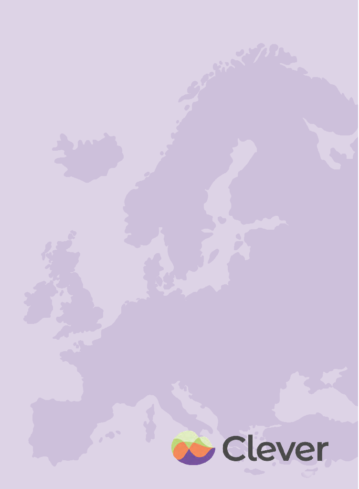

###### 🌐 www.clever-energy-scenario.eu #CleverScenario 📧 contact@clever-energy-scenario.eu

