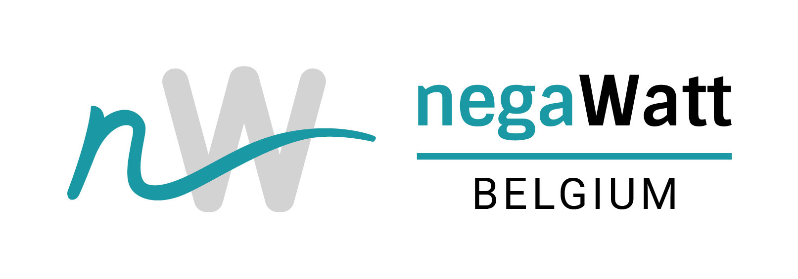

# nW-BE - negaWatt Belgium

This repository contains the notebooks used by negaWatt Belgium to project sufficiency and efficiency assumptions on future energy demand levels.

  

The documentation is still under construction...